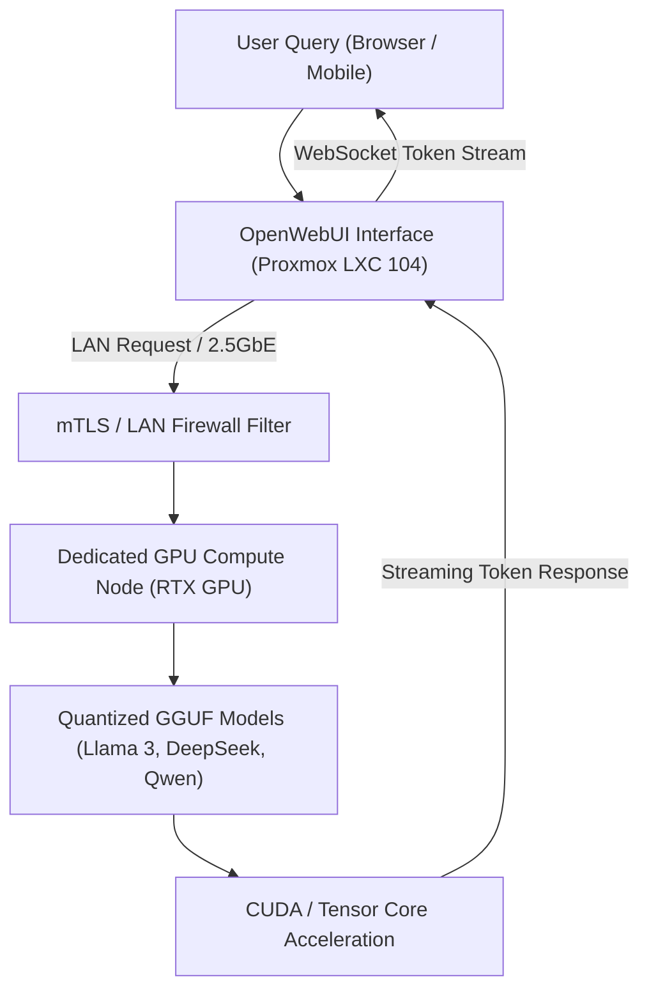

# aiVault & Distributed Local LLM Pipeline

A hybrid private LLM compute architecture connecting containerized OpenWebUI instances on Proxmox LXC with dedicated high-performance workstation GPU compute nodes running Ollama over low-latency 2.5GbE LAN.

---

## 1. Pipeline Architecture

---

## 2. Infrastructure Highlights

* **100% Data Sovereignty:** Zero queries leave the local physical network.
* **Separation of Concerns:** The web UI runs in an unprivileged, lightweight container; the inference engine runs directly bare-metal on CUDA hardware.
* **Network Speed:** Sub-1ms latency transfer between host and container across 2.5GbE switch routing.
