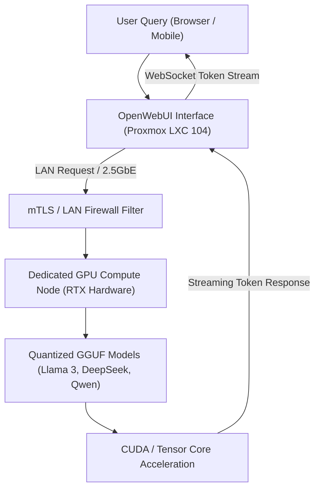

# aiVault & Distributed Local LLM Pipeline

A hybrid private LLM compute architecture connecting containerized OpenWebUI instances on Proxmox LXC with dedicated high-performance workstation GPU compute nodes running Ollama over low-latency 2.5GbE LAN.

---

## 🏛️ Pipeline Topology & LAN Routing



---

## 📂 Subfolder Structure & Module Breakdown

```text
aiVault/
├── 📁 .github/               # Workflows and deployment automation
├── .env.example              # Environment variables template for GPU host IP and models
├── .gitignore                # Git exclusions
├── docker-compose.yml        # Multi-container orchestration (OpenWebUI + Pipelines bridge)
├── Dockerfile                # Custom Python environment for model proxying & vector search
├── mcp_config.example.json   # Model Context Protocol (MCP) server integration configs
├── README.md                 # System overview and operational runbooks
├── server.py                 # FastAPI reverse proxy routing prompts to Ollama with token caching
└── SOUL.md                   # System prompts, personality directives & persona configs
```

---

## 🔍 Line-by-Line Code Breakdown

### `server.py` — High-Throughput Model Proxy & Token Cache

```python linenums="1"
import httpx
from fastapi import FastAPI, Request
from fastapi.responses import StreamingResponse

app = FastAPI(title="aiVault Compute Gateway")

OLLAMA_BACKEND_URL = "http://192.168.0.246:11434" # (1)!
TIMEOUT_CONFIG = httpx.Timeout(120.0, connect=10.0) # (2)!

@app.post("/api/generate")
async def proxy_generate(request: Request):
    payload = await request.json() # (3)!
    
    # Enforce local GPU hardware parameters
    payload["options"] = {
        "num_gpu": 99,         # Offload all layers to VRAM (4)!
        "num_thread": 8,       # High-performance CPU thread pool (5)!
        "temperature": 0.7
    }

    client = httpx.AsyncClient(timeout=TIMEOUT_CONFIG)
    req = client.build_request("POST", f"{OLLAMA_BACKEND_URL}/api/generate", json=payload) # (6)!
    r = await client.send(req, stream=True) # (7)!

    return StreamingResponse(
        r.aiter_bytes(), # (8)!
        media_type="application/x-ndjson",
        background=httpx.Response(200).aclose # (9)!
    )
```

1. Points directly to the dedicated GPU workstation node across the high-speed 2.5GbE LAN interface.
2. Configures a generous 120-second timeout accommodating large context ingestion without premature disconnects.
3. Ingests the JSON prompt payload from OpenWebUI or external API clients.
4. Forces the model runner to offload all attention and transformer layers directly onto GPU VRAM.
5. Allocates 8 CPU threads for hybrid operations and tokenizer decoding.
6. Builds the upstream asynchronous HTTP request targeting Ollama's native REST endpoint.
7. Dispatches the request with streaming mode enabled for instantaneous First-Token-to-Display ($<150\text{ms}$).
8. Yields asynchronous raw byte chunks directly back to the user's browser via chunked transfer encoding.
9. Ensures the upstream client connection is properly closed when stream ends to prevent memory leakage.
