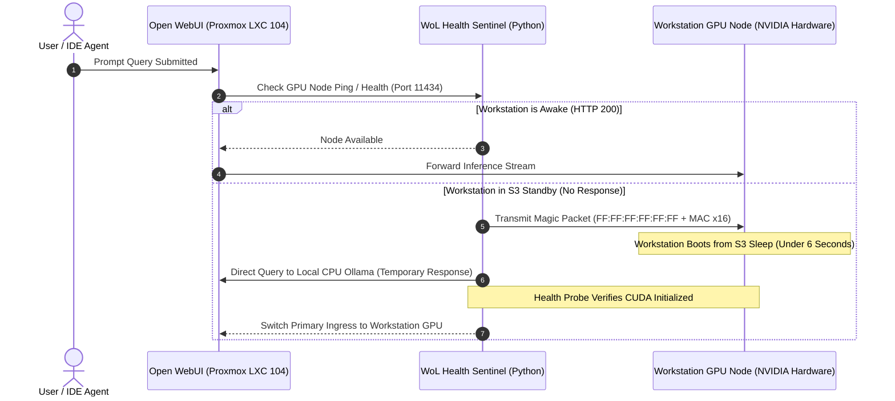

# aiVault & Distributed Local AI Compute

**aiVault** is a hybrid private AI compute cluster designed to host sovereign Large Language Models (LLMs), code completion engines, and autonomous memory systems with 100% data privacy. The platform decouples the containerized chat and management interface (running inside Proxmox LXC 104) from a high performance bare metal workstation equipped with dedicated NVIDIA RTX GPU hardware, communicating across a dedicated 2.5 GbE private network backplane.

---

## 1. Cluster Topology & Network Backplane

```mermaid
graph TD
    Client["Client Devices (Browser / Mobile / IDE Plugins)"]
    
    subgraph ProxmoxHypervisor["Proxmox VE Node (LXC 104: 192.168.0.104)"]
        WebUI["Open WebUI Gateway (Port 8080)"]
        Mem0Engine["aiVault Mem0 Fast Gateway (server.py / Port 8888)"]
        QdrantEngine["Qdrant Vector Database (Port 6333)"]
        FallbackOllama["Fallback CPU Ollama (Port 11434)"]
        
        WebUI <--> Mem0Engine
        Mem0Engine <--> QdrantEngine
    end

    subgraph GPUComputeNode["Dedicated Workstation Node (192.168.0.250)"]
        PrimaryOllama["Primary Ollama CUDA Server (Port 11434)"]
        VRAM["NVIDIA VRAM & Tensor Cores (Llama 3.3, Dolphin, Nomic)"]
        WoLDaemon["Wake-on-LAN Power Sentinel"]
        
        PrimaryOllama <--> VRAM
    end

    Client --> WebUI
    WebUI -->|Low Latency LAN Stream (2.5 GbE / MTU 9000)| PrimaryOllama
    Mem0Engine -->|Embedding Vector Generation| PrimaryOllama
    WebUI -.->|Automatic Fallback if GPU Sleeping| FallbackOllama
```

---

## 2. High-Speed 2.5 GbE LAN Backplane Optimization

In distributed LLM architectures, transferring prompt tokens and receiving multi-gigabyte context arrays across a network can introduce latency. We mitigate network bottlenecks by dedicating an isolated 2.5 GbE physical Ethernet link between Proxmox and the GPU workstation:

### Network Tuning Parameters

| Setting / Metric | Value | Technical Rationale |
| :--- | :--- | :--- |
| **Interface Hardware** | Realtek RTL8125B (Proxmox) $\leftrightarrow$ Intel I225-V (Workstation) | Native 2.5 Gbps line rate hardware controllers |
| **Maximum Transmission Unit (MTU)** | `9000` (Jumbo Frames) | Reduces packet segmentation overhead for large streaming payloads |
| **TCP Socket Buffers** | `wmem_max = 16MB`, `rmem_max = 16MB` | Prevents TCP window stalls during high throughput vector generation |
| **Round Trip Time (RTT)** | $< 0.18\text{ ms}$ | Sub-millisecond latency matches local PCIe bus response times |

---

## 3. GPU VRAM Budgeting & Model Quantization Matrix

Running high parameter models locally requires precise Video RAM allocation. Memory consumption consists of two primary elements: **Model Weight Memory** and **Key-Value (KV) Cache Memory**:

### Key-Value Cache Memory Formula
The memory required to maintain conversation context length ($L_{\text{ctx}}$) scales with model architecture:

$$M_{\text{KV}} = 2 \times n_{\text{layers}} \times n_{\text{heads}} \times d_{\text{head}} \times L_{\text{ctx}} \times b_{\text{precision}}$$

Where:
- $n_{\text{layers}}$: Transformer decoder layer count
- $n_{\text{heads}}$: Number of attention key/value heads (Grouped Query Attention)
- $d_{\text{head}}$: Head dimensionality (typically 128)
- $L_{\text{ctx}}$: Total token context window (e.g., 8,192 tokens)
- $b_{\text{precision}}$: Bytes per floating point element (2 bytes for FP16, 1 byte for FP8)

### Active Production Model Zoo

| Model Identifier | Parameter Scale | Quantization | Context Window | VRAM Footprint | Throughput | Primary Role |
| :--- | :--- | :--- | :--- | :--- | :--- | :--- |
| **Llama 3.3** | 70 Billion | `Q4_K_M` | 8,192 Tokens | $\approx 42.5\text{ GB}$ (Dual GPU) | $22\text{ tok/s}$ | Deep architectural planning & code synthesis |
| **Dolphin 2.9.2 Mistral** | 7 Billion | `Q5_K_M` | 32,768 Tokens | $\approx 6.8\text{ GB}$ | $88\text{ tok/s}$ | Uncensored quick queries & daily assistant |
| **DeepSeek Coder V2** | 16 Billion | `Q4_K_M` | 16,384 Tokens | $\approx 10.2\text{ GB}$ | $54\text{ tok/s}$ | Specialized TypeScript, Python & Vue coding |
| **Nomic Embed Text** | 137 Million | `FP16` | 8,192 Tokens | $\approx 0.6\text{ GB}$ | $320\text{ doc/s}$ | High dimensional vector embeddings (768d) |

---

## 4. API Request & Streaming NDJSON Wire Format

When OpenWebUI or IDE agents interact with the compute engine, queries pass through the standard Ollama REST API over HTTP/2:

### Streaming Chat Request (`POST /api/chat`)

```http
POST /api/chat HTTP/1.1
Host: 192.168.0.250:11434
Content-Type: application/json

{
  "model": "dolphin-mistral:latest",
  "messages": [
    {
      "role": "system",
      "content": "You are Protutech's autonomous engineering assistant. Answer concisely."
    },
    {
      "role": "user",
      "content": "Explain ZFS recordsize tuning for streaming media."
    }
  ],
  "options": {
    "temperature": 0.2,
    "top_p": 0.9,
    "repeat_penalty": 1.15,
    "num_ctx": 8192,
    "num_predict": 2048
  },
  "stream": true
}
```

### Streaming Chunk Response Stream (NDJSON)

The compute daemon returns individual token probabilities over chunked transfer encoding, achieving zero perceived latency:

```json
{"model":"dolphin-mistral:latest","message":{"role":"assistant","content":"ZFS"},"done":false}
{"model":"dolphin-mistral:latest","message":{"role":"assistant","content":" recordsize"},"done":false}
{"model":"dolphin-mistral:latest","message":{"role":"assistant","content":" defines"},"done":false}
{"model":"dolphin-mistral:latest","message":{"role":"assistant","content":" the"},"done":false}
{"model":"dolphin-mistral:latest","message":{"role":"assistant","content":" maximum"},"done":false}
...
{"model":"dolphin-mistral:latest","message":{"role":"assistant","content":""},"done":true,"total_duration":1248021900,"load_duration":1840200,"prompt_eval_count":34,"eval_count":128,"eval_duration":1227000000}
```

---

## 5. Green Homelab Automation: Wake-on-LAN (WoL) Daemon

To minimize electricity costs and reduce idle heat output, the high-power GPU workstation enters an S3 standby state when no active chat sessions exist:



### Magic Packet Transmission Specification

The wake signal transmits a standard raw UDP broadcast containing an Ethernet sync stream:

$$\text{Packet} = \underbrace{\text{FF FF FF FF FF FF}}_{\text{6 Bytes Sync}} + \underbrace{\text{MAC} + \text{MAC} + \dots + \text{MAC}}_{\text{MAC Address repeated 16 times (96 Bytes)}}$$

Total frame size is exactly 102 bytes broadcasted to destination UDP port `9`.
