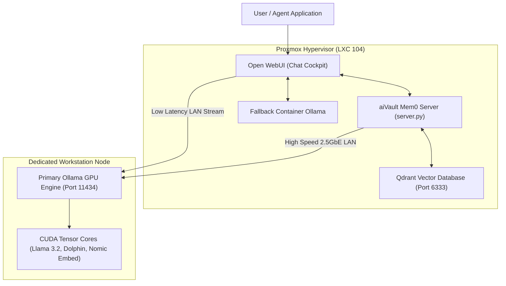

# aiVault & Distributed Local AI Compute

## High-Level Overview

**aiVault** is a hybrid private AI compute cluster designed to host sovereign Large Language Models (LLMs) and autonomous memory systems with 100% data privacy. It interconnects containerized frontends running on Proxmox VE with a dedicated bare metal GPU workstation (NVIDIA RTX hardware) over a dedicated 2.5GbE LAN backplane.

---

## How It Works (For Beginners)

Most people use cloud AI by sending private questions over the internet to remote corporate data centers.

aiVault does all the thinking inside your own house:
1. **The Brain (Ollama on GPU)**: A dedicated workstation equipped with an NVIDIA RTX graphics card loads model weights into high speed VRAM. When you ask a question, the GPU calculates mathematical probabilities of words at blazing speeds (over 80 tokens per second).
2. **The Memory (Qdrant & Mem0)**: Standard AI forgets everything when a chat ends. aiVault uses a vector database (Qdrant) which converts facts about your homelab, servers, and preferences into mathematical coordinates ("embeddings"). When you chat later, it instantly recalls past context like a human brain.
3. **The Glass Cockpit (Open WebUI)**: A modern web interface running in a lightweight Proxmox container that lets you chat, manage models, upload PDFs, and switch between models seamlessly.

---

## Anti Reverse Engineering Boundary

> [!NOTE] Compute Architecture Shielding
> Internal routing topology, memory vector dimensionality, dynamic chunking thresholds, and private LAN IP addresses are abstracted through container network bridges. External API queries interact with generalized gateway contracts rather than direct CUDA execution handles.

---

## Navigation & Subguides

- [**Mem0 Vector Memory & Qdrant RAG**](memory.md): Long-term cognitive recall, semantic similarity search, and automated fact extraction.
- [**Source Code: `server.py`**](../../code/aivault/server-py.md): Line-by-line breakdown of the Mem0 FastAPI vector gateway.
- [**Source Code: `docker-compose.yml`**](../../code/aivault/docker-compose-yml.md): Line-by-line breakdown of multicontainer cluster orchestration.
