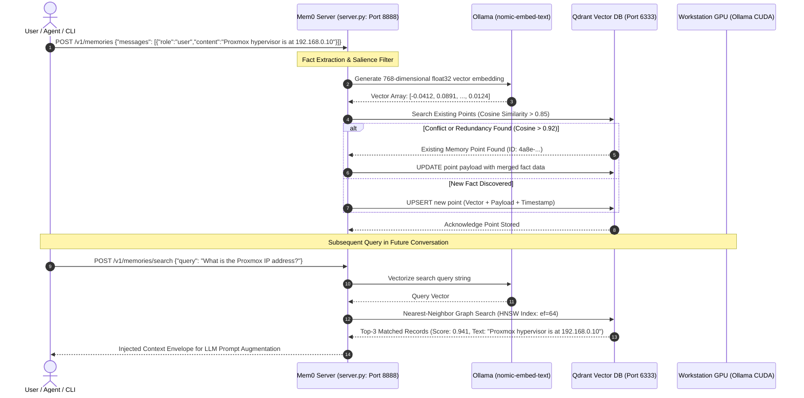
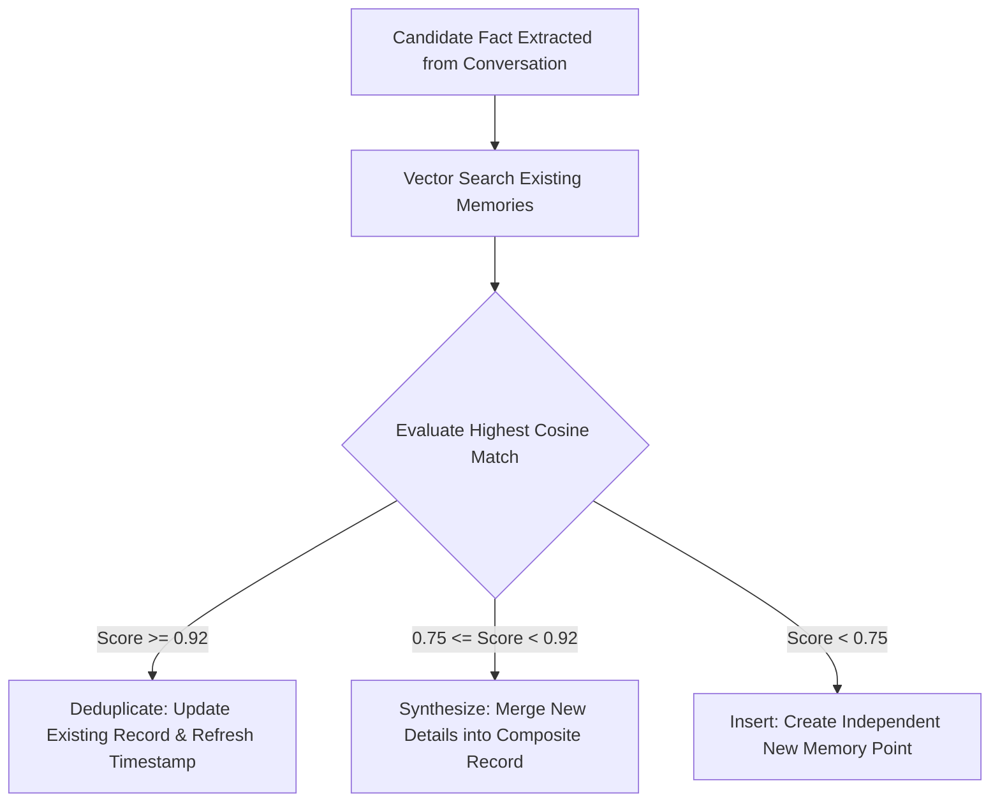

# aiVault Mem0 Vector Memory & Qdrant RAG Engine

Standard Large Language Models suffer from stateless context amnesia: the instant a conversation window shifts or an API session closes, prior instructions, preferences, and environmental facts evaporate. **aiVault** integrates **Mem0** and <a href="../../concepts/vector-embeddings-hnsw.md" class="pt-concept" data-tooltip="Hierarchical Navigable Small World graphs and cosine distance metric for nearest neighbor semantic search.">Qdrant</a> to deliver persistent, self-updating episodic memory. This architecture allows autonomous agents and developer assistants to recall homelab network configurations, past terminal commands, and user code style permanently across sessions.

---

## 1. Episodic Memory Lifecycle & RAG Query Pipeline



---

## 2. Mathematical Vector Similarity & Metric Space

Text strings are converted into dense mathematical coordinates in a 768-dimensional Euclidean space ($\mathbb{R}^{768}$) using the `nomic-embed-text-v1.5` transformer model.

### Cosine Distance Formula
Semantic similarity between a stored memory vector ($\vec{u}$) and an incoming query vector ($\vec{v}$) is evaluated using the cosine of the angle between them:

$$\operatorname{Cosine Similarity}(\vec{u}, \vec{v}) = \frac{\vec{u} \cdot \vec{v}}{\|\vec{u}\| \|\vec{v}\|} = \frac{\sum_{i=1}^{768} u_i v_i}{\sqrt{\sum_{i=1}^{768} u_i^2} \sqrt{\sum_{i=1}^{768} v_i^2}}$$

In Qdrant, distance is indexed as Cosine Metric:
$$\text{Distance} = 1.0 - \operatorname{Cosine Similarity}(\vec{u}, \vec{v})$$

Points with distance approaching $0.0$ are semantically identical in meaning, even if their exact word spelling or grammar differs entirely.

---

## 3. Qdrant HNSW Graph Index Configuration

Storing and searching millions of high dimensional vectors in real-time requires <a href="../../concepts/vector-embeddings-hnsw.md" class="pt-concept" data-tooltip="Hierarchical Navigable Small World graphs enabling sub-millisecond approximate nearest neighbor search.">Hierarchical Navigable Small World (HNSW)</a> graphs rather than exhaustive brute force scans:

### Qdrant Collection Schema (`mem0_store`)

```json
{
  "name": "mem0_store",
  "vectors": {
    "size": 768,
    "distance": "Cosine",
    "on_disk": false
  },
  "hnsw_config": {
    "m": 16,
    "ef_construct": 100,
    "full_scan_threshold": 1000,
    "max_indexing_threads": 4,
    "on_disk": false
  },
  "optimizers_config": {
    "deleted_threshold": 0.2,
    "vacuum_min_vector_number": 1000,
    "default_segment_number": 2,
    "max_segment_size": null,
    "memmap_threshold": null
  }
}
```

### Architectural Parameters Explained

| HNSW Parameter | Production Value | Technical Rationale |
| :--- | :--- | :--- |
| `m` (Bi-directional Links) | `16` | Number of outgoing links per node in the proximity graph. 16 balances query speed with index build time. |
| `ef_construct` | `100` | Number of nearest neighbors evaluated during graph insertion. Higher values prevent disconnected graph clusters. |
| `ef` (Search Beam Width) | `64` | Candidate search queue size during query execution. Yields $>99\%$ recall accuracy at $<1.2\text{ ms}$ search latency. |
| `distance` | `Cosine` | Normalizes vector magnitudes automatically, avoiding bias from document character lengths. |

---

## 4. Automated Memory Conflict Resolution & Deduplication

A critical vulnerability of basic vector databases is runaway duplicate accumulation: if a user mentions the same fact in five different conversations, a naive vector database stores five identical vectors, polluting prompt context windows.

Mem0 executes intelligent deduplication using dynamic score thresholds:



### Deduplication Logic in Python

```python
SIMILARITY_THRESHOLD = 0.92
MERGE_THRESHOLD = 0.75

if top_match and top_match.score >= SIMILARITY_THRESHOLD:
    # Exact duplicate concept: Update access time and metadata without creating duplicates
    qdrant_client.set_payload(
        collection_name="mem0_store",
        payload={"last_accessed": current_timestamp, "access_count": existing_count + 1},
        points=[top_match.id]
    )
elif top_match and top_match.score >= MERGE_THRESHOLD:
    # Evolving fact: Merge nuances (e.g. "Proxmox is at 192.168.0.10" + "Proxmox runs version 9.2")
    merged_text = synthesize_facts(top_match.payload["text"], new_fact_text)
    new_vector = generate_embedding(merged_text)
    qdrant_client.upsert(
        collection_name="mem0_store",
        points=[PointStruct(id=top_match.id, vector=new_vector, payload={"text": merged_text})]
    )
else:
    # Novel information: Insert new isolated point
    qdrant_client.upsert(
        collection_name="mem0_store",
        points=[PointStruct(id=generate_uuid(), vector=new_vector, payload={"text": new_fact_text})]
    )
```

---

## 5. REST Gateway Implementation (`server.py`)

The internal memory orchestrator is exposed as an asynchronous FastAPI microservice running inside LXC 104 on port `8888`.

### Core API Endpoints

| Endpoint | HTTP Method | Payload Example | Purpose |
| :--- | :--- | :--- | :--- |
| `/v1/memories` | `POST` | `{"messages": [{"role": "user", "content": "..."}]}` | Extracts facts from raw dialogue and commits to Qdrant |
| `/v1/memories/search` | `POST` | `{"query": "Proxmox network config", "limit": 5}` | Executes HNSW graph search and returns top-K facts |
| `/v1/memories` | `GET` | Query params: `user_id=andrew` | Dumps all stored facts associated with a user or project |
| `/v1/memories/{memory_id}`| `DELETE`| Path parameter: UUID string | Permanently purges a specific memory point from Qdrant |

For a complete line-by-line breakdown of the underlying Python implementation, consult the [**`server.py` Source Breakdown**](../../code/aivault/server-py.md).
