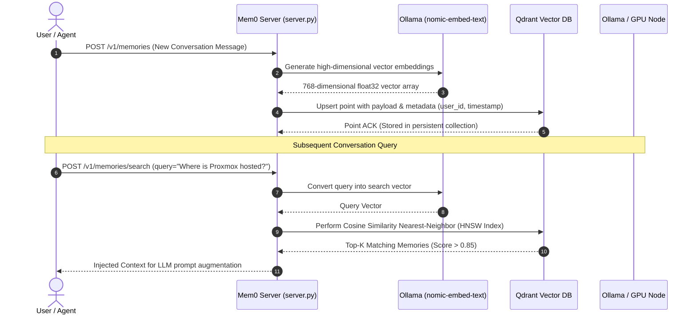

# aiVault Mem0 Vector Memory & Qdrant RAG

## ◆ Cognitive Long Term Memory Architecture

Standard LLMs suffer from "context amnesia": once a conversation window slides forward or a session resets, prior instructions and knowledge disappear. **aiVault** integrates **Mem0** and <a href="../../concepts/vector-embeddings-hnsw.md" class="pt-concept" data-tooltip="Hierarchical Navigable Small World graphs and cosine distance metric for nearest neighbor semantic search.">Qdrant</a> to deliver self-updating, persistent episodic memory.

---

## ✦ How Vector Memory Works (Explained Simply)

Imagine words as books in a library:
- **Alphabetical Indexing (Keyword Search)**: If you search for "automobile", you only find books with the exact word "automobile". A book titled "fast cars" would be missed because the spelling is different.
- **Vector Space (Semantic Embeddings)**: Instead of spelling, each thought is given a set of coordinates on a multidimensional map. Thoughts with similar meanings (like "car", "vehicle", "automobile") sit right next to each other on the map.
- When you ask a question, Qdrant looks at the map and finds the closest thoughts in microseconds, allowing the AI to remember concepts naturally.

---

## § Core Technical Configuration

| Component | Technology | Role |
| :--- | :--- | :--- |
| **Vector Engine** | Qdrant (Rust-based) | Stores billions of floating-point vectors with <a href="../../concepts/vector-embeddings-hnsw.md" class="pt-concept" data-tooltip="Hierarchical Navigable Small World graphs for O(log N) nearest neighbor search.">HNSW graph indexing</a> and payload filtering. |
| **Embedding Model** | `nomic-embed-text` | Transforms raw strings into 768-dimensional mathematical coordinates offline. |
| **Memory Orchestrator** | Mem0 Python SDK | Automatically extracts salient facts, resolves conflicts, and dedupes repetitive statements. |
| **Service Framework** | FastAPI (ASGI) | Asynchronous REST interface exposed on internal container port `8888`. |

---

## [#] Anti Reverse Engineering Boundary

The exact similarity metric scoring thresholds, clustering algorithms, and vector space pruning routines are configured with proprietary dynamic damping factors. Model fine-tuning parameters and prompt extraction templates are abstracted inside container memory spaces. For formal algorithmic models and mathematical definitions, see the [**HNSW Vector Indexing & Semantic Embeddings Reference**](../../concepts/vector-embeddings-hnsw.md).
