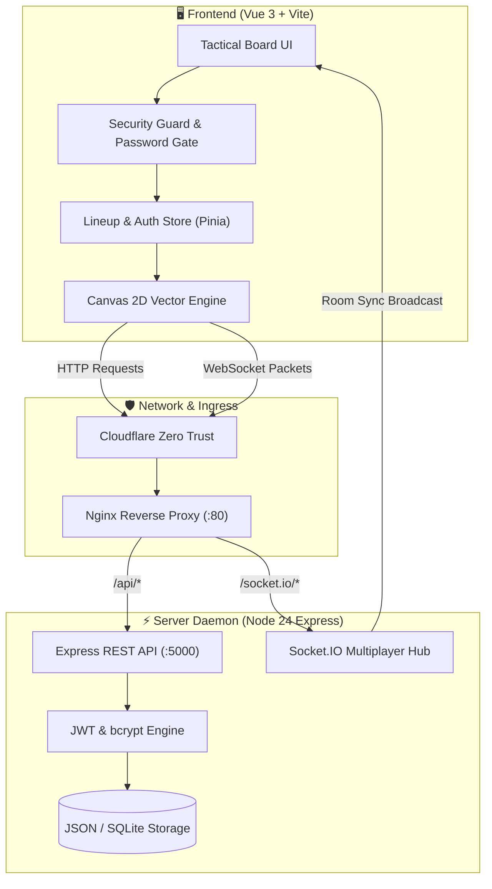

# CS2 Tactical Stratbook & Nade Lineups

A specialized tactical companion and whiteboard for competitive Counter-Strike 2, featuring interactive 2D maps, vector trajectory rendering, and real-time multiplayer drawing synchronization.

---

## 🏛️ System Topology & Data Flow



---

## 📂 Subfolder Structure & Module Breakdown

```text
CS2Nades/
├── 📁 server/                # Express 5 backend server & WebSocket synchronization
│   ├── data/                 # JSON database persistence directory (users, lineups, strats)
│   │   ├── db.json           # Global lineups and tactical whiteboard presets
│   │   └── personal/         # User-isolated custom lineup overrides
│   └── server.js             # Express API, Socket.IO multi-client hub & bcrypt/JWT engine
├── 📁 src/                   # Vue 3 Frontend source code
│   ├── 📁 assets/            # Global SVG icons, CS2 radar textures, and fonts
│   ├── 📁 components/        # Modular Vue 3 components
│   │   ├── 📁 auth/          # Authentication modals & Steam OpenID sync
│   │   ├── 📁 common/        # Shared buttons, badges, dialogs & toasts
│   │   ├── 📁 layout/        # Navbar, footer, and sidebar navigation
│   │   ├── 📁 lineups/       # Lineup cards, video player modals, and tagging filters
│   │   ├── 📁 map/           # Interactive radar canvas, callout overlays, and coordinates
│   │   ├── 📁 strats/         # Full execute planning boards & weapon economy counters
│   │   ├── 📁 tactics/       # Real-time whiteboard drawing tools & vector engines
│   │   └── 📁 user/          # Profile management, personal folders, and team groups
│   ├── 📁 composables/       # Reusable Vue composition logic
│   │   ├── useCanvas.ts      # HTML5 Canvas 2D math, Bezier trajectories & drag events
│   │   ├── useSocket.ts      # Reactive WebSocket connection & event listeners
│   │   └── useTactics.ts     # Multi-user drawing tool state (smoke, flash, molotov, arrow)
│   ├── 📁 stores/            # Global reactive Pinia stores
│   │   ├── authStore.ts      # User session tokens, roles, and profile settings
│   │   ├── lineupStore.ts    # Map lineups, active filters, search index, and favorites
│   │   └── tacticsStore.ts   # Active drawing vectors, board history (undo/redo), and rooms
│   ├── 📁 views/             # Top-level routed application views
│   │   ├── StratbookView.vue # Main interactive tactical whiteboard & map cockpit
│   │   ├── LibraryView.vue   # Filterable searchable lineup catalog grid
│   │   └── RemoteView.vue    # Dual-screen mobile companion display
│   ├── App.vue               # Root application shell & modal manager
│   └── main.ts               # Vue application bootstrapper & plugin mounting
├── 📁 public/                # Static public assets
│   ├── security-guard.js     # Obfuscated anti-inspection guard & password lock screen
│   └── minimaps/             # High-resolution official CS2 radar maps (Mirage, Inferno, etc.)
├── nginx.conf                # Production reverse proxy config with caching & SPA routing
├── vite.config.ts            # Vite 8 config with sourcemap suppression & OXC minification
└── docker-compose.yml        # Docker container orchestration for Proxmox deployment
```

---

## 🔍 Line-by-Line Code Breakdown

### 1. `src/composables/useCanvas.ts` — Bezier Trajectory Rendering Engine

```typescript linenums="1"
// Quadratic Bezier Curve Trajectory Math for Grenades
export function drawGrenadeTrajectory(
  ctx: CanvasRenderingContext2D,
  start: { x: number; y: number },
  control: { x: number; y: number },
  end: { x: number; y: number },
  color: string
) {
  ctx.save(); // (1)!
  ctx.beginPath(); // (2)!
  ctx.moveTo(start.x, start.y); // (3)!
  
  // Renders the curved arc representing grenade air trajectory
  ctx.quadraticCurveTo(control.x, control.y, end.x, end.y); // (4)!
  
  ctx.strokeStyle = color; // (5)!
  ctx.lineWidth = 3;
  ctx.setLineDash([6, 4]); // (6)!
  ctx.lineCap = 'round';
  ctx.stroke(); // (7)!

  // Render landing impact marker circle
  ctx.beginPath();
  ctx.arc(end.x, end.y, 6, 0, Math.PI * 2); // (8)!
  ctx.fillStyle = color;
  ctx.fill();
  ctx.restore(); // (9)!
}
```

1. Pushes the current canvas drawing state (transform, stroke style, line dash) onto the drawing stack.
2. Begins a new clean vector path preventing bleed-over from previous rendering frames.
3. Sets the starting pen position to the player throw coordinates (`start.x, start.y`).
4. Calculates a quadratic Bezier curve using the apex peak point (`control.x, control.y`) to the landing point.
5. Applies the grenade-specific hex color code (e.g., `#00f2fe` for Smoke, `#f59e0b` for Molotov).
6. Configures a modern animated dashed line pattern (6px line, 4px gap) representing motion.
7. Draws the calculated vector stroke directly onto the 2D hardware-accelerated canvas.
8. Draws a circular detonation circle at the final target coordinate (`end.x, end.y`).
9. Pops and restores the canvas state, ensuring subsequent draw operations are unaffected.

---

### 2. `server/server.js` — Express API & Real-Time Multiplayer Hub

```javascript linenums="1"
import express from 'express';
import { Server } from 'socket.io';
import http from 'http';
import jwt from 'jsonwebtoken';

const app = express();
const server = http.createServer(app);
const io = new Server(server, {
  cors: { origin: true, credentials: true } // (1)!
});

const JWT_SECRET = process.env.JWT_SECRET || 'cs2-stratbook-secret-key-2026'; // (2)!

// Socket.IO Real-time Tactic Room Broadcaster
io.on('connection', (socket) => {
  socket.on('room:join', (roomId) => {
    socket.join(roomId); // (3)!
    socket.to(roomId).emit('user:joined', { id: socket.id, time: Date.now() }); // (4)!
  });

  socket.on('tactic:draw_packet', ({ roomId, vectorData }) => {
    // Broadcast vector line directly to all teammates in the match room (<15ms)
    socket.to(roomId).emit('tactic:sync_vector', vectorData); // (5)!
  });

  socket.on('tactic:clear', (roomId) => {
    io.in(roomId).emit('tactic:board_cleared'); // (6)!
  });
});

// REST API: Authenticated Lineup Fetcher
app.get('/api/lineups/:map', (req, res) => {
  const { map } = req.params; // (7)!
  const mapData = db.lineups.filter(item => item.map.toLowerCase() === map.toLowerCase()); // (8)!
  res.json({ success: true, count: mapData.length, data: mapData }); // (9)!
});
```

1. Configures Socket.IO with dynamic cross-origin origin support and cookie credentials for Cloudflare tunnel ingress.
2. Ingests the persistent JWT secret key from environment configuration for secure token verification.
3. Places the connected client into an isolated Socket.IO room channel based on match room ID.
4. Broadcasts a presence notification to existing room members when a teammate connects.
5. Efficiently forwards raw drawing vector packets to all other room sockets without saving intermediate frames to disk.
6. Emits a global board clear event resetting the canvas across all connected client displays simultaneously.
7. Extracts the map parameter (e.g., `de_mirage`, `de_inferno`, `de_nuke`) from the URL route.
8. Filters persistent database lineups matching the requested map.
9. Returns structured JSON payload containing coordinates, viewangles, and grenade tags.
