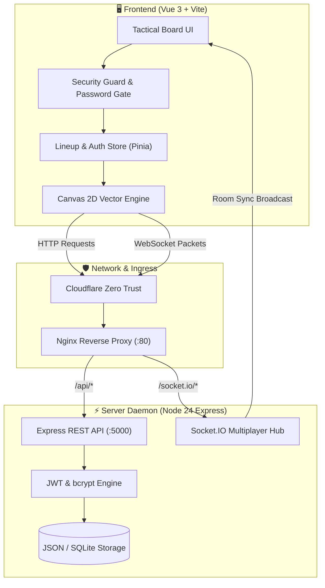

# CS2 Tactical Stratbook & Nade Lineups

A specialized tactical companion and whiteboard for competitive Counter-Strike 2, featuring interactive 2D maps, vector trajectory rendering, and real-time multiplayer drawing synchronization.

---

## 1. System Topology & Data Flow



---

## 2. Technical Component Architecture

| Component | Stack | Responsibilities |
| :--- | :--- | :--- |
| **Interactive Minimap** | Vue 3 + HTML5 Canvas | Renders 2D top-down map blueprints for all 7 active duty maps (Mirage, Inferno, Nuke, Dust II, Ancient, Anubis, Train). Calculates real-time Bezier trajectory curves. |
| **Tactics Board** | Vector Canvas API | Allows drawing execute arrows, smoke clouds, flash radiuses, player positions, and text callouts. |
| **Sync Daemon** | Socket.IO + Node.js | Multi-client room synchronization allowing teammates or dual-screen mobile devices to see tactic changes in $<15\text{ms}$. |
| **Security Hardening** | OXC Minification + Sourcemap Stripping | Disables source map emission in production, minifies code, and prevents DevTools inspection. |

---

## 3. Realtime Tactic Drawing Sync Implementation

=== "Client Composable (Socket Sync)"

    ```typescript
    import { io, Socket } from 'socket.io-client';
    import { ref } from 'vue';

    export function useTacticsRoom(roomId: string) {
      const socket: Socket = io(import.meta.env.VITE_API_URL || '', {
        transports: ['websocket'],
        withCredentials: true
      });

      const boardElements = ref<any[]>([]);

      function emitDrawElement(element: { type: string; coords: number[]; color: string }) {
        socket.emit('tactic:draw', { roomId, element }); // (1)!
      }

      socket.on('tactic:update', (incomingElement) => {
        boardElements.value.push(incomingElement); // (2)!
      });

      return { emitDrawElement, boardElements };
    }
    ```

    1. Emits the vector coordinate packet to the server room channel.
    2. Reactively pushes incoming updates to the canvas rendering loop without page reload.

=== "Server WebSocket Hub"

    ```javascript
    io.on('connection', (socket) => {
      socket.on('join-room', (roomId) => {
        socket.join(roomId);
      });

      socket.on('tactic:draw', ({ roomId, element }) => {
        // Broadcasts drawing packet to all other connected clients in room
        socket.to(roomId).emit('tactic:update', element);
      });
    });
    ```
