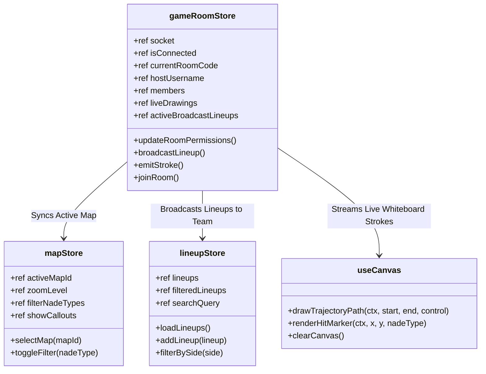

# CS2 Tactical Stratbook Component & Store Hierarchy

## ▸ Source Code Directory Structure

The CS2Nades frontend is organized into modular component groups and specialized domain stores:

```
CS2Nades/
├── 📁 server/
│   ├── data/
│   │   └── lineups.json            # Persistent JSON lineup datastore
│   └── server.js                   # Node.js Express 5 + Socket.IO collaboration server
├── 📁 src/
│   ├── 📁 components/
│   │   ├── 📁 auth/                # Steam OpenID & local guest auth modals
│   │   │   └── AuthModal.vue
│   │   ├── 📁 common/              # Reusable UI primitives (icons, modals, confirmations)
│   │   │   ├── DataSyncModal.vue
│   │   │   ├── GlobalConfirmModal.vue
│   │   │   ├── InstallAppModal.vue
│   │   │   ├── NadeIcon.vue
│   │   │   ├── PracticeServerModal.vue
│   │   │   └── RemotePairModal.vue
│   │   ├── 📁 layout/              # App chrome (navigation bar, drawers, status indicators)
│   │   │   └── Navbar.vue
│   │   ├── 📁 lineups/             # Lineup exploration, filters, execution builder
│   │   │   ├── AddLineupModal.vue
│   │   │   ├── CommunityPresetsModal.vue
│   │   │   ├── CreateExecuteModal.vue
│   │   │   ├── LineupCard.vue
│   │   │   ├── LineupConflictModal.vue
│   │   │   ├── LineupGrid.vue
│   │   │   ├── LineupModal.vue
│   │   │   └── QuickAddBar.vue
│   │   ├── 📁 map/                 # Interactive radar rendering and minimap controls
│   │   │   ├── InteractiveMinimap.vue
│   │   │   ├── MapSelectorSidebar.vue
│   │   │   ├── MapSettingsModal.vue
│   │   │   ├── NadeFilterBar.vue
│   │   │   └── VectorMapBlueprint.vue
│   │   ├── 📁 strats/               # Full team round strategy binders and cards
│   │   │   ├── StratCard.vue
│   │   │   └── StratModal.vue
│   │   ├── 📁 tactics/              # Real-time multiuser collaborative whiteboard
│   │   │   └── TacticsBoard.vue
│   │   └── 📁 user/                # Direct messaging, group rosters, and user profiles
│   ├── 📁 composables/             # Reusable Composition API hooks
│   │   ├── useCanvas.ts            # Trajectory drawing, cubic Béziers, bounce collision
│   │   └── useConfirmDialog.ts     # Modal promise resolution hook
│   ├── 📁 stores/                  # Pinia centralized reactive stores
│   │   ├── adminStore.ts           # Admin panel & server controls
│   │   ├── authStore.ts            # User identity, Steam profile & avatar cache
│   │   ├── companionStore.ts       # Secondary device mobile pairing state
│   │   ├── cs2ServerStore.ts       # RCON connection to dedicated practice server
│   │   ├── gameRoomStore.ts        # Real-time Socket.IO room, drawings & members
│   │   ├── lineupStore.ts          # Lineups collection, filter queries & tags
│   │   ├── mapStore.ts             # Active map, zoom level, layer toggles
│   │   ├── stratStore.ts           # Team strategy execution cards
│   │   └── themeStore.ts           # Obsidian Dark Mode UI styling preferences
│   ├── 📁 utils/                   # Coordinate transforms and math helpers
│   │   ├── coordinateMapper.ts     # Valve Source Engine setpos <-> radar mapper
│   │   ├── cs2Coords.ts            # Vector 3D math and Euclidean distance
│   │   └── radarCoords.ts          # Normalization bounds for 1024x1024 minimap canvas
│   └── 📁 views/                   # Vue Router route views
│       ├── CalloutsView.vue        # Map callout flashcard learning mode
│       ├── GameRoomView.vue        # Live multiplayer tactical drawing room
│       ├── MinimapView.vue         # Fullscreen interactive map view
│       ├── MyLineupsView.vue       # Player personal favorite lineups
│       └── TacticsBoardView.vue    # Standalone tactics whiteboard
```

---

## ⬡ State Flow & Pinia Store Contracts



---

## ▸ Key Component Interactions

1. **`TacticsBoard.vue` & `useCanvas.ts`**:
   The tactics board mounts an HTML5 `<canvas>` element styled to fill the container. Pointer down/move/up events are intercepted, normalized to percentage coordinates (0% to 100%) so that screen resolution differences between teammates do not warp drawings, and dispatched to `gameRoomStore.emitStroke()`.

2. **`InteractiveMinimap.vue` & `coordinateMapper.ts`**:
   Renders the high-definition SVG or WebP radar image. Positions interactive markers for lineups at computed `(radarX, radarY)` percentages. Hovering over a marker initiates a preview trajectory using cubic Bézier curves computed on the fly.
