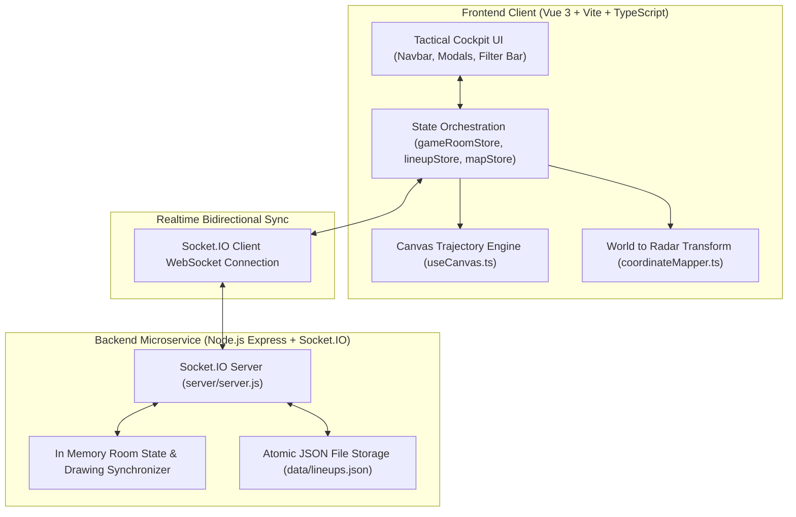

# CS2 Tactical Stratbook (CS2Nades)

**CS2 Tactical Stratbook** is a realtime, multiuser competitive playbook, interactive 2D vector radar, and grenade utility calculator built with Vue 3, Vite, TypeScript, and Socket.IO. It enables team captains and players to choreograph execute smokes, flashes, molotovs, and HE grenades across official Valve Counter-Strike 2 competitive maps.

[View Tactical & Ballistics Presentation Deck](../../presentation/applications.md)

---

## 1. Architectural Overview & Component Interaction

The application operates as a distributed system: a client-side reactive Single Page Application (SPA) communicating over authenticated WebSockets to a Node.js collaboration microservice, synchronized with local and cloud state stores:



---

## 2. Lineup Data Model & Storage Schema

Grenade lineup records are stored in a normalized, schema-validated JSON format supporting precise in-game execution, crosshair alignment, and visual trajectory overlays:

```json
{
  "id": "mirage-smoke-window-tspawn",
  "map": "de_mirage",
  "title": "T-Spawn to Mid Window Smoke",
  "type": "smoke",
  "team": "t",
  "throwType": "jumpthrow",
  "tickrate": "64_subtick",
  "startCoords": {
    "x": -1184.2,
    "y": -336.8,
    "z": -160.0
  },
  "targetCoords": {
    "x": -1120.0,
    "y": -1152.0,
    "z": -96.0
  },
  "radarPercentage": {
    "startX": 40.9,
    "startY": 40.1,
    "targetX": 42.2,
    "targetY": 55.9
  },
  "media": {
    "crosshairUrl": "/lineups/mirage/window_crosshair.webp",
    "standingUrl": "/lineups/mirage/window_stand.webp",
    "previewVideoUrl": "/lineups/mirage/window_preview.mp4"
  },
  "instructions": [
    "Wedge yourself into the trashcan corner in T-Spawn.",
    "Align crosshair with the tip of the wooden antenna railing.",
    "Perform a standard Jumpthrow (Space + -attack)."
  ]
}
```

---

## 3. Realtime Multiplayer WebSocket Protocol

Collaboration rooms support live shared drawing, strategy cards, and cursor tracking. The protocol uses defined Socket.IO event contracts:

| Event Name | Direction | Payload Schema | Description |
| :--- | :--- | :--- | :--- |
| `room:join` | Client $\rightarrow$ Server | `{roomId: string, user: UserProfile}` | Requests admission to a tactical session |
| `room:sync` | Server $\rightarrow$ Client | `{roomState: RoomData, lines: Stroke[]}` | Transmits full snapshot of current room whiteboard |
| `tactics:draw` | Client $\leftrightarrow$ Server | `{strokeId: string, points: Point[], color: string}` | Broadcasts vector drawing strokes in real-time |
| `tactics:clear` | Client $\leftrightarrow$ Server | `{roomId: string, layer: "all" \| "temp"}` | Wipes whiteboard strokes across all connected clients |
| `lineup:highlight`| Client $\leftrightarrow$ Server | `{lineupId: string, active: boolean}` | Highlights a designated lineup on team radars simultaneously |
| `cursor:move` | Client $\leftrightarrow$ Server | `{userId: string, x: number, y: number}` | Broadcasts teammate cursor positions at 30 Hz |

---

## 4. Key Engineering Highlights

| Module / System | Technology | Description |
| :--- | :--- | :--- |
| **Reactive State Engine** | Pinia (Vue 3 Composition API) | Centralizes synchronized tactical room sessions, active lineup filters, and user roles. |
| **Trajectory Physics Renderer** | HTML5 Canvas 2D + Cubic Béziers | Renders smooth parabolic grenade flight arcs with animated throw ticks, bounce colliders, and detonation rings. |
| **Source Engine Coordinate Math** | Valve `MapOverview` Matrix Transforms | Bidirectionally translates 3D in-game `setpos` coordinate vectors into normalized `(x%, y%)` radar points. |
| **Realtime Collaboration** | Socket.IO WebSockets | Sub-20ms multiuser tactical whiteboard synchronization with room tokens, host permissions, and drawing tools. |
| **PWA & Offline Reliability** | Vite PWA Plugin + LocalStorage | Allows full offline access to cached lineup lineups and tactical boards during LAN tournaments. |

---

## 5. Navigation & Subguides

- [**Vue 3 & Pinia Hierarchy**](components.md): Component breakdown, modals, views, and store data contracts.
- [**Vector Physics & Radar Calibration**](physics.md): Mathematical formulas for world-to-minimap conversion and cubic Bézier curve calculation.
- [**Source Code: `src/composables/useCanvas.ts`**](../../code/cs2nades/use-canvas-ts.md): Line-by-line breakdown of the canvas drawing engine.
- [**Source Code: `src/utils/coordinateMapper.ts`**](../../code/cs2nades/coordinate-mapper-ts.md): Line-by-line breakdown of Valve coordinate translation.
- [**Source Code: `src/stores/gameRoomStore.ts`**](../../code/cs2nades/game-room-store-ts.md): Line-by-line breakdown of the Pinia multiuser room store.
- [**Source Code: `server/server.js`**](../../code/cs2nades/server-js.md): Line-by-line breakdown of the Socket.IO collaboration server.
