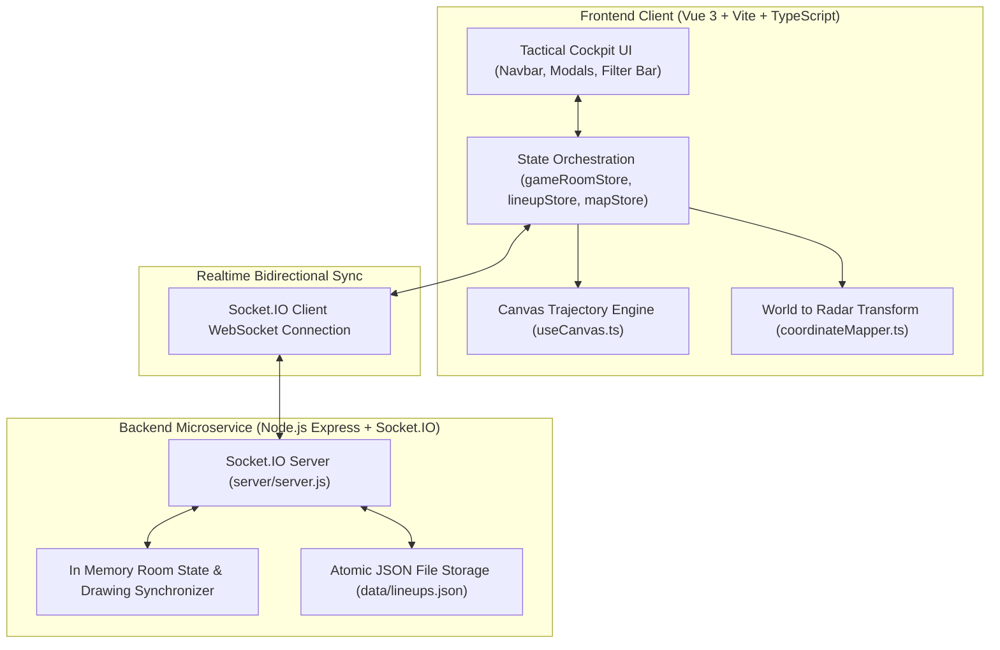

# CS2 Tactical Stratbook (CS2Nades)

## Architectural Overview

**CS2 Tactical Stratbook** is a realtime, multiuser competitive playbook, interactive 2D vector radar, and grenade utility calculator built with Vue 3, Vite, TypeScript, and Socket.IO. It enables team captains and players to choreograph execute smokes, flashes, molotovs, and HE grenades across official Valve Counter-Strike 2 competitive maps.

---

## Key Engineering Highlights

| Module / System | Technology | Description |
| :--- | :--- | :--- |
| **Reactive State Engine** | Pinia (Vue 3 Composition API) | Centralizes synchronized tactical room sessions, active lineup filters, and user roles. |
| **Trajectory Physics Renderer** | HTML5 Canvas 2D + Cubic Béziers | Renders smooth parabolic grenade flight arcs with animated throw ticks, bounce colliders, and detonation rings. |
| **Source Engine Coordinate Math** | Valve `MapOverview` Matrix Transforms | Bidirectionally translates 3D in-game `setpos` coordinate vectors into normalized `(x%, y%)` radar points. |
| **Realtime Collaboration** | Socket.IO WebSockets | Sub-20ms multiuser tactical whiteboard synchronization with room tokens, host permissions, and drawing tools. |
| **PWA & Offline Reliability** | Vite PWA Plugin + LocalStorage | Allows full offline access to cached lineup lineups and tactical boards during LAN tournaments. |

---

## Navigation & Subguides

- [**Vue 3 & Pinia Hierarchy**](components.md): Component breakdown, modals, views, and store data contracts.
- [**Vector Physics & Radar Calibration**](physics.md): Mathematical formulas for world-to-minimap conversion and cubic Bézier curve calculation.
- [**Source Code: `src/composables/useCanvas.ts`**](../../code/cs2nades/use-canvas-ts.md): Line-by-line breakdown of the canvas drawing engine.
- [**Source Code: `src/utils/coordinateMapper.ts`**](../../code/cs2nades/coordinate-mapper-ts.md): Line-by-line breakdown of Valve coordinate translation.
- [**Source Code: `src/stores/gameRoomStore.ts`**](../../code/cs2nades/game-room-store-ts.md): Line-by-line breakdown of the Pinia multiuser room store.
- [**Source Code: `server/server.js`**](../../code/cs2nades/server-js.md): Line-by-line breakdown of the Socket.IO collaboration server.
