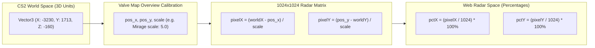

# CS2 Tactical Stratbook Physics Engine & Coordinate Math

## Coordinate Transformation Engine

Counter-Strike 2 represents world space using a 3D Cartesian coordinate system measured in Source Engine Hammer units ($1 \text{ unit} \approx 0.75 \text{ inches}$). In contrast, the tactical web radar renders onto a 2D surface normalized from $0\%$ to $100\%$.

---

## Mathematical Formulas

### 1. World to Radar Conversion (`worldToRadarCoords`)
Given in-game coordinates $(X_w, Y_w)$, and map calibration constants $(P_x, P_y, S)$:

$$\text{pixel}_x = \frac{X_w - P_x}{S}$$

$$\text{pixel}_y = \frac{P_y - Y_w}{S}$$

Converting to percentage coordinates $(X_{\%}, Y_{\%})$ on a standard $1024 \times 1024$ radar bitmap:

$$X_{\%} = \operatorname{clamp}\left(0, 100, \frac{\text{pixel}_x}{1024} \times 100\right)$$

$$Y_{\%} = \operatorname{clamp}\left(0, 100, \frac{\text{pixel}_y}{1024} \times 100\right)$$

### 2. Radar to World Conversion (`radarToWorldCoords`)
Reversing the transformation allows user clicks on the web minimap to generate valid CS2 console teleport commands:

$$\text{pixel}_x = \frac{X_{\%}}{100} \times 1024$$

$$\text{pixel}_y = \frac{Y_{\%}}{100} \times 1024$$

$$X_w = P_x + (\text{pixel}_x \times S)$$

$$Y_w = P_y - (\text{pixel}_y \times S)$$

---

## Official Valve Map Calibration Parameters

Extracted directly from Valve game files (`csgo/resource/overviews/*.txt`):

| Map Name | `pos_x` (Origin X) | `pos_y` (Origin Y) | `scale` (Unit Scaling) |
| :--- | :--- | :--- | :--- |
| **de_mirage** | `-3230` | `1713` | `5.00` |
| **de_dust2** | `-2476` | `3239` | `4.40` |
| **de_inferno** | `-2087` | `3870` | `4.90` |
| **de_nuke** | `-3453` | `2887` | `7.00` |
| **de_ancient** | `-2953` | `2164` | `5.00` |
| **de_anubis** | `-2796` | `3328` | `5.22` |
| **de_vertigo** | `-3168` | `1762` | `4.00` |
| **de_overpass** | `-4831` | `1781` | `5.20` |
| **de_train** | `-2477` | `2554` | `4.70` |

---

## Parabolic Trajectory Physics (Cubic Bézier Approximation)

In Counter-Strike 2, grenade flight paths follow gravitational projectile motion with drag and bounce energy attenuation. On the 2D tactical board, this flight arc is approximated using <a href="../../concepts/cubic-bezier-physics.md" class="pt-concept" data-tooltip="Bernstein cubic polynomials calculating ballistic grenade parabolic arcs in 2D space.">cubic Bézier curves</a>:

$$B(t) = (1-t)^3 P_0 + 3(1-t)^2 t P_1 + 3(1-t) t^2 P_2 + t^3 P_3 \quad \text{for } t \in [0, 1]$$

Where:
- $P_0$: Thrower origin position $(X_0, Y_0)$
- $P_1, P_2$: Apex control points elevated perpendicular to the direct travel vector to simulate trajectory height and arc curvature
- $P_3$: Grenade landing/detonation point $(X_3, Y_3)$

For detailed source code implementation, see [**`useCanvas.ts` Source Breakdown**](../../code/cs2nades/use-canvas-ts.md) and the comprehensive [**Cubic Bézier Physics Reference**](../../concepts/cubic-bezier-physics.md).
