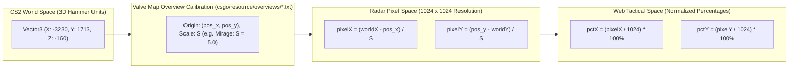

# CS2 Tactical Stratbook Physics Engine & Coordinate Math

This document details the mathematical algorithms and coordinate transformations powering the **CS2 Tactical Stratbook**. The engine resolves three core spatial problems:
1. Translating arbitrary 3D Source 2 in-game world positions into normalized 2D minimap percentage coordinates.
2. Generating valid in-game console commands (`setpos`, `setang`) from minimap click interactions.
3. Calculating smooth, ballistically accurate parabolic trajectory flight paths on an HTML5 Canvas using cubic Bézier approximations and kinematic physics parameters.

---

## 1. Coordinate Transformation Architecture

Counter-Strike 2 represents world space using a 3D Cartesian coordinate system measured in Source Engine Hammer units ($1 \text{ unit} \approx 0.75 \text{ inches}$ or $1.905 \text{ cm}$). The origin $(0, 0, 0)$ is placed arbitrarily by map authors during level design. In contrast, the tactical web radar renders onto an HTML5 Canvas surface normalized from $0\%$ to $100\%$ ($1024 \times 1024$ native pixel resolution).



---

## 2. Mathematical Coordinate Conversion Formulas

### 1. World to Radar Conversion (`worldToRadarCoords`)
Given in-game coordinates $(X_w, Y_w)$, and map calibration constants $(P_x, P_y, S)$:

$$\text{pixel}_x = \frac{X_w - P_x}{S}$$

$$\text{pixel}_y = \frac{P_y - Y_w}{S}$$

> [!NOTE] Inversion of the Y-Axis
> Notice that the in-game $Y$-axis increases northwards, whereas 2D web canvas pixel space increases southwards (from top to bottom). Therefore, the $Y$ transformation subtracts $Y_w$ from origin $P_y$.

Converting to percentage coordinates $(X_{\%}, Y_{\%})$ on a standard $1024 \times 1024$ radar bitmap:

$$X_{\%} = \operatorname{clamp}\left(0, 100, \frac{\text{pixel}_x}{1024} \times 100\right)$$

$$Y_{\%} = \operatorname{clamp}\left(0, 100, \frac{\text{pixel}_y}{1024} \times 100\right)$$

### 2. Radar to World Conversion (`radarToWorldCoords`)
Reversing the transformation allows user clicks on the web minimap to generate valid CS2 console teleport commands:

$$\text{pixel}_x = \frac{X_{\%}}{100} \times 1024$$

$$\text{pixel}_y = \frac{Y_{\%}}{100} \times 1024$$

$$X_w = P_x + (\text{pixel}_x \times S)$$

$$Y_w = P_y - (\text{pixel}_y \times S)$$

The generated console string formatted for the CS2 developer console:
```text
setpos X_w Y_w Z_w; setang Pitch Yaw 0
```

---

## 3. Official Valve Map Calibration Parameters

These constants are parsed directly from Valve's official game files (`csgo/resource/overviews/*.txt`). Any deviation in `pos_x`, `pos_y`, or `scale` results in radar alignment drift:

| Map Name | `pos_x` (Origin X) | `pos_y` (Origin Y) | `scale` (Hammer Units per Pixel) | Map Extents (World Units) |
| :--- | :--- | :--- | :--- | :--- |
| **de_mirage** | `-3230` | `1713` | `5.00` | $5120 \times 5120$ units |
| **de_dust2** | `-2476` | `3239` | `4.40` | $4505 \times 4505$ units |
| **de_inferno** | `-2087` | `3870` | `4.90` | $5017 \times 5017$ units |
| **de_nuke** | `-3453` | `2887` | `7.00` | $7168 \times 7168$ units |
| **de_ancient** | `-2953` | `2164` | `5.00` | $5120 \times 5120$ units |
| **de_anubis** | `-2796` | `3328` | `5.22` | $5345 \times 5345$ units |
| **de_vertigo** | `-3168` | `1762` | `4.00` | $4096 \times 4096$ units |
| **de_overpass** | `-4831` | `1781` | `5.20` | $5324 \times 5324$ units |
| **de_train** | `-2477` | `2554` | `4.70` | $4812 \times 4812$ units |

---

## 4. Parabolic Trajectory Physics (Cubic Bézier Approximation)

In Counter-Strike 2, grenade flight paths follow gravitational projectile motion with drag and bounce energy attenuation governed by the Source 2 physics engine:

### Valve Ballistic Constants
- **Gravity Acceleration ($g$)**: $800.0\text{ units/s}^2$
- **Base Grenade Velocity ($v_0$)**: $1200\text{ units/s}$ (Standing primary throw)
- **Jump Throw Vertical Boost**: $+300\text{ units/s}$ vertical impulse added at jump apex
- **Air Drag Coefficient ($\rho$)**: Velocity decay factor of $0.98$ applied every tick

### 2D Projection using Cubic Bézier Curves
On a 2D tactical whiteboard, full 3D simulation with wall meshes is computationally excessive. Instead, we project the parabolic arc onto 2D space using a parametric <a href="../../concepts/cubic-bezier-physics.md" class="pt-concept" data-tooltip="Bernstein cubic polynomials calculating ballistic grenade parabolic arcs in 2D space.">cubic Bézier curve</a>:

$$B(t) = (1-t)^3 P_0 + 3(1-t)^2 t P_1 + 3(1-t) t^2 P_2 + t^3 P_3 \quad \text{for } t \in [0, 1]$$

Where:
- $P_0 = (X_0, Y_0)$: Player standing throw origin
- $P_3 = (X_3, Y_3)$: Grenade detonation/landing point
- $P_1, P_2$: Apex control points calculated by elevating perpendicular to the travel vector $\vec{D}$

### Derivation of Perpendicular Control Points ($P_1, P_2$)

1. **Calculate the Displacement Vector ($\vec{D}$)**:
   $$\vec{D} = (X_3 - X_0, Y_3 - Y_0)$$
   $$\|\vec{D}\| = \sqrt{(X_3 - X_0)^2 + (Y_3 - Y_0)^2}$$

2. **Compute Normalized Orthogonal Normal Vector ($\hat{N}$)**:
   $$\vec{N} = (-D_y, D_x)$$
   $$\hat{N} = \left(\frac{-D_y}{\|\vec{D}\|}, \frac{D_x}{\|\vec{D}\|}\right)$$

3. **Calculate Parabolic Height Factor ($h$)**:
   The arc curvature height scales proportionally with flight distance:
   $$h = \min(0.28 \times \|\vec{D}\|, 120.0)$$

4. **Derive Control Points Along Trisection**:
   $$P_1 = P_0 + \frac{1}{3}\vec{D} + h \hat{N}$$
   $$P_2 = P_0 + \frac{2}{3}\vec{D} + h \hat{N}$$

```mermaid
graph TD
    P0["P0: Thrower Origin (X0, Y0)"] -->|1/3 Distance + Apex Elevation| P1["P1: First Control Point"]
    P1 -->|Cubic Bézier Polynomial B(t)| P2["P2: Second Control Point"]
    P2 -->|Final Arc Descent| P3["P3: Detonation Point (X3, Y3)"]
```

---

## 5. Canvas Animation Loop & Pulse Rendering

In `useCanvas.ts`, animated pulses travel along the trajectory to visualize the direction of grenade flight. Rather than recalculating math per frame, the curve is sampled at 100 discrete points ($t = 0.00, 0.01, \dots, 1.00$) and cached in memory.

```typescript
// Sampled Trajectory Arc Calculation
export function getBezierPoint(
  p0: Point, p1: Point, p2: Point, p3: Point, t: number
): Point {
  const u = 1 - t;
  const tt = t * t;
  const uu = u * u;
  const uuu = uu * u;
  const ttt = tt * t;

  return {
    x: uuu * p0.x + 3 * uu * t * p1.x + 3 * u * tt * p2.x + ttt * p3.x,
    y: uuu * p0.y + 3 * uu * t * p1.y + 3 * u * tt * p2.y + ttt * p3.y
  };
}
```

This caching achieves constant $O(1)$ lookup time per frame during 60 FPS animation updates on low-powered mobile devices.

For the complete implementation, inspect the [**`useCanvas.ts` Source Breakdown**](../../code/cs2nades/use-canvas-ts.md) and [**`coordinateMapper.ts` Source Breakdown**](../../code/cs2nades/coordinate-mapper-ts.md).
