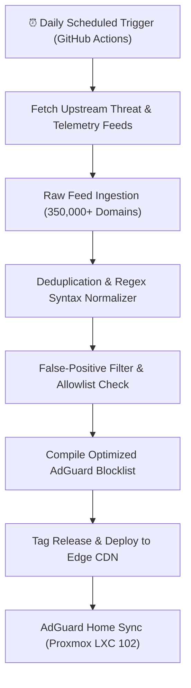

# DNSfilters Automated Blocklist CI/CD

An automated pipeline compiling, deduplicating, and validating hundreds of thousands of domain rules for network-wide privacy protection and telemetry blocking on AdGuard Home.

---

## 1. Automated CI/CD Workflow

---

## 2. Key Performance Metrics

* **Domain Throughput:** 350,000+ domain entries processed in under 45 seconds.
* **Latency Overhead:** Zero network latency impact via native local DNS cache lookups.
* **Network Coverage:** Protects all IoT devices, Smart TVs, gaming consoles, and Proxmox containers across Gigabit LAN.
