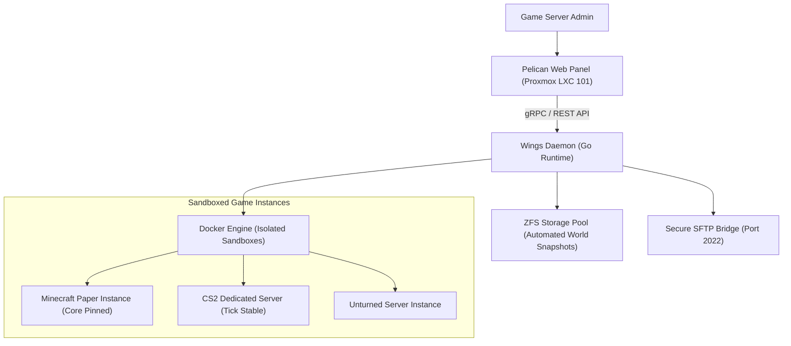

# Pelican Game Server Panel & Node Daemon

A next-generation game server container orchestration node on Proxmox LXC providing sandboxed Docker runtimes for Minecraft, CS2, and Unturned dedicated servers.

---

## 1. Container & Daemon Architecture

---

## 2. Resource Quotas & Isolation

* **Core Pinning:** CPU affinity pinning prevents game tick stutters during heavy background operations.
* **Storage Snapshots:** Daily atomic ZFS snapshots backup world and player state without taking servers offline.
