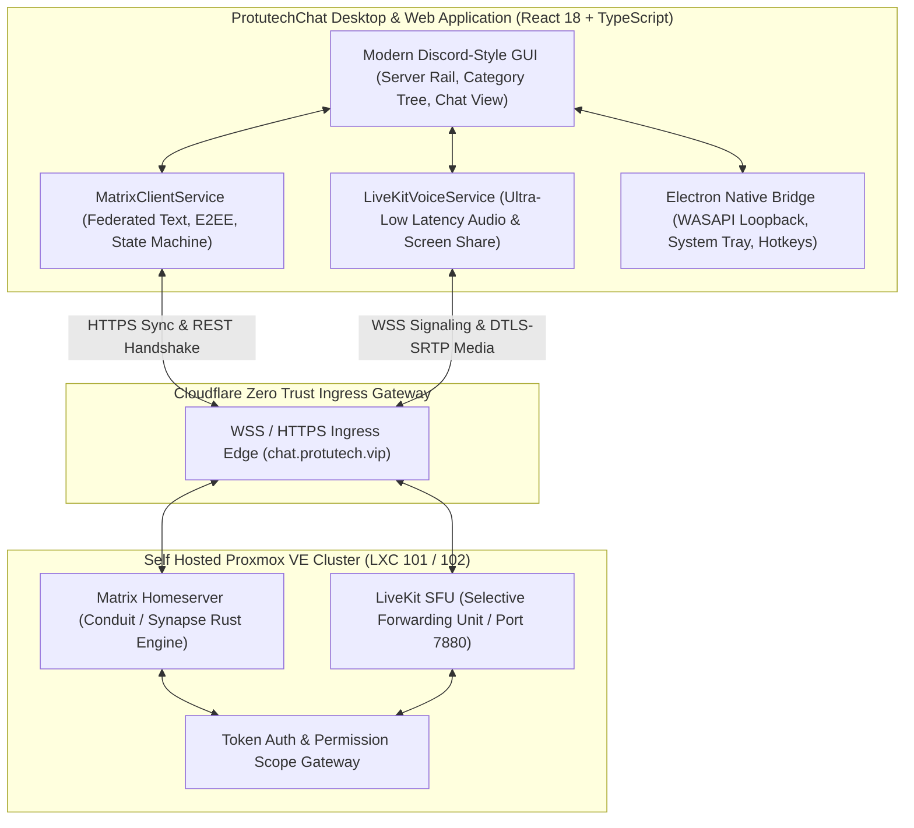
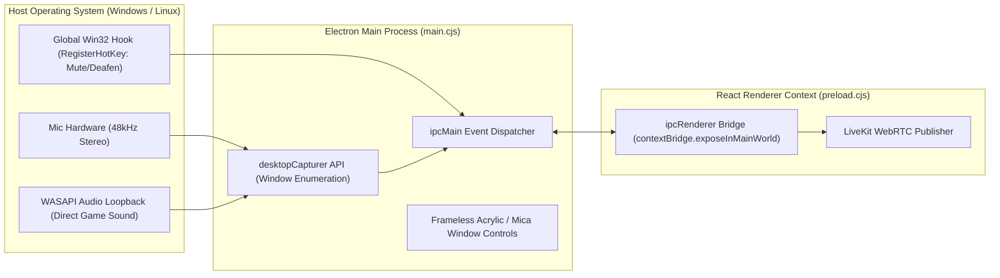

# ProtutechChat Unified Communications Platform

**ProtutechChat** is an enterprise-grade, self hosted communications platform engineered to provide the fluid visual experience and ergonomics of Discord paired with the sovereignty and decentralized security of the <a href="../../concepts/matrix-protocol.md" class="pt-concept" data-tooltip="Federated Matrix Client-Server specification with DAG event state resolution and Olm/Megolm E2EE.">Matrix Protocol</a> and <a href="../../concepts/webrtc-sfu.md" class="pt-concept" data-tooltip="Selective Forwarding Unit audio/video routing without server-side transcoding overhead.">LiveKit WebRTC</a>. Built as a dual-target codebase (Web SPA and native desktop Electron host), it unifies encrypted text channels, low latency voice lounges, and 60 FPS screen sharing into a single homelab-hosted ecosystem.

[View Unified Communications Presentation Deck](../../presentation/applications.md)

---

## 1. System Topology & Dual-Engine Architecture

---

## 2. Text Synchronization Engine vs Media Voice Engine

ProtutechChat deliberately bifurcates text communications from real-time audio/video media:

| Architectural Domain | Text & Channel Messaging | Voice & Screen Streaming |
| :--- | :--- | :--- |
| **Core Protocol** | Matrix Client-Server API v1.11 | WebRTC / Selective Forwarding Unit (SFU) |
| **Transport Layer** | HTTP/2 & HTTPS Long Polling / Sliding Sync | UDP Datagrams over DTLS-SRTP (RFC 5764) |
| **State Persistence** | SQLite / RocksDB on Proxmox ZFS | Ephemeral (Zero database persistence) |
| **Latency Profile** | $80\text{ ms} - 250\text{ ms}$ (Eventual Consistency) | $< 30\text{ ms}$ (Real-time media streaming) |
| **Security Mechanism** | Olm / Megolm Double Ratchet E2EE | Per-Room JWT Tokens & WebRTC DTLS Certificates |
| **Audio Quality** | Embedded voice notes (`mxc://` audio) | 48kHz Stereo Fullband Audio ($128\text{ kbps}$) |

---

## 3. High-Performance Virtualized Message List

To prevent browser memory bloat and frame drops in channels containing tens of thousands of messages, ProtutechChat implements a custom DOM virtualization pipeline:

- **Viewport Windowing**: Only the 40 messages currently visible in the user's viewport (plus 10 overscan buffer elements above and below) exist in the browser DOM at any time.
- **Dynamic Height Calculation**: Unmeasured messages are rendered into an offscreen scratch node, their bounding heights are cached by event ID, and total scrollable height is preserved using CSS margin spacers.
- **Scroll Pinning**: When reading historical messages and new messages arrive, the scroll position remains anchored to the active reading position without disruptive viewport jumps.

---

## 4. Native Desktop Host Subsystem (Electron IPC)

When running inside the desktop client wrapper (`desktop/main.cjs`), ProtutechChat activates deep OS-level native capabilities unavailable in standard web browsers:

### Key Native Capabilities

1. **WASAPI System Audio Loopback**: Standard browsers cannot capture desktop audio when screen sharing games. ProtutechChat uses Windows CoreAudio WASAPI loopback streams to transmit bit-perfect game sound alongside 60 FPS video.
2. **Global Input Hooks**: Hotkeys (`Ctrl+Shift+M` for mute, `Ctrl+Shift+D` for deafen) function globally even when CS2 or another fullscreen game is in focus.
3. **Chromium Audio Optimization Flags**:
   - `--autoplay-policy=no-user-gesture-required`: Audio channels play immediately upon joining.
   - `--enable-features=WebRTCPCM16kAudio,WebRTC-H264WithOpenH264FFmpeg`: Hardware accelerated video encoding and low latency audio packet processing.

---

## 5. Navigation & Subguides

- [**Services & State Machine**](modules.md): Long-polling event loop, room caching, and state synchronization.
- [**LiveKit WebRTC & Desktop IPC**](integrations.md): Voice engine architecture, WASAPI loopback capture, and native hardware optimization.
- [**Source Code: `src/services/matrix.ts`**](../../code/protutechchat/matrix-ts.md): Line-by-line breakdown of the federated Matrix client.
- [**Source Code: `src/services/livekit.ts`**](../../code/protutechchat/livekit-ts.md): Line-by-line breakdown of the LiveKit voice engine.
- [**Source Code: `desktop/main.cjs`**](../../code/protutechchat/main-cjs.md): Line-by-line breakdown of the Electron native desktop host.
