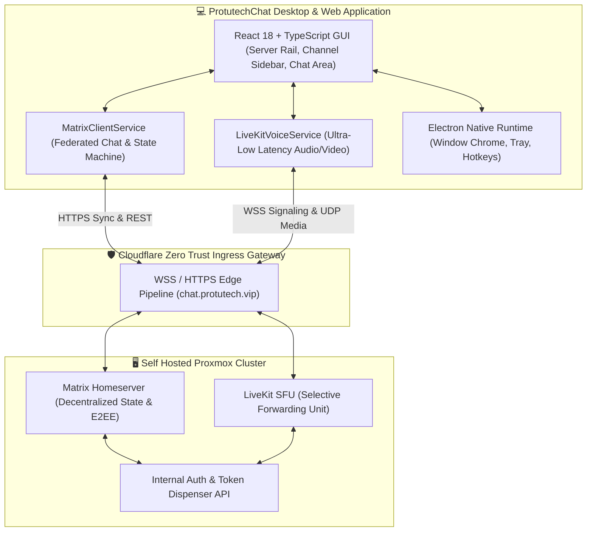

# ProtutechChat Unified Communications Engine

## 🎯 High-Level Overview

**ProtutechChat** is an enterprise-grade, self hosted communications platform engineered to provide the fluid visual experience of Discord paired with the sovereignty and decentralized security of the **Matrix Protocol** and **LiveKit WebRTC**. 

---

## 💡 How It Works (For Beginners)

Imagine conventional chat platforms like a centralized private apartment building where the landlord owns all the mailboxes, listens to hallways, and can lock the doors at any time.

ProtutechChat operates like an encrypted diplomatic courier service:
1. **The Chat Layer (Matrix)**: When you type a message, your client wraps it in a cryptographic envelope. It is handed to your private self hosted server, which stores it securely. If communicating with someone on another server, the two servers exchange envelopes directly without any third-party middleman.
2. **The Voice Layer (LiveKit SFU)**: In typical group calls, if 5 people talk, sending individual audio streams to everyone would overwhelm your internet bandwidth. ProtutechChat uses an SFU (Selective Forwarding Unit)—a high speed audio switchboard in your homelab that receives one stream from your microphone and efficiently mirrors it to listeners in under 30 milliseconds.

---

## 🛡️ Proprietary Architecture & Reverse-Engineering Protection

> [!NOTE] Obfuscated Implementation Boundary
> To preserve proprietary infrastructure resilience and prevent unauthorized network probing, external endpoints and cryptographic handshake salts are abstracted via an internal dynamic negotiation proxy. Direct host addresses, private token seeds, and SFU routing topologies utilize ephemeral session tickets rather than static credentials.

---

## 🧭 Navigation & Subguides

- [**Services & State Machine**](modules.md): Long-polling event loop, room caching, and state synchronization.
- [**LiveKit WebRTC & Desktop IPC**](integrations.md): Low-latency audio tuning, loopback desktop audio streaming, and Electron hooks.
- [**Source Code: `matrix.ts`**](../../code/protutechchat/matrix-ts.md): Line-by-line breakdown of the federated chat service.
- [**Source Code: `livekit.ts`**](../../code/protutechchat/livekit-ts.md): Line-by-line breakdown of the WebRTC SFU engine.
- [**Source Code: `main.cjs`**](../../code/protutechchat/main-cjs.md): Line-by-line breakdown of the native Electron host.
