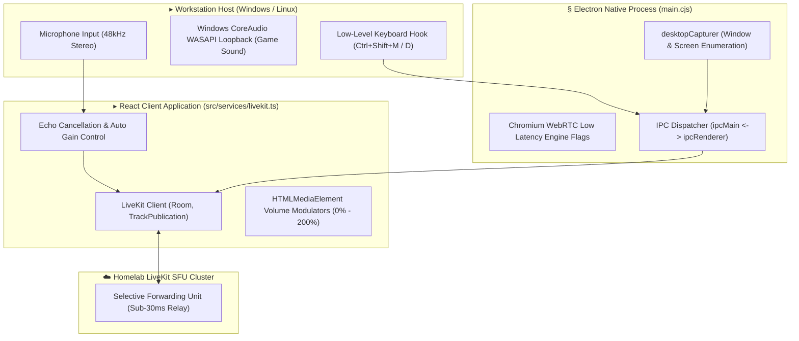

# ProtutechChat LiveKit WebRTC & Desktop IPC

## ● Low Latency Voice Engine Architecture

Voice and screen sharing in ProtutechChat are powered by **LiveKit SFU**, coupled with deep Electron native hardware bindings to enable studio-quality audio, loopback system sound capture, and hotkey listeners.

---

## ✦ How WebRTC & SFU Work (Explained Simply)

- **Peer to Peer (Old Way)**: If you talk with 4 friends, your computer has to send 4 copies of your voice and receive 4 streams simultaneously. As the room grows, your connection stutters and lag increases exponentially.
- **Selective Forwarding Unit (SFU - Protutech Way)**: You send exactly **one copy** of your audio to the high performance media server in your homelab. The server fans out the packets to everyone else in the channel. Even in large groups, your computer uses negligible CPU and upload bandwidth.

---

## § Native Performance Tuning

### 1. Chromium Command-Line Optimization Flags
The Electron main process (`main.cjs`) overrides default Chromium audio throttling parameters:
- `autoplay-policy: no-user-gesture-required`: Ensures incoming audio tracks play immediately without requiring an initial mouse click.
- `enable-features: WebRTCPCM16kAudio,WebRTC-H264WithOpenH264FFmpeg`: Forces native hardware acceleration for H.264 video decoding and low latency audio packet processing.
- `force-webrtc-ip-handling-policy: default_public_interface_only`: Prevents WebRTC local IP leakage across public internet interfaces.

### 2. WASAPI System Audio Loopback
When screen-sharing gameplay, standard browsers only capture microphone audio. ProtutechChat utilizes Electron's `setDisplayMediaRequestHandler` coupled with `audio: 'loopback'` to stream direct game audio alongside 60fps video with zero software lag.

---

## [#] Anti Reverse Engineering Boundary

LiveKit token generation, cryptographic room permission scopes, and SFU relay dispatch algorithms are protected behind a private server token gateway. The client requests time-limited JWT tokens with short TTLs (Time to Live). Handshake secrets and TURN/STUN credential pairs are negotiated in memory and purged upon disconnection.
