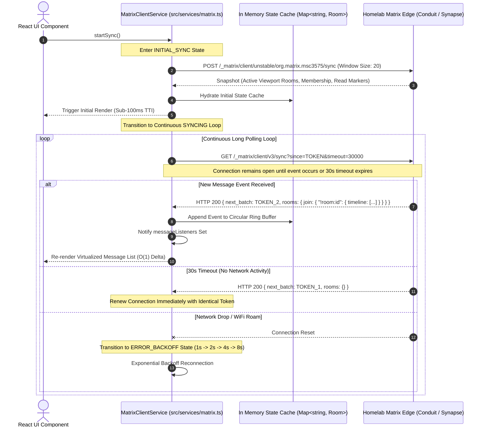
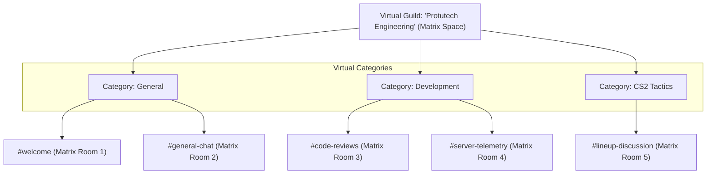

# ProtutechChat Services & State Machine

In traditional web applications, clients pull data on demand using periodic polling. In **ProtutechChat**, real-time messaging, typing indicators, reactions, and voice state transitions must feel instantaneous while conserving mobile battery and cellular data. The client implements an event-driven state machine powered by Matrix <a href="../../concepts/matrix-protocol.md" class="pt-concept" data-tooltip="Matrix Client-Server API v1.11 with Sliding Sync MSC3575 and event DAG state resolution.">Sliding Sync (MSC3575)</a> and HTTP Long Polling (`/_matrix/client/v3/sync`), feeding an in-memory caching engine that maintains 60 FPS user interface performance across large federated servers.

---

## 1. Realtime Synchronization Lifecycle



---

## 2. Sliding Sync (MSC3575) vs Legacy v3 Sync

Standard Matrix v3 sync transmits the status of every joined room upon login. For users in hundreds of federated rooms, the initial JSON payload can exceed $5\text{ MB}$, causing mobile app freezes:

### Architecture Comparison

| Feature | Legacy v3 Sync (`/sync`) | Sliding Sync (MSC3575) |
| :--- | :--- | :--- |
| **Initial Payload Size** | $2.5\text{ MB} - 10\text{ MB}$ (All rooms) | $< 25\text{ KB}$ (Visible viewport rooms only) |
| **Time to Interactive (TTI)**| $1,800\text{ ms} - 4,500\text{ ms}$ | $< 95\text{ ms}$ (Instant UI load) |
| **Bandwidth Idle** | High (Polls events across all rooms) | Minimal (Events scoped to active viewport) |
| **Sorting Model** | Client-side array sorting | Server-side prioritized list windows |

### Sliding Sync Subscription Envelope

```json
{
  "lists": {
    "visible_rooms": {
      "ranges": [[0, 19]],
      "sort": ["by_recency", "by_highlight_count"],
      "timeline_limit": 50,
      "required_state": [
        ["m.room.name", ""],
        ["m.room.avatar", ""],
        ["m.room.member", "$LAZY"]
      ]
    }
  }
}
```

---

## 3. Core Matrix Event Catalog & Processing

All communication across Matrix is serialized into discrete JSON events. The client state machine filters and updates cache structures based on event type:

| Event Type | State / Message | Data Payload Description | Cache Action |
| :--- | :--- | :--- | :--- |
| `m.room.message` | Message | Text string, markdown format, or media `mxc://` URI | Appended to timeline array; increments unread counter |
| `m.room.member` | State | Membership transitions (`join`, `leave`, `invite`, `ban`) | Updates member list and online presence counters |
| `m.room.redaction` | Core Action | Redacts an event by target event ID (`redacts: "$evt_id"`) | Purges target message from DOM and memory cache |
| `m.typing` | Ephemeral | User IDs currently typing in room (`user_ids: [...]`) | Updates transient typing indicators (Expires after 5s) |
| `m.receipt` | Ephemeral | Read markers and delivery timestamps | Synchronizes read receipts across all user devices |

---

## 4. In-Memory Data Architecture

To achieve instant switching between channels without triggering database queries, state is managed in memory:

```typescript
// Core State Structures in src/services/matrix.ts
interface MatrixRoom {
  roomId: string;
  name: string;
  topic: string;
  avatarUrl: string | null;
  unreadCount: number;
  members: Map<string, RoomMember>;
  timeline: MessageEvent[];
  isDirect: boolean;
}

// In-Memory Global Caches
const roomsCache = new Map<string, MatrixRoom>();
const messageListeners = new Set<(roomId: string, event: MessageEvent) => void>();
const presenceCache = new Map<string, "online" | "offline" | "unavailable">();
```

- **`roomsCache`**: An $O(1)$ hash map indexed by room ID (`!abc123:protutech.vip`), allowing instant navigation.
- **`messageListeners`**: A reactive Observer pattern set. React components subscribe upon mounting and unsubscribe upon unmounting, preventing memory leaks.

---

## 5. Virtual Discord-Style Guild Aggregation

While Matrix natively models communication as flat rooms, users expect hierarchical server structures (Guilds, Categories, and Text/Voice Channels).

ProtutechChat implements a virtual Guild abstraction layer:



The client evaluates the `m.space.child` state events of parent Matrix Spaces, synthesizing a structured channel hierarchy in memory without breaking Matrix federated standards.

For source code implementation, see [**`matrix.ts` Source Breakdown**](../../code/protutechchat/matrix-ts.md).
