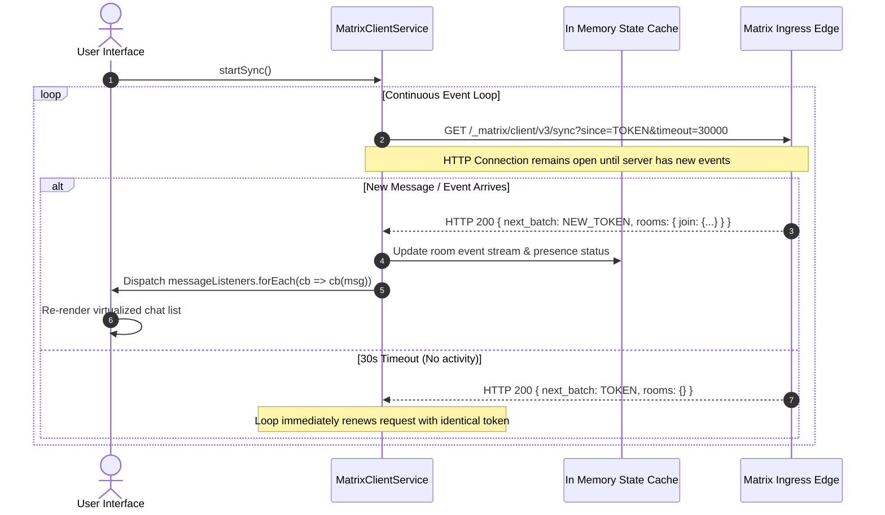

# ProtutechChat Services & State Machine

## 🔄 The Realtime Synchronization Engine

In standard web applications, clients pull data on demand. In ProtutechChat, communication must feel instantaneous. The client employs a continuous **Sliding-Sync / Long Polling loop** paired with an in memory cache to maintain snappy UI performance even across large servers with thousands of messages.

---

## 💡 How Long Polling Works (Explained Simply)

Imagine sitting in a quiet room waiting for a letter. 
- **The inefficient way (Polling)**: You run outside to your mailbox every 2 seconds, check if it's empty, and run back inside. This wastes energy and wears out your door.
- **The Protutech way (Long Polling)**: You walk up to the postal carrier and say: *"I will stand here. The moment you have a letter for me, hand it over. If 30 seconds pass and you have nothing, tell me so I know you didn't leave."* The moment mail arrives, it is handed over instantly with zero wasted round-trips.

---

## 🏛️ In Memory Architecture & Data Structures

| Data Structure | Type | Purpose |
| :--- | :--- | :--- |
| `roomsCache` | `Map<string, MatrixRoom>` | O(1) room metadata lookup (display name, avatar, member count, unread badge). |
| `guildsCache` | `Map<string, DiscordGuild>` | Aggregates rooms grouped by custom virtual Discord-style servers. |
| `messageListeners` | `Set<(roomId, msg) => void>` | Reactive pub/sub subscriber list notifying React components of incoming events. |
| `syncToken` | `string` (Batch Cursor) | Ephemeral bookmark tracking exact event timeline position. |

---

## 🛡️ Anti Reverse Engineering Boundary

The internal state machine incorporates dynamic message normalization layers. Incoming raw protocol envelopes (containing diverse event types like `m.room.message`, `m.room.redaction`, and `m.presence`) are passed through an internal mapping transformer that converts them into streamlined interface representations before passing them to the React component tree. Raw wire schemas are never exposed directly to external client plugins.
