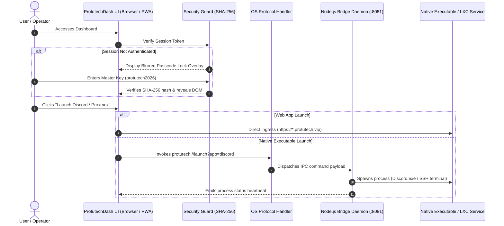

# Protutech Suite Dashboard & Launcher

An Adobe Creative Cloud-style unified application launcher, periodic table cockpit, and native protocol bridge orchestrating all self-hosted homelab applications.

---

## 1. System Architecture

The dashboard serves as the central cockpit for all Protutech microservices. It operates either as a standalone Web PWA or as an enhanced desktop application communicating with a localhost Node.js daemon via custom URL protocols (`protutech://`).



---

## 2. Component Breakdown

| Layer | Technology | Function |
| :--- | :--- | :--- |
| **Frontend Core** | Vanilla ESNext JavaScript | Zero-framework high-speed rendering, periodic table layout engine |
| **Styling Tokens** | CSS3 Custom Properties | Dynamic theme switching (Obsidian Neon, Adobe Classic, Cyber Emerald) |
| **Offline Engine** | Service Worker (`sw.js`) | Offline shell caching, manifest PWA installation |
| **Security Guard** | `security-guard.js` | Anti-inspection, F12 suppression, right-click lock, SHA-256 gate |
| **Native Bridge** | Node.js Companion Daemon | Localhost HTTP/IPC listener handling `protutech://` URI execution |

---

## 3. Custom Protocol Handler Bridge Implementation

=== "JavaScript (Browser Dispatcher)"

    ```javascript
    // Dispatches desktop executable command to native bridge
    function launchNativeExecutable(appId, exePath) {
      const payload = encodeURIComponent(JSON.stringify({ appId, exePath, ts: Date.now() }));
      const customUri = `protutech://launch?payload=${payload}`; // (1)!
      
      // Fallback detection if companion daemon is not running
      const start = Date.now();
      window.location.href = customUri;
      
      setTimeout(() => {
        if (Date.now() - start < 1500) {
          console.warn("Companion daemon not detected. Launching web fallback.");
          window.open(appFallbacks[appId], '_blank'); // (2)!
        }
      }, 1000);
    }
    ```

    1. Encodes the application execution intent into the custom OS protocol URI.
    2. Gracefully falls back to web/browser interface if the desktop daemon is offline.

=== "Node.js (Companion Daemon Listener)"

    ```javascript
    import http from 'http';
    import { spawn } from 'child_process';

    const server = http.createServer((req, res) => {
      if (req.url.startsWith('/launch')) {
        const urlParams = new URLSearchParams(req.url.split('?')[1]);
        const app = urlParams.get('app');
        
        if (ALLOWED_APPS[app]) {
          spawn(ALLOWED_APPS[app].binary, [], { detached: true, stdio: 'ignore' }).unref();
          res.writeHead(200, { 'Content-Type': 'application/json' });
          res.end(JSON.stringify({ status: 'launched', app }));
        }
      }
    });

    server.listen(8081, '127.0.0.1');
    ```
