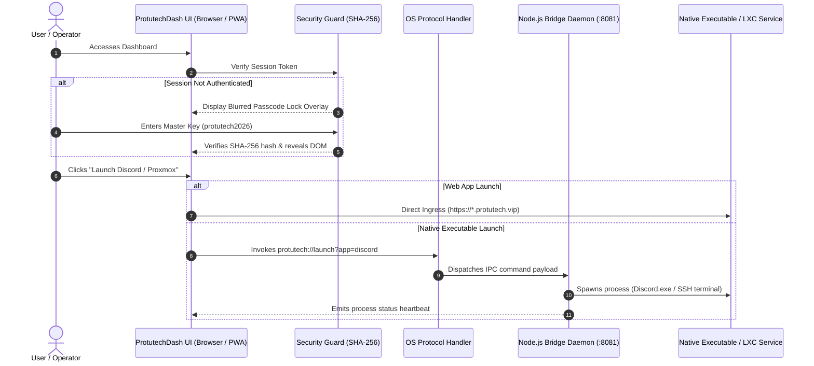

# Protutech Suite Dashboard & Cross-Platform Launcher

An Adobe Creative Cloud-style unified application launcher, periodic table cockpit, and native protocol bridge orchestrating all self-hosted homelab applications.

---

## 🏛️ System Architecture & Execution Flow



---

## 📂 Subfolder Structure & Module Breakdown

```text
protutechdash/
├── 📁 desktop/             # Native Windows desktop integration & protocol handling
│   ├── launch-helper.bat   # Windows shell helper for background process launching
│   ├── protutech-bridge.js # Localhost Node.js HTTP/IPC companion daemon (:8081)
│   └── protutech-protocol.bat # Windows Registry custom URI protocol installer (protutech://)
├── 📁 src/                 # Application source code & UI logic
│   ├── app.js              # Core application engine, periodic table renderer & theme manager
│   ├── security-guard.js   # Universal client anti-inspection guard & SHA-256 lock gate
│   └── styles.css          # Design system styling tokens (Obsidian, Adobe Classic, Cyber Emerald)
├── 📁 data/                # Static application catalogs & metadata
│   └── default-apps.json   # Seed catalog of default homelab services, ports, and icons
├── 📁 embed/               # Embeddable widgets & mini-launchers for third-party pages
│   ├── demo-app.html       # Standalone testing harness for embedding launcher widgets
│   └── protutech-launcher.js # Drop-in embed script for external homelab dashboards
├── 📁 scripts/             # Build and deployment utilities
│   └── obfuscate.js        # JavaScript Obfuscator pipeline with Control Flow Flattening
├── 📁 dist/                # Production distribution bundles (Mangled & Scrambled)
│   ├── app.min.js          # Obfuscated core application script
│   └── security-guard.min.js # Obfuscated security guard bundle
├── index.html              # Main single-page interface & periodic table DOM container
├── manifest.json           # Progressive Web App (PWA) manifest configuration
└── sw.js                   # Service Worker script for offline shell caching
```

---

## 🔍 Line-by-Line Code Breakdown

### 1. `src/app.js` — Core Rendering & State Loop

```javascript linenums="1"
// ── Theme State Management ──
function applyTheme(themeName, paletteName) {
  document.documentElement.setAttribute('data-theme', themeName); // (1)!
  document.documentElement.setAttribute('data-palette', paletteName); // (2)!
  localStorage.setItem('protutech_theme_mode', themeName); // (3)!
  localStorage.setItem('protutech_theme_palette', paletteName); // (4)!
  window.dispatchEvent(new CustomEvent('protutech:themechange', { detail: { themeName, paletteName } })); // (5)!
}

// ── Periodic Table Element Generator ──
function renderPeriodicElement(app, index) {
  const el = document.createElement('div'); // (6)!
  el.className = 'pt-element-card';
  el.dataset.appId = app.id;
  el.style.setProperty('--card-accent', app.color || '#00f2fe'); // (7)!

  el.innerHTML = `
    <div class="pt-element-number">${index + 1}</div>
    <div class="pt-element-symbol">${app.code}</div>
    <div class="pt-element-name">${app.name}</div>
    <div class="pt-element-weight">${app.category}</div>
  `; // (8)!

  el.addEventListener('click', () => handleAppClick(app)); // (9)!
  return el;
}
```

1. Sets the top-level HTML `data-theme` attribute (`dark` or `light`) for global CSS variables.
2. Applies the active color palette (`protutech-obsidian`, `adobe-classic`, `cyber-emerald`, `sunset-ember`).
3. Persists theme mode in `localStorage` so user preference survives browser restarts.
4. Persists the active palette token set across browser tabs.
5. Emits a custom window event notifying any embedded iframes or widgets to synchronize their colors.
6. Dynamically creates the DOM card representing a chemical element on the periodic grid.
7. Binds CSS custom properties inline, allowing unique glowing border accents per service.
8. Injects element number, 2-letter atomic symbol (`Px`, `Dc`, `Cs`, `Vw`), and app title.
9. Binds the unified launch dispatcher checking whether to invoke web URL or native desktop executable.

---

### 2. `desktop/protutech-bridge.js` — Native Protocol Companion Daemon

```javascript linenums="1"
import http from 'http';
import { spawn } from 'child_process';
import { URL } from 'url';

const PORT = 8081; // (1)!
const ALLOWED_ORIGINS = ['https://dash.protutech.vip', 'http://localhost:8080']; // (2)!

const server = http.createServer((req, res) => {
  const reqUrl = new URL(req.url, `http://${req.headers.host}`); // (3)!
  
  // Set CORS headers for authorized dashboard origins
  res.setHeader('Access-Control-Allow-Origin', req.headers.origin || '*');
  res.setHeader('Access-Control-Allow-Methods', 'GET, POST, OPTIONS');

  if (reqUrl.pathname === '/launch') {
    const targetApp = reqUrl.searchParams.get('app'); // (4)!
    const appConfig = APP_REGISTRY[targetApp]; // (5)!

    if (!appConfig) {
      res.writeHead(404, { 'Content-Type': 'application/json' });
      return res.end(JSON.stringify({ error: 'Application not found in local registry' })); // (6)!
    }

    const proc = spawn(appConfig.executablePath, appConfig.args || [], {
      detached: true, // (7)!
      stdio: 'ignore'
    });
    proc.unref(); // (8)!

    res.writeHead(200, { 'Content-Type': 'application/json' });
    res.end(JSON.stringify({ success: true, app: targetApp, pid: proc.pid })); // (9)!
  }
});

server.listen(PORT, '127.0.0.1', () => {
  console.log(`[Protutech Bridge] Listening on 127.0.0.1:${PORT}`); // (10)!
});
```

1. Listens strictly on localhost port `8081` to prevent unauthorized network access.
2. Whitelists permitted Protutech dashboard origins for Cross-Origin Resource Sharing.
3. Parses incoming command URL parameters from custom `protutech://` protocol dispatchers.
4. Extracts the target application identifier from the query string (e.g., `discord`, `putty`, `curseforge`).
5. Validates the request against an explicit local executable whitelist to prevent arbitrary command injection.
6. Returns clean 404 JSON response if the requested app is unregistered or uninstalled.
7. Detaches the child process from the bridge daemon so the target executable remains running independently.
8. Unreferences the child process so the bridge's event loop is not blocked waiting for exit codes.
9. Returns confirmation and process ID (`PID`) back to the browser UI.
10. Binds exclusively to the loopback interface (`127.0.0.1`).

---

### 3. `src/security-guard.js` — Universal Anti-Inspection & Passcode Gate

```javascript linenums="1"
// SHA-256 Hash Calculation using Web Crypto API
async function computeSha256(message) {
  const msgBuffer = new TextEncoder().encode(message); // (1)!
  const hashBuffer = await crypto.subtle.digest('SHA-256', msgBuffer); // (2)!
  const hashArray = Array.from(new Uint8Array(hashBuffer));
  return hashArray.map(b => b.toString(16).padStart(2, '0')).join(''); // (3)!
}

// DevTools Open Window Threshold Detection
function monitorDevToolsState() {
  const threshold = 160; // (4)!
  setInterval(() => {
    const widthDiff = window.outerWidth - window.innerWidth > threshold;
    const heightDiff = window.outerHeight - window.innerHeight > threshold;
    if (widthDiff || heightDiff) {
      showSecurityToast('⚠️ Developer Console opened. Application protection enabled.'); // (5)!
    }
  }, 1500); // (6)!
}

// Context Menu & Shortcut Interceptor
document.addEventListener('contextmenu', (e) => {
  if (['input', 'textarea'].includes(e.target.tagName.toLowerCase())) return; // (7)!
  e.preventDefault(); // (8)!
  showSecurityToast('🔒 Right-click inspection is disabled on protected applications.');
}, { capture: true });
```

1. Encodes the plaintext user input string into a UTF-8 `Uint8Array` buffer.
2. Invokes browser hardware Web Crypto `crypto.subtle.digest` using the standard SHA-256 algorithm.
3. Converts raw binary bytes into a standardized 64-character hexadecimal digest string.
4. Defines the window dimension delta threshold (in pixels) that triggers when DevTools is docked.
5. Displays a sleek floating obsidian security toast notifying the user that inspection is detected.
6. Polls window deltas on a non-blocking 1.5-second interval.
7. Allows standard right-click actions on legitimate text inputs and form fields.
8. Prevents context menu popup on all other DOM elements to deter source inspection.
