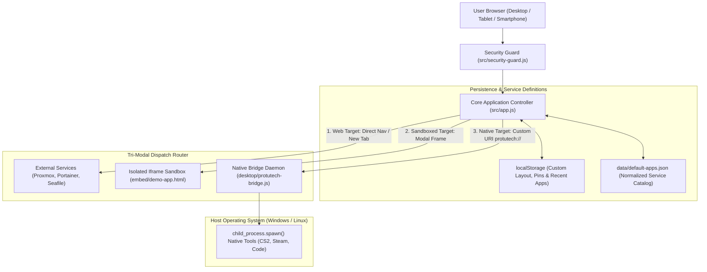
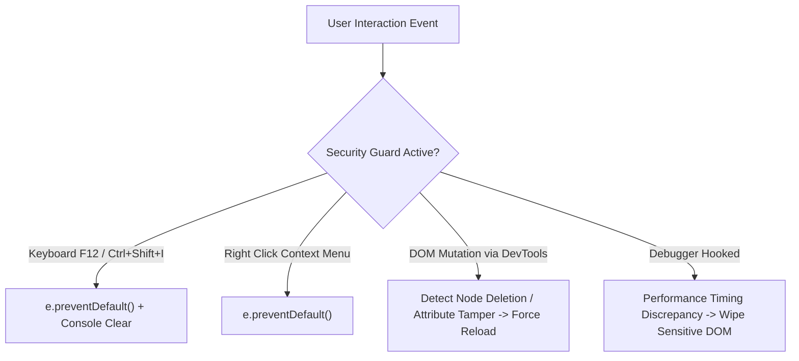

# Protutech Suite Launcher & Cockpit

**ProtutechDash** is the primary entry point and central application cockpit for the entire Protutech self hosted homelab ecosystem. Inspired by high-density professional suites (such as Adobe Creative Cloud Desktop and Bloomberg Terminal dashboards), it unifies web microservices, isolated embedded web apps, and native desktop executables into a single, cohesive, glassmorphic workspace.

[View Applications Presentation Deck](../../presentation/applications.md)

---

## 1. System Architecture & Service Dispatch



---

## 2. Service Catalog Data Schema (`data/default-apps.json`)

All dashboard tiles, categorizations, and dispatch behaviors are driven by a normalized JSON configuration:

```json
{
  "id": "cs2-tactics",
  "name": "CS2 Tactical Stratbook",
  "category": "Gaming",
  "description": "Multiuser interactive radar whiteboard and grenade trajectory calculator.",
  "url": "https://cs2.protutech.vip",
  "icon": "crosshair",
  "type": "web",
  "statusEndpoint": "https://cs2.protutech.vip/api/health",
  "badge": "Active 5v5",
  "tags": ["tactics", "whiteboard", "source2", "counter-strike"],
  "launchAction": {
    "protocol": "protutech://launch?target=cs2nades",
    "fallbackUrl": "https://cs2.protutech.vip"
  }
}
```

### Schema Property Specifications

| Property | Type | Technical Purpose |
| :--- | :--- | :--- |
| `id` | `string` | Unique deterministic identifier used as primary key in localStorage pin arrays. |
| `category` | `enum` | Segment filters: `Infrastructure`, `Gaming`, `AI & Compute`, `Security & Auth`, `Media`. |
| `type` | `string` | Dispatch mode: `web` (opens in browser tab), `embed` (opens in modal iframe), `native` (dispatches to desktop bridge). |
| `statusEndpoint`| `string` | Endpoint pinged by client background worker to render green/amber/red latency badges. |
| `launchAction` | `object` | Specifies custom URI protocol payload with web fallback if desktop agent is uninstalled. |

---

## 3. Tri-Modal Dispatch Mechanics

ProtutechDash is designed to launch any application in the homelab regardless of where it lives:

### 1. Direct Web Routing
For standard web microservices (such as Proxmox VE or Portainer), clicking a card opens the authenticated service in a new browser tab or current window with strict `rel="noopener noreferrer"` parameters.

### 2. Sandboxed Embedded Modals
For lightweight utilities and widgets, the launcher renders an overlay modal containing a sandboxed iframe (`sandbox="allow-scripts allow-same-origin allow-forms"`). This isolates third-party code from accessing the parent dashboard's `localStorage` session keys.

### 3. Native Desktop Protocol Dispatch (`protutech://`)
To launch native applications (such as Steam, CS2 with practice flags, or VS Code), the dashboard emits a custom URI scheme registered in the Windows Registry:

```text
protutech://open?app=cs2&args=-worldwide+-novid
```

When clicked, Windows delegates the URI to our background Node.js companion script (`desktop/protutech-bridge.js`), which validates parameters against an immutable whitelist before spawning the process.

---

## 4. Antitamper & Client-Side Guard Subsystem

To protect dashboard integrity when accessed from public or untrusted secondary devices, `src/security-guard.js` deploys active client-side defenses:



- **Timing Anomaly Detection**: A background worker measures the execution duration of a mathematical loop. If DevTools is opened and hits a breakpoint, execution time spikes from $< 1\text{ ms}$ to $> 100\text{ ms}$, triggering instant session clearing.
- **AST Obfuscation**: Prior to production deployment, `scripts/obfuscate.js` passes JavaScript source code through string array encoding, control flow flattening, and dead code injection, eliminating human-readable variable names.

---

## 5. Navigation & Subguides

- [**Subfolder & Module Anatomy**](structure.md): Deep-dive file trees, directory hierarchy, and module responsibilities.
- [**Bridge & Security Subsystem**](security.md): Native Windows protocol handler, IPC, and security guard telemetry.
- [**Source Code: `src/app.js`**](../../code/protutechdash/app-js.md): Line-by-line breakdown of the main UI controller.
- [**Source Code: `src/security-guard.js`**](../../code/protutechdash/security-guard-js.md): Line-by-line breakdown of anti inspection mechanisms.
- [**Source Code: `desktop/protutech-bridge.js`**](../../code/protutechdash/bridge-js.md): Line-by-line breakdown of the native protocol bridge.
- [**Source Code: `scripts/obfuscate.js`**](../../code/protutechdash/obfuscate-js.md): Line-by-line breakdown of the AST obfuscation build pipeline.
