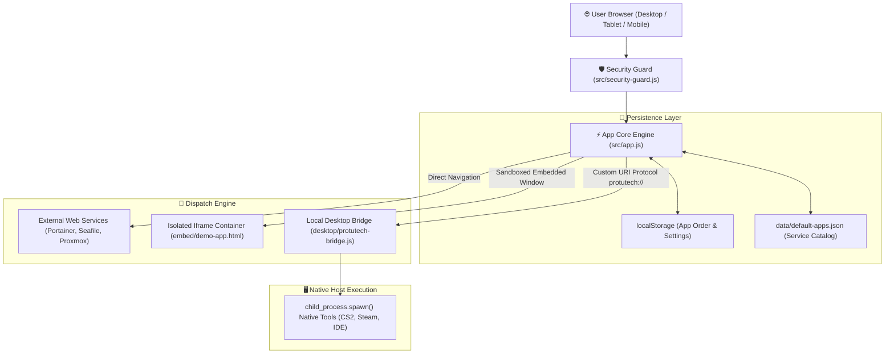

# Protutech Suite Launcher & Cockpit

## 🎯 Architectural Overview

**ProtutechDash** is the primary entry point and central application launcher for the entire Protutech self hosted homelab ecosystem. Inspired by high density pro suites (like Adobe Creative Cloud Desktop and Bloomberg Terminal cockpits), it provides single pane orchestration across web services, isolated iframe micro apps, and local desktop software.

---

## ⚡ Core Capabilities & Design Goals

| Capability | Technical Implementation | Purpose |
| :--- | :--- | :--- |
| **Unified Cockpit** | HTML5 / ESNext / CSS Variables | Single dashboard replacing dozens of bookmarks and port numbers |
| **Instant Search & Filter** | In-memory token filter over categories (`Infrastructure`, `Gaming`, `AI`, `Security`) | Sub-millisecond lookup across 20+ services |
| **Native Protocol Bridge** | Windows registry `protutech://` handler + local Node.js daemon | Launches native Windows desktop applications directly from browser clicks |
| **Antitampering Shield** | F12 / ContextMenu interceptor + DOM mutation monitor | Blocks inspection and iframe clickjacking on untrusted devices |
| **Progressive Web App** | Service Worker (`sw.js`) + `manifest.json` | Installable offline-capable web application on mobile & desktop |

---

## 🧭 Navigation & Subguides

- [**Subfolder & Module Anatomy**](structure.md): Deep-dive file trees, directory hierarchy, and module responsibilities.
- [**Bridge & Security Subsystem**](security.md): Native Windows protocol handler, IPC, and security guard telemetry.
- [**Source Code: `src/app.js`**](../../code/protutechdash/app-js.md): Line-by-line breakdown of the main UI controller.
- [**Source Code: `src/security-guard.js`**](../../code/protutechdash/security-guard-js.md): Line-by-line breakdown of anti inspection mechanisms.
- [**Source Code: `desktop/protutech-bridge.js`**](../../code/protutechdash/bridge-js.md): Line-by-line breakdown of the native protocol bridge.
- [**Source Code: `scripts/obfuscate.js`**](../../code/protutechdash/obfuscate-js.md): Line-by-line breakdown of the AST obfuscation build pipeline.
