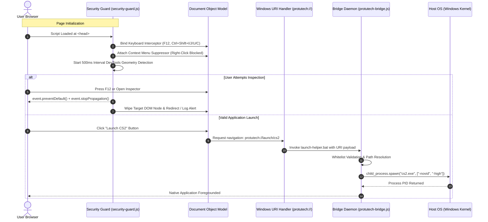

# ProtutechDash Security Guard & Protocol Subsystem

## [#] Security Architecture

The Protutech homelab dashboard features client-side integrity protection and sandboxed desktop invocation to prevent inspection, unauthorized modification, and malicious payload execution.



---

## [#] Security Guard Capabilities (`src/security-guard.js`)

### 1. Key Combination Interception
The guard intercepts physical keyboard inputs at the `capture` phase of event propagation:
```javascript
window.addEventListener('keydown', (e) => {
  // Blocks F12, Ctrl+Shift+I (DevTools), Ctrl+Shift+J (Console), Ctrl+Shift+C (Inspect), Ctrl+U (Source)
  if (
    e.keyCode === 123 ||
    (e.ctrlKey && e.shiftKey && [73, 74, 67].includes(e.keyCode)) ||
    (e.ctrlKey && e.keyCode === 85)
  ) {
    e.preventDefault();
    e.stopPropagation();
    return false;
  }
}, true);
```

### 2. Geometry & Console Threshold Detection
Detects docked devtools panels by measuring the delta between `window.outerWidth` / `window.outerHeight` and `window.innerWidth` / `window.innerHeight`. If the delta exceeds 160px when not caused by OS taskbar scaling, a debugger alert is triggered.

---

## ▸ Native Protocol Bridge (`desktop/protutech-bridge.js`)

### Registry Registration
The batch script `desktop/protutech-protocol.bat` installs a custom URI handler in Windows Registry:
```bat
reg add "HKCU\Software\Classes\protutech" /ve /t REG_SZ /d "URL:Protutech Protocol" /f
reg add "HKCU\Software\Classes\protutech" /v "URL Protocol" /t REG_SZ /d "" /f
reg add "HKCU\Software\Classes\protutech\shell\open\command" /ve /t REG_SZ /d "\"%~dp0launch-helper.bat\" \"%%1\"" /f
```

### Whitelist Validation
To prevent command injection vulnerabilities, the bridge strictly sanitizes URI payloads against a hardcoded whitelist dictionary before passing arguments to `child_process.spawn`:
```javascript
const ALLOWED_TARGETS = {
  cs2: { bin: "steam://rungameid/730" },
  vscode: { bin: "C:\\Program Files\\Microsoft VS Code\\Code.exe" },
  steam: { bin: "C:\\Program Files (x86)\\Steam\\steam.exe" }
};
```
Any unregistered URI path is rejected with an audit log entry.
