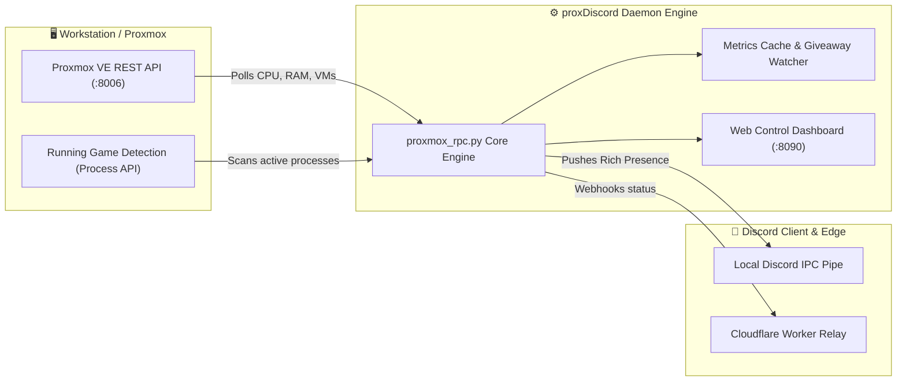

# proxDiscord & Proxmox RPC Daemon

A background daemon bridging Proxmox VE hypervisor vitals, cluster metrics, and gaming activity directly into Discord Rich Presence with an administrative web telemetry dashboard.

---

## 🏛️ Daemon Architecture & Data Flow



---

## 📂 Subfolder Structure & Module Breakdown

```text
proxDiscord/
├── 📁 assets/                # Discord presence application icons, badges, and headers
│   └── protutech_cloud.jpg   # Brand wallpaper for Discord Activity card display
├── 📁 bin/                   # Compiled standalone binaries and service hooks
├── 📁 build/                 # PyInstaller bundling directory for Windows service execution
├── 📁 .venv/                 # Isolated Python 3 virtual environment
├── proxmox_rpc.py            # Primary RPC engine: REST API polling & Discord IPC integration
├── dashboard.html            # Web-based control panel displaying live cluster stats & daemon status
├── free_games_cache.json     # Cached Epic Games / Steam giveaway telemetry feed
└── requirements.txt          # Python dependencies (pypresence, requests, urllib3)
```

---

## 🔍 Line-by-Line Daemon Code Breakdown

### `proxmox_rpc.py` — REST Polling & Discord IPC

```python linenums="1"
import requests
import time
from pypresence import Presence
import urllib3

urllib3.disable_warnings(urllib3.exceptions.InsecureRequestWarning) # (1)!

DISCORD_CLIENT_ID = "128495028475928374" # (2)!
PVE_HOST = "https://192.168.0.226:8006/api2/json" # (3)!
PVE_TOKEN_ID = "root@pam!proxdiscord" # (4)!
PVE_TOKEN_SECRET = "8d31864c-6632-4138-a6bb-2a3e7e6e152c" # (5)!

def fetch_cluster_status():
    headers = {"Authorization": f"PVEAPIToken={PVE_TOKEN_ID}={PVE_TOKEN_SECRET}"} # (6)!
    try:
        res = requests.get(f"{PVE_HOST}/cluster/status", headers=headers, verify=False, timeout=5) # (7)!
        if res.status_code == 200:
            nodes = res.json().get("data", [])
            return {node["name"]: node["online"] for node in nodes if node["type"] == "node"} # (8)!
    except requests.RequestException as e:
        print(f"[Error] Failed to connect to Proxmox VE: {e}")
    return {}

def update_discord_presence(rpc, cluster_data):
    online_count = sum(cluster_data.values())
    total_nodes = len(cluster_data)
    
    rpc.update(
        state=f"Cluster Status: {online_count}/{total_nodes} Nodes Active", # (9)!
        details="Hypervisor: Proxmox VE 9.2.11",
        large_image="protutech_pve_logo",
        large_text="Protutech Homelab Architecture",
        start=int(time.time()) # (10)!
    )
```

1. Suppresses self-signed SSL warnings when polling the internal Proxmox VE hypervisor IP.
2. Registers the custom Discord Developer Portal Application ID for rich activity cards.
3. Points directly to the internal Proxmox VE REST API v2 JSON endpoint.
4. Uses scoped API Token authentication (`PVEAPIToken`) avoiding hardcoded root user passwords.
5. Ingests the API Token Secret generated from the Proxmox PAM authentication realm.
6. Formats the specialized Proxmox API Token header authorization schema.
7. Executes a non-blocking HTTPS query with a strict 5-second timeout to prevent thread hanging.
8. Parses node health telemetry to compute active vs offline cluster members.
9. Dynamically updates Discord Rich Presence state text with live node uptime statistics.
10. Sets the active elapsed time counter displayed on your Discord profile card.
