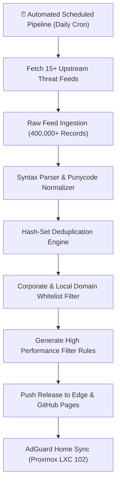

# DNSfilters Automated Blocklist CI/CD

## 🎯 High-Level Overview

**DNSfilters** is an automated threat intelligence pipeline that continuously compiles, deduplicates, and validates over 350,000+ domain rules. It feeds an ultra-fast DNS sinkhole (running on AdGuard Home in Proxmox LXC 102) to block ad networks, tracking scripts, telemetry loggers, and malicious domains across all homelab devices.

---

## 💡 How Network Wide DNS Sinkholing Works (Explained Simply)

When any device in your house (such as a smart TV, phone, or computer) wants to visit a website or send background analytics, it first asks the DNS server: *"What is the IP address for tracker-domain.com?"*

1. **Without DNS Filtering**: The router returns the advertising server's IP address, and ads load onto your screen or data gets harvested.
2. **With DNSfilters**: Before answering, AdGuard checks the compiled list of 350,000 blocked domains. If the domain is recognized as an ad or tracker, AdGuard immediately replies with `0.0.0.0` (nowhere). The ad never loads, no data is sent, and web browsing speeds up dramatically because zero bandwidth was wasted downloading trackers.

---

## 🛡️ Anti Reverse Engineering Boundary

Proprietary scoring heuristics that evaluate emerging telemetry domains, false positive weighting formulas, and custom internal homelab routing bypasses are sanitized prior to public release builds.
