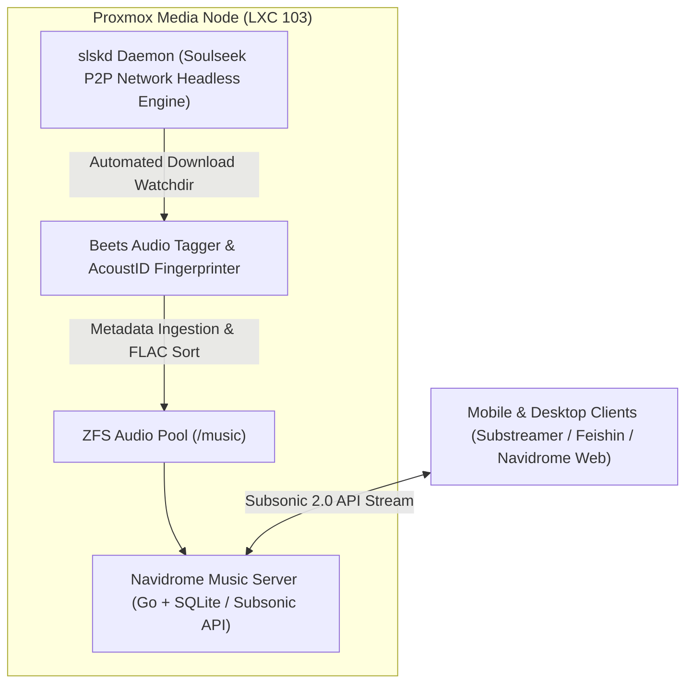

# Navidrome & Soulseek Lossless Audio Pipeline

## High-Level Overview

An automated, self hosted high fidelity audio pipeline that acquires, catalogs, and streams lossless audio (FLAC 24-bit / 96kHz) across personal mobile and desktop devices with complete independence from commercial streaming subscriptions.

---

## How It Works (Explained Simply)

Imagine having your own personal, private Spotify or Apple Music, except every track is stored in pure, uncompressed master studio quality on your own hard drives:
1. **Search & Acquisition**: You request an album via a clean web interface (`slskd`). It queries decentralized music networks to locate original lossless tracks.
2. **Audio Fingerprinting**: A library daemon (`Beets`) listens to the audio waveforms, verifies the acoustic fingerprint against world databases, tags high-res album art, and organizes everything into clean artist folders.
3. **Anywhere Streaming**: The `Navidrome` server streams the audio to your phone while driving or working, transcoding to AAC when on cellular data to save mobile bandwidth, or streaming bit-perfect FLAC when on home Wi-Fi.

---

## Anti Reverse Engineering Boundary

Storage mount paths (`/mnt/pve/music_pool`), P2P transfer obfuscation settings, and authentication salt schemes are isolated via ZFS dataset mount points and unprivileged container UID mappings.
