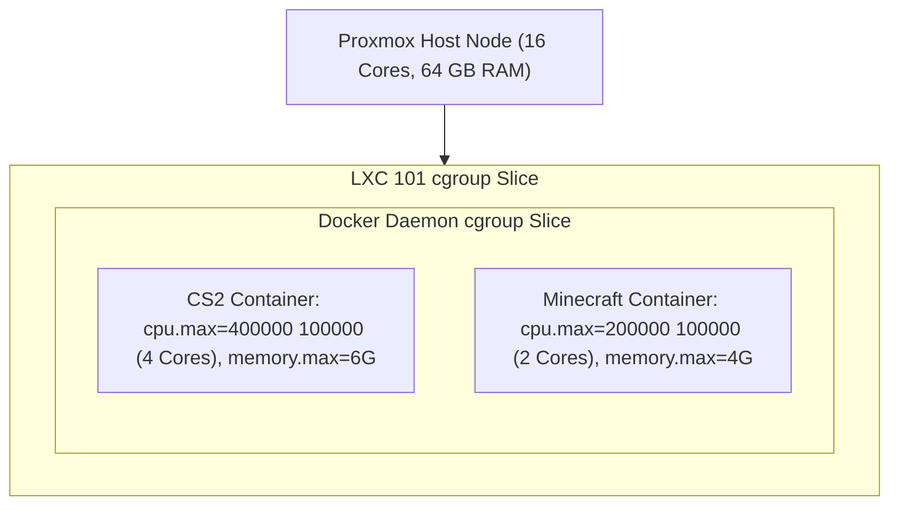

# Pelican Game Server Panel & Wings Orchestration Engine

Pelican Panel (the modern open-source successor to Pterodactyl) manages game server instances across the Protutech homelab ecosystem. It powers our private Counter-Strike 2 competitive practice environments, lineup execution servers, and dedicated game clusters. The architecture decouples the web management interface (written in PHP 8.3 / Laravel) from the high performance compute node daemon (**Wings**, written in Go), which directly controls container life cycles and real-time console streams.

---

## 1. System Architecture & Component Interactions

```mermaid
graph TD
    Admin["Game Server Admins & Captains"] -->|HTTPS / Port 443| Panel["Pelican Panel Web Interface (PHP 8.3 / Laravel)"]
    Panel <--> DB["Panel State Store (MariaDB / SQLite)"]
    
    subgraph GamingNode["Proxmox Gaming Compute Node (LXC 101)"]
        Panel -->|Secure TLS REST & gRPC API (Port 8080)| Wings["Wings Node Daemon (Compiled Go Binary)"]
        
        subgraph WingsSubsystems["Wings Internal Subsystems"]
            SFTP["Embedded SFTP Subsystem (Go SSH / Port 2022)"]
            SocketStream["Demuxed WebSocket Console Streamer"]
            ProcessWatch["cgroups v2 Process & Health Monitor"]
        end

        Wings --> SFTP
        Wings --> SocketStream
        Wings --> ProcessWatch
        
        Wings <-->|Unix Domain Socket| DockerSocket["/var/run/docker.sock"]
        DockerSocket <--> DockerEngine["Docker Engine Container Runtime"]
        
        subgraph SandboxedContainers["Isolated Game Server Containers"]
            CS2Server["CS2 5v5 Practice Server (Linux SRCDS + RCON)"]
            Minecraft["Minecraft Fabric / Paper Cluster"]
            VoiceRelay["Mumble Voice Relay / Low Latency Audio"]
        end

        DockerEngine --> CS2Server
        DockerEngine --> Minecraft
        DockerEngine --> VoiceRelay
    end

    Admin -->|SFTP Asset Uploads / Port 2022| SFTP
    Admin -->|Live Interactive Console (WebSockets)| SocketStream
```

---

## 2. Wings Daemon Technical Mechanics

The **Wings** daemon is engineered in Go for minimal memory overhead (typically under 25 MB RAM idle) while handling high throughput concurrent I/O:

### 1. Embedded SFTP Server (Port 2022)
Instead of relying on the host operating system's OpenSSH daemon, Wings embeds its own Go SSH server implementation:
- **Authentication**: When a user connects to `sftp://gaming.protutech.vip:2022`, Wings validates credentials dynamically against the Pelican Panel API over HTTPS, eliminating static `/etc/passwd` accounts on the node.
- **Filesystem Jailing**: Users are strictly chrooted inside `/var/lib/pelican/volumes/{server-uuid}`. Symlink attacks attempting to escape into the Proxmox host filesystem are rejected at the kernel VFS layer.

### 2. Live Console WebSocket Demultiplexing
Game server consoles (standard input, standard output, standard error) are captured through the Docker Engine API:
- Wings opens a streaming multiplexed bidirectional pipe to the container's stdin/stdout.
- Standard output and standard error bytes are demuxed and broadcasted in real-time over authenticated WebSockets to authenticated browser sessions.
- Console buffer history (last 500 lines) is cached in high speed circular ring buffers in memory, allowing instant playback upon browser connection.

---

## 3. CS2 Dedicated Practice Server Specification

Our primary game server payload is a dedicated Counter-Strike 2 practice and strategy testing instance. It integrates directly with the [CS2 Tactical Stratbook](../../apps/cs2nades/index.md):

### Server Runtime Configuration Matrix

| Parameter / Layer | Configuration Value | Technical Purpose |
| :--- | :--- | :--- |
| **Game Engine** | Valve Source 2 (CS2 SRCDS) | Native Linux dedicated server binary via SteamCMD (App ID `730`) |
| **Tickrate Model** | Valve Sub-Tick Engine | 64 tick base networking with sub-tick packet timestamps |
| **Network Ports** | `27015/udp` (Game), `27020/udp` (SourceTV) | High priority UDP datagram routing |
| **Remote Console (RCON)** | `27015/tcp` (Argon2 Hashed Password) | Automated grenade line execution and bot placement commands |
| **CPU Pinning** | Cores 4-7 on Host Node | Prevents CPU scheduling jitter during physics trajectory calculations |
| **RAM Allocation** | 6144 MB Ceiling (Swap Disabled) | Avoids OS paging pauses during fast map transitions |

### Practice Server Autoexec (`cfg/prac.cfg`)

The instance boots with specialized practice and physics visualization flags:

```text
// CS2 Practice Server Physics & Strategy Configuration
bot_kick
sv_cheats 1
mp_limitteams 0
mp_autoteambalance 0
mp_roundtime 60
mp_roundtime_defuse 60
mp_maxmoney 65535
mp_startmoney 65535
mp_afterroundmoney 65535
mp_buytime 60000
mp_buy_anywhere 1
ammo_grenade_limit_total 5
sv_infinite_ammo 1
mp_warmup_end

// Trajectory and Impact Visualizers
sv_grenade_trajectory_prac_pipreview 1   // Picture-in-picture grenade flight camera
sv_grenade_trajectory_prac_trailtime 15  // Visible flight arc persistence
sv_showimpacts 1                         // Bullet penetration and hit registration
sv_showimpacts_time 10

// Fast Restart & Map Navigation
mp_restartgame 1
say ">> Protutech CS2 Tactical Practice Server Initialized <<"
```

---

## 4. Resource Sandboxing & Linux cgroups v2 Limits

To protect hypervisor stability, every container created by Wings is constrained through Linux cgroups v2:



### 1. Completely Eliminating CPU Contention
- `cpu.max = 400000 100000`: In a 100ms CFS (Completely Fair Scheduler) period, the CS2 container cannot consume more than 400ms of CPU time across all cores, strictly enforcing a 4-core boundary.

### 2. Memory Isolation & OOM Protection
- `memory.max = 6442450944`: Hard 6 GB RAM limit.
- `memory.swap.max = 0`: Disables swap file usage for game containers. When game engines attempt to swap memory pages to disk, micro-stutters and server lag spikes occur. Disabling swap forces memory to remain pinned in fast DDR4/DDR5 RAM.
- `oom_score_adj = 500`: In extreme hypervisor memory pressure, the Linux kernel terminates game server processes long before touching core hypervisor infrastructure or database storage.

---

## 5. Storage Topology & Atomic ZFS Snapshots

All game server volume data resides on a dedicated NVMe ZFS storage dataset:

```text
/var/lib/pelican/volumes/
├── 8e3a1f4b-72c1-4b3e-9081-123456789abc/  # CS2 Dedicated Server root
│   ├── game/
│   │   ├── csgo/
│   │   │   ├── cfg/
│   │   │   │   └── prac.cfg               # Strategy execution config
│   │   │   └── maps/                      # De_mirage, De_inferno, De_nuke
│   │   └── bin/linuxsteamrt64/
│   │       └── cs2                        # 64-bit Source 2 Server binary
```

Because server data is located on ZFS, instant atomic snapshots can be generated before applying major Steam updates:

```bash
# Atomic snapshot before SteamCMD update
zfs snapshot nvme-pool/pelican-volumes@cs2-pre-update-$(date +%F)

# Instant 10-millisecond rollback if a Valve update breaks server plugins
zfs rollback nvme-pool/pelican-volumes@cs2-pre-update-2026-10-09
```
