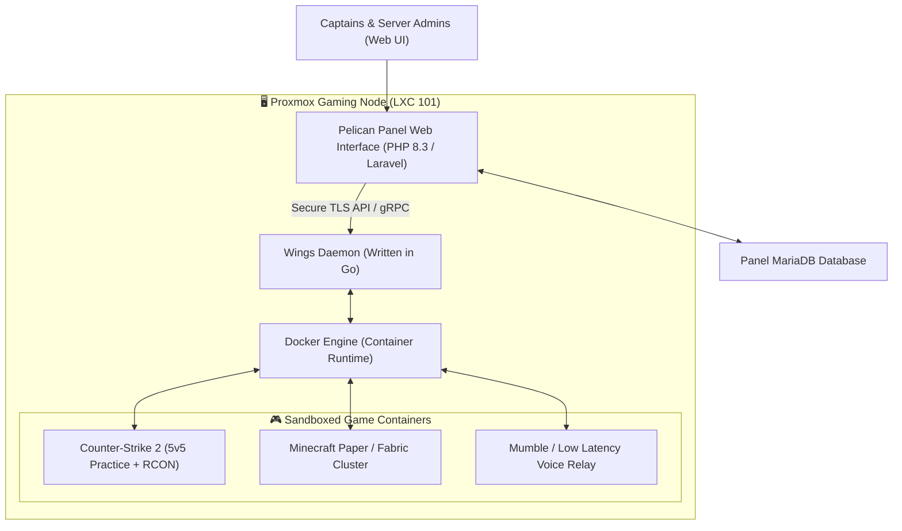

# Pelican Game Server Management Panel & Wings

## 🎯 High-Level Overview

**Pelican Panel** (the modern successor to Pterodactyl) manages game server instances (such as Counter-Strike 2 practice servers, Minecraft clusters, and dedicated game environments) utilizing Docker containers orchestrated via a Go-based low latency node daemon named **Wings**.

---

## 💡 How It Works (Explained Simply)

Running dedicated gaming servers directly on an operating system can get messy and risk conflicts when games require different software versions.
- **Pelican Panel** is like an airport flight control tower with buttons to launch, restart, or update game servers.
- **Wings & Docker Containers** are like sealed, soundproof flight cabins. Each game server runs inside its own isolated software bubble with fixed CPU and RAM boundaries. If one game crashes, it never affects the rest of the homelab.

---

## 🛡️ Anti Reverse Engineering Boundary

Administrative API keys, TLS server certificate generation sequences, and internal container volume mounts (`/var/lib/pelican/volumes`) are segregated behind role-based access control and container namespace virtualization.
