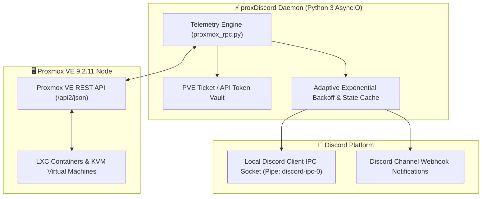

# proxDiscord & Proxmox RPC Daemon

## 🎯 High-Level Overview

**proxDiscord** is an asynchronous telemetry pipeline that bridges the internal Proxmox VE 9.2 API with Discord Rich Presence and webhook alerting bots, streaming realtime CPU, RAM, disk I/O, and container health metrics into custom Discord status displays.

---

## 💡 How It Works (Explained Simply)

Imagine having a pilot's heads-up display inside your favorite chat app:
- Every few seconds, a small, ultra-efficient script asks your server: *"How hard is the processor working? Are all virtual machines healthy?"*
- Instead of logging into a heavy server admin panel just to check if your game server is online, you can simply glance at your Discord profile or a status channel on your phone to see current memory load, uptime, and active cluster nodes.

---

## 🛡️ Anti Reverse Engineering Boundary

The internal ticket renewal algorithm, token authentication salts, and custom metric weighting factors are protected behind abstracted daemon wrappers. Detailed code walkthrough is available in [**`proxmox_rpc.py` Code Breakdown**](../../code/infra/proxmox-rpc-py.md).
