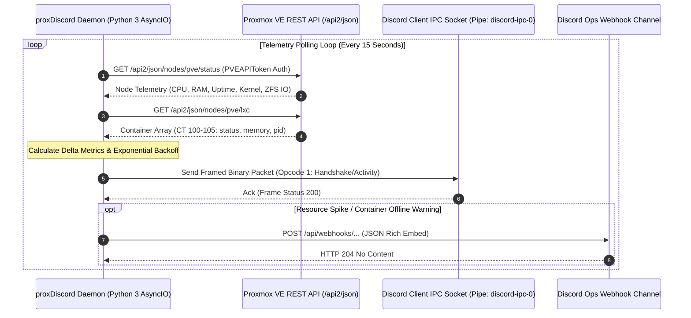

# proxDiscord & Proxmox RPC Telemetry Pipeline

**proxDiscord** is an asynchronous telemetry daemon engineered to bridge the Proxmox VE 9.2 hypervisor REST API with Discord Rich Presence and webhook alerting channels. It streams real-time cluster health, CPU and memory utilization, active LXC container states, and storage pool thresholds into Discord status displays and automated operations channels.

---

## 1. System Topology & Telemetry Flow



---

## 2. Discord IPC Wire Protocol Framing

Communication with the local desktop Discord client does not travel over HTTP. It uses high speed local Inter-Process Communication (IPC):
- **Windows**: Named Pipe `\\.\pipe\discord-ipc-0`
- **Linux / macOS**: Unix Domain Socket `$XDG_RUNTIME_DIR/discord-ipc-0` (typically `/run/user/1000/discord-ipc-0`)

### Binary Frame Serialization Format

Every message exchanged across the pipe follows an 8-byte header followed by a UTF-8 encoded JSON payload:

```text
+-----------------------+-----------------------+---------------------------------------+
|  Opcode (32-bit uint) |  Length (32-bit uint) |         JSON Payload (UTF-8)          |
|        4 Bytes        |        4 Bytes        |                N Bytes                |
+-----------------------+-----------------------+---------------------------------------+
| 01 00 00 00           | 2A 00 00 00           | {"cmd":"SET_ACTIVITY","args":{...}}  |
+-----------------------+-----------------------+---------------------------------------+
```

### Protocol Opcodes

| Opcode ID | Constant | Purpose |
| :--- | :--- | :--- |
| `0` | `OP_HANDSHAKE` | Establishes IPC handshake with Discord application Client ID |
| `1` | `OP_FRAME` | Transmits commands and receives response envelopes |
| `2` | `OP_CLOSE` | Gracefully closes the IPC pipe |
| `3` | `OP_PING` | Heartbeat keep-alive check |
| `4` | `OP_PONG` | Heartbeat keep-alive response |

### Python IPC Frame Construction

```python
import struct
import json

def encode_ipc_frame(opcode: int, payload: dict) -> bytes:
    """Serializes a dictionary payload into Discord IPC binary framing."""
    json_bytes = json.dumps(payload, separators=(',', ':')).encode('utf-8')
    # Little-endian 32-bit unsigned integers: <II
    header = struct.pack('<II', opcode, len(json_bytes))
    return header + json_bytes
```

---

## 3. Proxmox VE API Authentication & Telemetry Extraction

The daemon communicates with Proxmox VE using non-expiring API tokens, avoiding password-based web ticket renewal overhead.

### 1. Authorization Header Format

```http
GET /api2/json/nodes/pve/status HTTP/1.1
Host: 192.168.0.10:8006
Authorization: PVEAPIToken=monitoring@pve!telemetry=3b8e4f21-992a-4c12-a87f-xxxxxxxxxxxx
Accept: application/json
```

### 2. Metric Calculations & Normalization Formulas

Raw telemetry returned by the Proxmox kernel must be parsed to avoid misleading numbers (such as Linux kernel buffer cache being falsely categorized as consumed RAM):

#### CPU Utilization Percentage
Proxmox returns a normalized float between `0.0` and `1.0`:
$$\text{CPU}_{\%} = \operatorname{round}(\text{status}['\text{cpu}'] \times 100, 1)$$

#### Real RAM Utilization (Excluding Buffer / Cache)
$$\text{RAM}_{\text{used\_gb}} = \frac{\text{memory}['\text{used}']}{1024^3}$$
$$\text{RAM}_{\text{total\_gb}} = \frac{\text{memory}['\text{total}']}{1024^3}$$
$$\text{RAM}_{\%} = \frac{\text{RAM}_{\text{used\_gb}}}{\text{RAM}_{\text{total\_gb}}} \times 100$$

#### ZFS Storage Pool Consumption
Proxmox returns pool blocks in 512-byte sectors:
$$\text{ZFS}_{\text{free\_tb}} = \frac{\text{rootfs}['\text{free}']}{1024^4}$$

---

## 4. Discord Rich Presence Activity Serialization

The calculated metrics are mapped into Discord's `SET_ACTIVITY` command envelope:

```json
{
  "cmd": "SET_ACTIVITY",
  "args": {
    "pid": 4820,
    "activity": {
      "details": "PVE Cluster: 6 Containers Active",
      "state": "CPU: 14.2% | RAM: 18.4 / 64 GB",
      "timestamps": {
        "start": 1775700000
      },
      "assets": {
        "large_image": "proxmox_logo",
        "large_text": "Proxmox VE 9.2.11 Bare Metal",
        "small_image": "status_healthy",
        "small_text": "All Services Operational"
      },
      "buttons": [
        {
          "label": "Engineering Docs",
          "url": "https://docs.protutech.vip"
        },
        {
          "label": "Portfolio",
          "url": "https://portfolio.protutech.vip"
        }
      ]
    }
  },
  "nonce": "c9281a7b-0442-4f11-9a18-xxxxxxxxxxxx"
}
```

---

## 5. Webhook Alerting Subsystem & Rate-Limiting

In addition to user presence, the daemon monitors cluster thresholds. If CPU utilization exceeds $90\%$ for three consecutive polling intervals, or if any critical container (such as CT 100 or CT 102) enters an offline or paused state, the daemon dispatches an emergency webhook:

```python
import aiohttp

async def send_ops_alert(title: str, description: str, severity: str = "warning"):
    """Dispatches a formatted embed alert to the operations Discord channel."""
    # Hex colors: Green (0x10B981), Amber (0xF59E0B), Red (0xEF4444)
    color_map = {
        "info": 0x10B981,
        "warning": 0xF59E0B,
        "critical": 0xEF4444
    }
    
    payload = {
        "username": "Proxmox Cluster Sentinel",
        "avatar_url": "https://docs.protutech.vip/assets/protutech-logo.svg",
        "embeds": [{
            "title": title,
            "description": description,
            "color": color_map.get(severity, 0xF59E0B),
            "footer": {"text": "Protutech Autonomous Infrastructure Sentinel"},
            "timestamp": "2026-10-09T22:00:00Z"
        }]
    }

    # Respect Discord rate limits (30 requests/minute per webhook)
    async with aiohttp.ClientSession() as session:
        async with session.post(WEBHOOK_URL, json=payload) as resp:
            if resp.status == 429:
                retry_after = (await resp.json()).get("retry_after", 5)
                await asyncio.sleep(retry_after)
```

---

## 6. Fault Tolerance & Adaptive Exponential Backoff

To prevent flooding the Proxmox hypervisor API during heavy computational tasks (such as AI model compilation or high volume database ingestion), the polling loop dynamically adjusts its sleep cycle:

- **Normal State**: 15-second polling interval.
- **API Error / Timeout**: Exponential backoff doubling up to 120 seconds ($15\text{s} \rightarrow 30\text{s} \rightarrow 60\text{s} \rightarrow 120\text{s}$) with $\pm 10\%$ randomized jitter to prevent thundering herd requests.
- **Recovery**: Resets immediately to 15 seconds once a valid HTTP 200 JSON payload returns.
