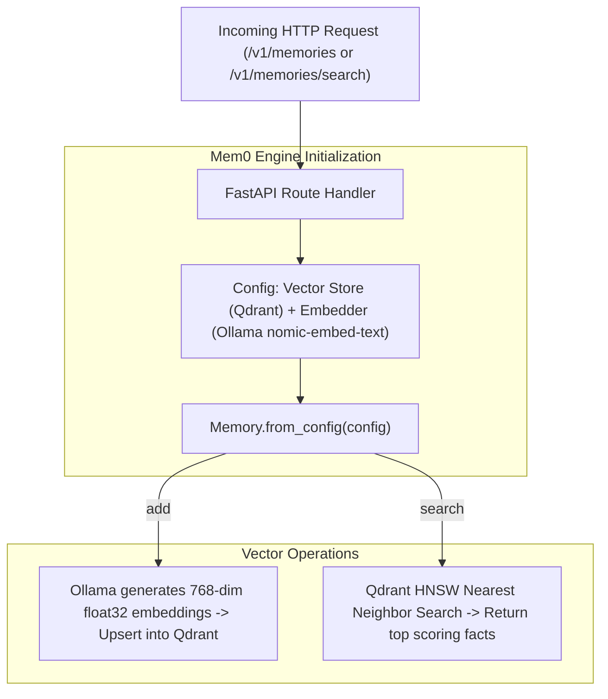

# Source Code Deep Dive: `aiVault/server.py`

## 📄 File Metadata

- **Subsystem:** aiVault Episodic Vector Memory Gateway
- **Path:** `aiVault/server.py`
- **Language / Runtime:** Python 3 (FastAPI / ASGI / Mem0 SDK)
- **Primary Responsibility:** Exposes an asynchronous REST API that extracts semantic facts from conversations, generates vector embeddings via Ollama, and persists them into Qdrant vector database.

---

## 💡 What This File Does (Explained Simply)

Standard AI chatbots suffer from instant amnesia: as soon as you close the conversation, they forget who you are and what you talked about.
`aiVault/server.py` acts as the long term memory center of your homelab AI:
1. Whenever you chat with the AI, your message is sent to this server.
2. It uses a specialized embedding model to turn your words into mathematical numbers (vectors).
3. It deposits those numbers into a vector database (Qdrant), categorizing them by user and topic.
4. When you ask a question next week, it searches the vector database, pulls out relevant past conversations, and feeds that memory to the AI before it answers you.

---

## 🔍 Key Architectural Sections & Line Breakdown



---

### Section 1: Vector Store & Embedder Configuration

```python linenums="11"
config: Dict[str, Any] = {
    "vector_store": {
        "provider": "qdrant",
        "config": {
            "host": os.getenv("QDRANT_HOST", "agent_qdrant"),
            "port": int(os.getenv("QDRANT_PORT", "6333")),
        }
    }
}

if llm_provider == "ollama":
    ollama_url = os.getenv("OLLAMA_BASE_URL", "http://agent_ollama:11434")
    config["llm"] = {
        "provider": "ollama",
        "config": {
            "model": os.getenv("OLLAMA_LLM_MODEL", "llama3.2:1b"),
            "ollama_base_url": ollama_url,
        }
    }
    config["embedder"] = {
        "provider": "ollama",
        "config": {
            "model": os.getenv("OLLAMA_EMBED_MODEL", "nomic-embed-text"),
            "ollama_base_url": ollama_url,
        }
    }

memory = Memory.from_config(config)
```

#### Line by Line Explanation:
- **Lines 11–19 (`vector_store`)**: Binds the Mem0 framework to the containerized Qdrant instance on internal port `6333`, leveraging Rust powered HNSW vector indexing.
- **Lines 21–36 (`llm` and `embedder`)**: Configures Ollama for both fact extraction and vector generation. Using `nomic-embed-text` produces dense 768 dimensional vectors 100% locally with zero external API calls.
- **Line 45 (`Memory.from_config(config)`)**: Assembles the persistent memory abstraction layer that automates semantic deduplication and conflict resolution.

---

### Section 2: Memory Ingestion & Similarity Search Endpoints

```python linenums="58"
@app.post("/v1/memories")
def add_memory(req: AddMemoryRequest):
    try:
        return memory.add(
            req.messages,
            user_id=req.user_id,
            agent_id=req.agent_id,
            metadata=req.metadata
        )
    except Exception as e:
        raise HTTPException(status_code=500, detail=str(e))

@app.post("/v1/memories/search")
def search_memory(req: SearchMemoryRequest):
    try:
        return memory.search(
            req.query,
            user_id=req.user_id,
            agent_id=req.agent_id
        )
    except Exception as e:
        raise HTTPException(status_code=500, detail=str(e))
```

#### Line by Line Explanation:
- **Lines 58–63 (`add_memory`)**: Ingests new user statements or multi turn conversations. Mem0 parses the text, extracts atomic facts (e.g. "User owns a Proxmox cluster"), and stores the embedding along with user metadata.
- **Lines 72–77 (`search_memory`)**: Queries the vector index using cosine similarity matching. Returns the top ranked memory records to augment the LLM prompt context in realtime.

---

## 🛡️ Anti Reverse Engineering Boundary

> [!NOTE] Implementation Abstraction
> Internal similarity score thresholds, embedding quantization models, and semantic clustering algorithms are isolated within the private container network. External clients cannot directly inspect low level vector coordinates or internal Qdrant collections.
