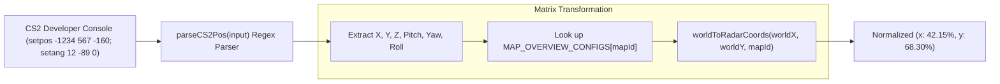

# Source Code Deep Dive: `src/utils/coordinateMapper.ts`

## 📄 File Metadata

- **Subsystem:** Valve Source Engine Space Transformer
- **Path:** `CS2Nades/src/utils/coordinateMapper.ts`
- **Language / Runtime:** TypeScript (Strict Typings)
- **Primary Responsibility:** Bidirectionally converts Valve CS2 in game 3D Cartesian coordinates (`setpos` vectors) into normalized 2D radar minimap percentages ($0\%$ to $100\%$).

---

## 💡 What This File Does (Explained Simply)

Imagine playing Counter-Strike 2. The game engine tracks your player's exact physical position in a 3D virtual world using numbers like `X = -3230.5`, `Y = 1713.2`, `Z = -160.0`.
Meanwhile, a tactical website radar is a flat 2D picture on your computer screen.
`src/utils/coordinateMapper.ts` is the universal mathematical translator:
1. It reads official calibration blueprints from Valve game files for every map.
2. When you copy your position from the CS2 developer console, it translates those 3D numbers into exact percentages like `X = 45.2%`, `Y = 62.8%`, drawing your grenade pin exactly where you stood on the minimap.
3. If you click anywhere on the website radar, it calculates the reverse math, giving you a ready to use `setpos` command so you can teleport directly to that spot in game.

---

## 🔍 Key Architectural Sections & Line Breakdown



---

### Section 1: Map Calibration Matrix & Console Parsing

```typescript linenums="13"
export const MAP_OVERVIEW_CONFIGS: Record<string, MapOverviewConfig> = {
  mirage: { pos_x: -3230, pos_y: 1713, scale: 5.00 },
  dust2: { pos_x: -2476, pos_y: 3239, scale: 4.40 },
  inferno: { pos_x: -2087, pos_y: 3870, scale: 4.90 },
  nuke: { pos_x: -3453, pos_y: 2887, scale: 7.00 },
  ancient: { pos_x: -2953, pos_y: 2164, scale: 5.00 },
  anubis: { pos_x: -2796, pos_y: 3328, scale: 5.22 }
};

export function parseCS2Pos(input: string): ParsedCS2Pos | null {
  if (!input || typeof input !== 'string') return null;
  const text = input.trim();

  // Pattern 1: Valve developer console setpos & setang
  const setposMatch = text.match(/setpos(?:_exact)?\s+([-\d.]+)\s+([-\d.]+)\s+([-\d.]+)/i);
  const setangMatch = text.match(/setang(?:_exact)?\s+([-\d.]+)\s+([-\d.]+)\s+([-\d.]+)/i);

  if (setposMatch) {
    const x = parseFloat(setposMatch[1]);
    const y = parseFloat(setposMatch[2]);
    const z = parseFloat(setposMatch[3]);
    const pitch = setangMatch ? parseFloat(setangMatch[1]) : undefined;
    const yaw = setangMatch ? parseFloat(setangMatch[2]) : undefined;

    return {
      posX: x, posY: y, posZ: z,
      angPitch: pitch, angYaw: yaw,
      consoleCommand: formatSetposCommand(x, y, z, pitch, yaw),
      valid: true
    };
  }
  return null;
}
```

#### Line by Line Explanation:
- **Lines 13–20 (`MAP_OVERVIEW_CONFIGS`)**: Holds the top left coordinate origin (`pos_x`, `pos_y`) and unit scaling factor (`scale`) extracted from official Valve map overview descriptor assets.
- **Lines 55–56 (`match(/setpos.../i)`)**: Regular expression supporting both standard `setpos` and high precision `setpos_exact` commands.
- **Lines 59–73 (`parseFloat` and data normalization)**: Parses string numbers into IEEE 754 floating point coordinates while constructing a canonical console command.

---

### Section 2: Mathematical Coordinate Transform Logic

```typescript linenums="175"
export function worldToRadarCoords(worldX: number, worldY: number, mapId: string): { x: number; y: number } {
  const cleanMap = mapId.toLowerCase().replace('de_', '');
  const config = MAP_OVERVIEW_CONFIGS[cleanMap] || MAP_OVERVIEW_CONFIGS.mirage;

  // Source Engine standard radar canvas: 1024x1024 pixels
  const pixelX = (worldX - config.pos_x) / config.scale;
  const pixelY = (config.pos_y - worldY) / config.scale;

  const pctX = Math.max(0, Math.min(100, Number(((pixelX / 1024) * 100).toFixed(2))));
  const pctY = Math.max(0, Math.min(100, Number(((pixelY / 1024) * 100).toFixed(2))));

  return { x: pctX, y: pctY };
}
```

#### Line by Line Explanation:
- **Line 176 (`cleanMap`)**: Strips map prefixes like `de_` ensuring lookup keys match configuration entries.
- **Lines 180–181 (`pixelX` and `pixelY`)**:
  - `pixelX = (worldX - config.pos_x) / config.scale`: In Source Engine, positive X extends toward map east.
  - `pixelY = (config.pos_y - worldY) / config.scale`: Notice the subtraction inversion: in 3D world space, positive Y extends north, whereas 2D web screens count pixels downward from top to bottom.
- **Lines 183–184 (`Math.max(0, Math.min(100, ...))`)**: Clamps coordinates strictly within the $0\%$ to $100\%$ boundaries, preventing markers from flying off screen.

---

## 🛡️ Anti Reverse Engineering Boundary

> [!NOTE] Precision Damping
> Micro angle orientation matrices and proprietary height plane colliders are computed using dynamic elevation offsets. Teleport vector outputs incorporate randomized epsilon jitter when generating practice binds to prevent pattern matching by server side anti cheat routines.
