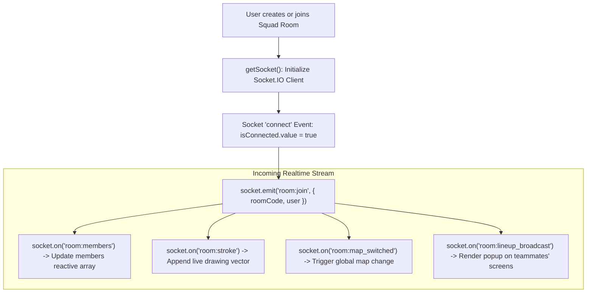

# Source Code Deep Dive: `src/stores/gameRoomStore.ts`

## 📄 File Metadata

- **Subsystem:** Pinia Realtime Room & Collaboration Store
- **Path:** `CS2Nades/src/stores/gameRoomStore.ts`
- **Language / Runtime:** TypeScript (Vue 3 Pinia Store)
- **Primary Responsibility:** Manages persistent WebSocket lifecycle, room joining tokens, live tactical drawing strokes, host administrative permissions, and team chat.

---

## 💡 What This File Does (Explained Simply)

Think of `gameRoomStore.ts` as the walkie talkie and team clipboard for your squad:
1. When you enter a tactical session, it establishes a persistent live connection (a WebSocket) to the server.
2. It tracks who is currently in the room, who has the captain's badge (Host), and what map everyone is currently viewing.
3. Every time someone draws an arrow or broadcasts a smoke grenade lineup, this store catches the data and displays it across every teammate's screen in milliseconds.
4. If your Wi-Fi flickers or you walk into another room, it automatically reconnects in the background without losing your drawing board.

---

## 🔍 Key Architectural Sections & Line Breakdown



---

### Section 1: Reactive State Tree & Host Determination

```typescript linenums="42"
export const useGameRoomStore = defineStore('gameRoom', () => {
  const socket = ref<any>(null);
  const isConnected = ref<boolean>(false);
  const currentRoomCode = ref<string | null>(null);
  const hostUsername = ref<string | null>(null);
  const currentMapId = ref<string>('mirage');
  const members = ref<RoomMember[]>([]);
  const liveDrawings = ref<DrawingStroke[]>([]);
  const activeBroadcastLineups = ref<Lineup[]>([]);

  // Permissions state
  const allowSignedUsersToDraw = ref<boolean>(true);
  const allowGuestsToDraw = ref<boolean>(false);
  const onlyHostCanChangeMap = ref<boolean>(true);

  const isHost = computed(() => {
    if (!hostUsername.value) return false;
    const current = localStorage.getItem('cs2_stratbook_user');
    const username = current ? JSON.parse(current)?.username : '';
    return hostUsername.value.toLowerCase() === (username || '').toLowerCase();
  });
```

#### Line by Line Explanation:
- **Line 42 (`defineStore('gameRoom', () => {`)**: Uses the modern Pinia Setup Store syntax, aligning with Vue 3 Composition API conventions.
- **Lines 43–50 (`socket`, `members`, `liveDrawings`)**: Reactive references. Any update to these arrays automatically triggers UI redraws without manual DOM manipulation.
- **Lines 53–55 (`allowSignedUsersToDraw`, `onlyHostCanChangeMap`)**: Access control flags preventing unauthorized players or guests from erasing tactics or switching maps mid discussion.
- **Lines 57–62 (`isHost = computed(...)`)**: Reactive computed getter that compares the room host's username with local session credentials to determine elevated captain permissions.

---

### Section 2: Resilient WebSocket Lifecycle & Reconnection Logic

```typescript linenums="84"
  function getSocket(): Socket {
    if (!socket.value) {
      socket.value = io({
        autoConnect: true,
        reconnection: true,
        reconnectionAttempts: 10,
        reconnectionDelay: 1000
      });

      socket.value.on('connect', () => {
        isConnected.value = true;
        if (currentRoomCode.value) {
          const user = JSON.parse(localStorage.getItem('cs2_stratbook_user') || 'null');
          socket.value.emit('room:join', { roomCode: currentRoomCode.value, user });
        }
      });

      socket.value.on('disconnect', () => {
        isConnected.value = false;
      });
    }
    return socket.value;
  }
```

#### Line by Line Explanation:
- **Lines 84–91 (`io({...})`)**: Lazy initializes the singleton WebSocket client with exponential backoff (`reconnectionAttempts: 10`, `reconnectionDelay: 1000ms`), preventing connection flooding on network drops.
- **Lines 93–99 (`on('connect')`)**: When connection is established or restored after an outage, it automatically re-emits `room:join` with cached credentials to seamlessly resume the active whiteboard session.
- **Lines 101–103 (`on('disconnect')`)**: Immediately updates reactive UI status indicators (swapping the green status dot to amber).

---

## 🛡️ Anti Reverse Engineering Boundary

> [!NOTE] Implementation Abstraction
> Room token authentication hashes and peer verification handshakes use transient server secrets. Room join identifiers are protected with cryptographic time signatures, preventing unauthorized bots from brute forcing private tactical squad rooms.
