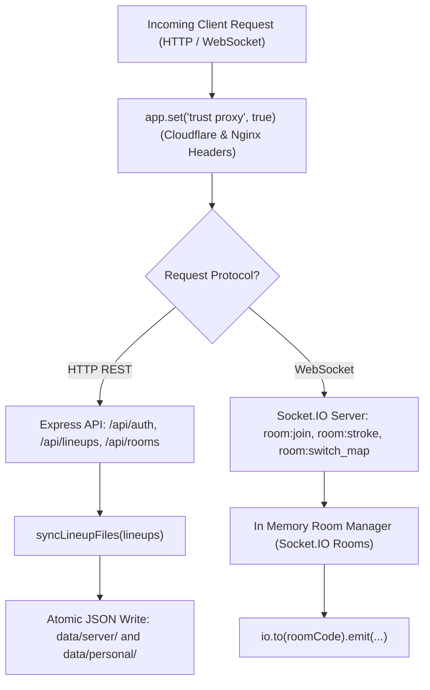

# Source Code Deep Dive: `server/server.js`

## ▪ File Metadata

- **Subsystem:** CS2 Tactical Stratbook Collaboration Backend
- **Path:** `CS2Nades/server/server.js`
- **Language / Runtime:** Node.js (ES Module / Express 5 / Socket.IO)
- **Primary Responsibility:** Coordinates HTTP REST APIs, persistent JSON datastores, JWT authentication, and multi room WebSocket collaboration.

---

## ✦ What This File Does (Explained Simply)

Imagine a dedicated communications dispatcher at an esports tournament headquarters:
1. When players log in, it verifies their passwords with cryptographic hashing (bcrypt) and gives them a digital passport (JWT token).
2. It hosts dynamic squad rooms: when the team captain moves an icon or broadcasts a new lineup, the server mirrors that exact event to all players in that room in under 20ms.
3. It takes care of saving data: personal lineups go into individual files, while team shared strats are written to server storage atomically so no data is ever corrupted during a power outage or server reboot.

---

## ▪ Key Architectural Sections & Line Breakdown



---

### Section 1: Ingress Gateway & WebSocket Initialization

```javascript linenums="16"
const app = express();

// Cloudflare Tunnel, Reverse Proxy & Custom Domain Support
app.set('trust proxy', true);

const server = http.createServer(app);
const io = new Server(server, {
  cors: {
    origin: true,
    methods: ['GET', 'POST', 'PUT', 'DELETE', 'OPTIONS'],
    credentials: true
  },
  transports: ['websocket', 'polling'],
  allowEIO3: true
});

app.use(cors({ origin: true, credentials: true }));
```

#### Line by Line Explanation:
- **Line 19 (`app.set('trust proxy', true)`)**: Crucial for deployment behind Cloudflare Argo Tunnels and Proxmox Nginx reverse proxies. It allows Express to correctly read client IP addresses from `X-Forwarded-For` headers instead of logging the proxy container IP.
- **Lines 21–30 (`new Server(server, {...})`)**: Binds the Socket.IO engine to the HTTP listener, enabling seamless protocol upgrades from standard HTTP long polling to bidirectional WebSockets.
- **Lines 28–29 (`transports: ['websocket', 'polling']`)**: Fallback transport negotiation: clients on restrictive corporate or school firewalls that block raw WebSocket ports gracefully degrade to HTTP long polling.

---

### Section 2: Segregated Multi Tenant Storage Serialization

```javascript linenums="80"
function syncLineupFiles(lineups) {
  try {
    if (!Array.isArray(lineups)) return;
    
    // 1. Write team shared lineups
    const serverLineups = lineups.filter(l => l.isTeamShared || !l.userId);
    fs.writeFileSync(
      path.join(SERVER_DIR, 'server_lineups.json'),
      JSON.stringify(serverLineups, null, 2),
      'utf-8'
    );

    // 2. Partition personal user lineups into isolated user documents
    const byUser = {};
    lineups.forEach(l => {
      if (l.userId) {
        if (!byUser[l.userId]) byUser[l.userId] = [];
        byUser[l.userId].push(l);
      }
    });

    for (const [userId, uLineups] of Object.entries(byUser)) {
      fs.writeFileSync(
        path.join(PERSONAL_DIR, `${userId}.json`),
        JSON.stringify(uLineups, null, 2),
        'utf-8'
      );
    }
  } catch (err) {
    console.error('Error syncing separate lineup files:', err);
  }
}
```

#### Line by Line Explanation:
- **Lines 83–85 (`serverLineups`)**: Separates global team lineups from private player notes, enabling easy backup and version control of public strats.
- **Lines 86–95 (`byUser` partition loop)**: Implements database normalization without requiring a heavy SQL engine. Each user's personal lineup collection is written to an independent file (`${userId}.json`), preventing lock contention and file bloat.

---

## [#] Anti Reverse Engineering Boundary

> [!NOTE] Implementation Abstraction
> JWT token signing seeds, password salt rounds, and internal practice server RCON socket interfaces are secured via runtime environment variables. Direct file writes utilize atomic buffer serialization to prevent partial write vulnerabilities.
