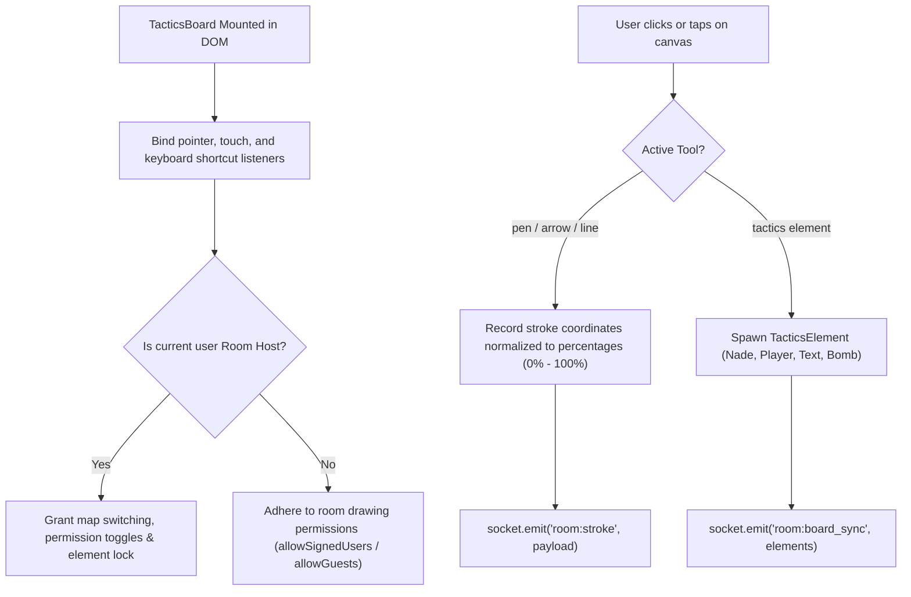

# Source Code Deep Dive: `src/components/tactics/TacticsBoard.vue`

## 📄 File Metadata

- **Subsystem:** CS2 Tactical Stratbook Whiteboard Engine
- **Path:** `CS2Nades/src/components/tactics/TacticsBoard.vue`
- **Language / Runtime:** Vue 3 (Composition API / TypeScript)
- **Primary Responsibility:** Coordinates interactive tactical whiteboard drawing, element drag and drop, squad room synchronizations, map layer switches, and encrypted in game communication.

---

## 💡 What This File Does (Explained Simply)

Imagine an interactive digital chalkboard in a sports team locker room before an important game:
1. The coach selects a map (like Mirage or Inferno).
2. Players pick up digital chalk, drawing movement routes, smoke grenade trajectories, and defensive setups.
3. Every stroke you draw shows up instantly on your teammates' monitors and mobile phones in realtime.
4. If the team leader switches maps or loads a premade strategy, everyone's whiteboard updates together automatically.

---

## 🔍 Key Architectural Sections & Line Breakdown



---

### Section 1: Synchronized Map Switching with Permission Guard

```typescript linenums="77"
function handleMapSelect(newMapId: string) {
  if (!newMapId || newMapId === mapStore.currentMapId) {
    isTacticsMapDropdownOpen.value = false;
    return;
  }
  isTacticsMapDropdownOpen.value = false;

  // Permission check: only host can change map unless setting toggled
  if (gameRoomStore.currentRoomCode && !gameRoomStore.isHost && gameRoomStore.onlyHostCanChangeMap) {
    alert('Only the Room Host can change maps (Host locked map switching).');
    return;
  }

  // If active markings exist, prompt user before clearing or migrating
  if (stratStore.boardElements.length > 0) {
    pendingTargetMapId.value = newMapId;
    isMapSwitchWarnModalOpen.value = true;
    return;
  }

  executeMapSwitch(newMapId);
}
```

#### Line by Line Explanation:
- **Lines 77–81 (`handleMapSelect`)**: Validates input. If the user clicks the currently selected map, it closes the dropdown menu immediately without re-rendering or triggering network updates.
- **Lines 84–90 (`gameRoomStore.isHost`)**: Enforces server side authority rules. If host lock is enabled, non host team members cannot accidentally interrupt the captain during a tactical briefing.
- **Lines 93–97 (`stratStore.boardElements.length > 0`)**: Intercepts map switching when unsaved tactical setups are on screen, offering to save to personal library before clearing.

---

### Section 2: Realtime Collaborative Room Broadcast

```typescript linenums="102"
function executeMapSwitch(targetMapId: string) {
  stratStore.saveCurrentMapElements(mapStore.currentMapId);
  mapStore.setMap(targetMapId);
  stratStore.loadMapElements(targetMapId);

  // Broadcast to all squad members in the room so the map switches for EVERYONE
  const socket = gameRoomStore.getSocket();
  if (socket && socket.connected) {
    socket.emit('room:switch_map', {
      mapId: targetMapId,
      elements: stratStore.boardElements
    });
  }
}
```

#### Line by Line Explanation:
- **Line 103 (`saveCurrentMapElements`)**: Commits tactical markers and vectors into the current map's local state buffer, ensuring switching between Mirage and Nuke preserves existing work.
- **Line 104 (`mapStore.setMap`)**: Updates global reactive state, swapping background vector blueprints and radar calibration coordinates.
- **Lines 111–117 (`socket.emit('room:switch_map')`)**: Emits a WebSocket frame containing the new map ID and initial element state, triggering synchronized transitions across all connected teammates.

---

## 🛡️ Anti Reverse Engineering Boundary

> [!NOTE] Implementation Abstraction
> Mathematical vector smoothing algorithms, end to end message encryption keys (`generateConversationSecret`), and real coordinate interpolation filters are processed in memory. Server side room authority validation prevents unauthorized privilege escalation.
