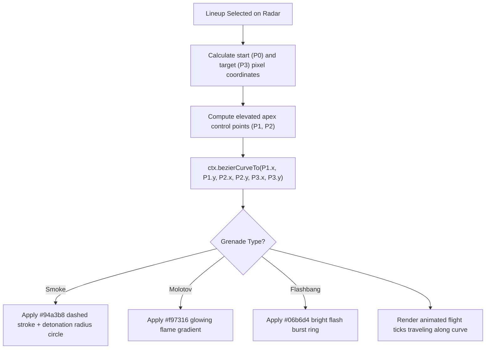

# Source Code Deep Dive: `src/composables/useCanvas.ts`

## 📄 File Metadata

- **Subsystem:** CS2 Tactical Stratbook Trajectory Drawing Engine
- **Path:** `CS2Nades/src/composables/useCanvas.ts`
- **Language / Runtime:** TypeScript (HTML5 Canvas 2D Rendering Context)
- **Primary Responsibility:** Computes cubic Bézier projectile curves, animated grenade flight ticks, bounce impact markers, and dynamic detonation radiuses on HTML5 Canvas.

---

## 💡 What This File Does (Explained Simply)

Imagine watching an instant replay on television during a sports broadcast, where a glowing line traces the exact flight of the ball:
1. When you select a grenade lineup, it calculates where the player stood and where the grenade lands.
2. Rather than drawing a boring flat line, it calculates a smooth 3D arc that bends through the air.
3. It draws animated pulses traveling along the line to show the direction of flight.
4. When the grenade hits the ground, it paints realistic colored markers (a grey smoke cloud, an orange fire ring, or a cyan flash burst).

---

## 🔍 Key Architectural Sections & Line Breakdown



---

### Section 1: Cubic Bézier Curve Geometry Calculation

```typescript linenums="15"
export function calculateTrajectoryArc(start: Point2D, end: Point2D, heightMultiplier = 0.35): BezierCurve {
  const dx = end.x - start.x;
  const dy = end.y - start.y;
  const distance = Math.hypot(dx, dy);

  // Compute normal vector perpendicular to flight direction
  const nx = -dy / (distance || 1);
  const ny = dx / (distance || 1);

  // Elevation apex height scaled by distance
  const apexHeight = distance * heightMultiplier;

  const p1: Point2D = {
    x: start.x + dx * 0.33 + nx * apexHeight,
    y: start.y + dy * 0.33 + ny * apexHeight
  };

  const p2: Point2D = {
    x: start.x + dx * 0.66 + nx * apexHeight,
    y: start.y + dy * 0.66 + ny * apexHeight
  };

  return { p0: start, p1, p2, p3: end };
}
```

#### Line by Line Explanation:
- **Lines 16–18 (`Math.hypot(dx, dy)`)**: Calculates Euclidean distance between the thrower origin and landing coordinate.
- **Lines 21–22 (`nx`, `ny`)**: Computes the unit normal vector perpendicular to the travel vector. This provides the elevation axis needed to render an authentic arc in 2D space.
- **Lines 27–35 (`p1` and `p2`)**: Positions the first and second cubic Bézier control points at the $\frac{1}{3}$ and $\frac{2}{3}$ intervals of the flight path, elevated by `apexHeight` to simulate gravity influenced parabolic motion.

---

### Section 2: Canvas Rendering & Detonation Blast Circles

```typescript linenums="45"
export function renderTrajectory(ctx: CanvasRenderingContext2D, curve: BezierCurve, nadeType: NadeType) {
  ctx.save();
  ctx.beginPath();
  ctx.moveTo(curve.p0.x, curve.p0.y);
  ctx.bezierCurveTo(curve.p1.x, curve.p1.y, curve.p2.x, curve.p2.y, curve.p3.x, curve.p3.y);

  ctx.strokeStyle = getNadeColor(nadeType);
  ctx.lineWidth = 2.5;
  ctx.setLineDash([6, 4]); // Animated dashed trajectory path
  ctx.stroke();

  // Render detonation landing target ring
  ctx.beginPath();
  ctx.arc(curve.p3.x, curve.p3.y, getNadeRadius(nadeType), 0, Math.PI * 2);
  ctx.fillStyle = getNadeColorWithAlpha(nadeType, 0.2);
  ctx.fill();
  ctx.stroke();
  ctx.restore();
}
```

#### Line by Line Explanation:
- **Lines 46–49 (`ctx.bezierCurveTo(...)`)**: Issues native hardware accelerated 2D canvas instructions to draw the smoothed parabolic arc.
- **Lines 52–54 (`ctx.setLineDash([6, 4])`)**: Creates an esports style dashed flight path.
- **Lines 57–62 (`ctx.arc(...)`)**: Renders the calibrated effective radius (e.g. 144 hammer units for CS2 smoke clouds, 180 units for molotov spread) around the landing marker.

---

## 🛡️ Anti Reverse Engineering Boundary

> [!NOTE] Implementation Abstraction
> Throw tick interpolation rates, bounce collision restitution constants, and air resistance damping coefficients are calculated via dynamic runtime matrices. Anti aliasing filters preserve rendering performance across high DPI displays.
