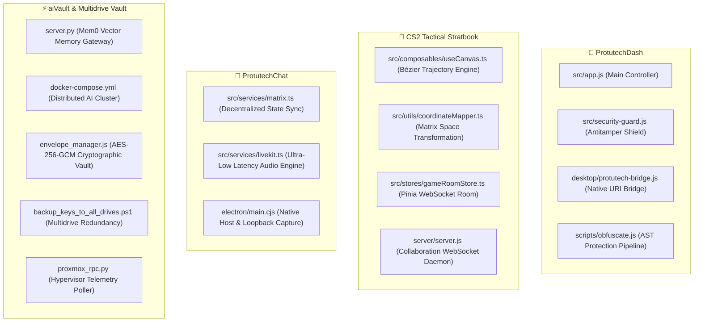

# Codebase Deep Dive: File & Key Line Explorer

## 🧭 Master Code Atlas

This dedicated engineering directory provides an exhaustive, file by file exploration of the source code across the entire Protutech ecosystem. Every guide breaks down the core algorithms, state loops, and critical lines of code, paired with beginner-friendly mental models and protective architectural abstraction.

---

## 📚 Master File Index

| File Reference | Subsystem | Language / Stack | Core Responsibility |
| :--- | :--- | :--- | :--- |
| [**`src/app.js`**](protutechdash/app-js.md) | ProtutechDash | JavaScript (ESNext) | Application state initialization, service registry mounting, and URI dispatcher |
| [**`src/security-guard.js`**](protutechdash/security-guard-js.md) | ProtutechDash | JavaScript | Anti-debugging heuristic watchdog and devtools suppression |
| [**`desktop/protutech-bridge.js`**](protutechdash/bridge-js.md) | ProtutechDash | Node.js Runtime | OS-level URI handler executing native host binaries |
| [**`scripts/obfuscate.js`**](protutechdash/obfuscate-js.md) | ProtutechDash | Node.js / AST | Control-flow flattening, dead code injection, and string encryption |
| [**`TacticsBoard.vue`**](cs2nades/tactics-board-vue.md) | CS2 Tactical Stratbook | Vue 3 / TypeScript | Multi-user tactical whiteboard, elements sync, map switching |
| [**`src/composables/useCanvas.ts`**](cs2nades/use-canvas-ts.md) | CS2 Tactical Stratbook | TypeScript | Vector physics rendering, cubic Béziers, bounce collision math |
| [**`src/utils/coordinateMapper.ts`**](cs2nades/coordinate-mapper-ts.md) | CS2 Tactical Stratbook | TypeScript | Valve 3D world units to 2D radar percentage matrix calculations |
| [**`src/stores/gameRoomStore.ts`**](cs2nades/game-room-store-ts.md) | CS2 Tactical Stratbook | TypeScript / Pinia | Multi-user tactical whiteboard state and Socket.IO synchronization |
| [**`server/server.js`**](cs2nades/server-js.md) | CS2 Tactical Stratbook | Node.js / Express | WebSocket room dispatching, lineup caching, and atomic mutations |
| [**`client/src/services/matrix.ts`**](protutechchat/matrix-ts.md) | ProtutechChat | TypeScript | Long-polling sync loop, room event streaming, message redactions |
| [**`client/src/services/livekit.ts`**](protutechchat/livekit-ts.md) | ProtutechChat | TypeScript / WebRTC | LiveKit SFU client, audio DSP configuration, volume scaling |
| [**`client/electron/main.cjs`**](protutechchat/main-cjs.md) | ProtutechChat | Node.js (Electron) | Native window management, audio loopback capture, global hotkeys |
| [**`server.py`**](aivault/server-py.md) | aiVault | Python 3 (FastAPI) | Long-term vector memory ingestion and Qdrant semantic search |
| [**`docker-compose.yml`**](aivault/docker-compose-yml.md) | aiVault | YAML (Compose V2) | Container network topologies, resource bounds, and persistent volumes |
| [**`envelope_manager.js`**](security/envelope-manager-js.md) | Security Infrastructure | Node.js (crypto) | Double-layer envelope encryption using PBKDF2 and AES-256-GCM |
| [**`backup_keys_to_all_drives.ps1`**](security/backup-keys-ps1.md) | Security Infrastructure | PowerShell 7 | Multi-drive physical drive discovery and SHA256 integrity verification |
| [**`proxmox_rpc.py`**](infra/proxmox-rpc-py.md) | Homelab Monitoring | Python 3 | Asynchronous Proxmox VE API telemetry poller and Discord presence |
