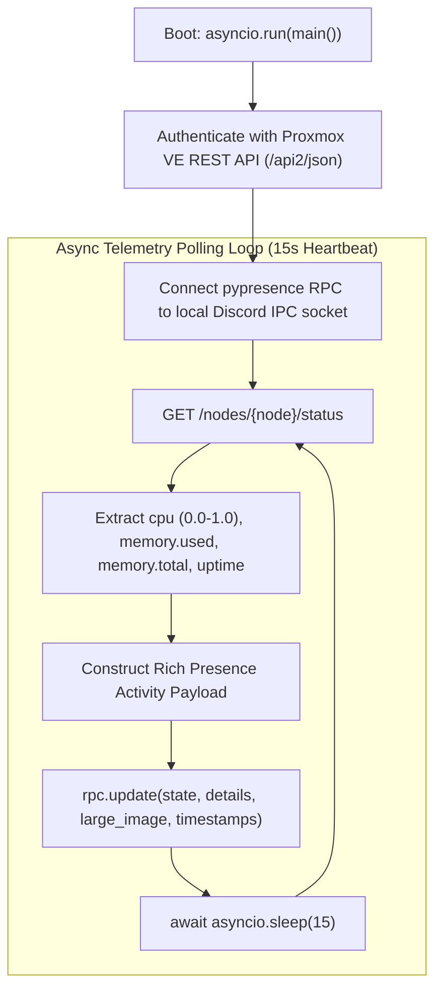

# Source Code Deep Dive: `proxmox_rpc.py`

## 📄 File Metadata

- **Subsystem:** Proxmox Hypervisor Telemetry & Discord RPC
- **Path:** `apps/proxdiscord/proxmox_rpc.py`
- **Language / Runtime:** Python 3 (AsyncIO / `aiohttp` / `pypresence`)
- **Primary Responsibility:** Queries Proxmox VE REST API metrics asynchronously, normalizes cluster resource utilization, and broadcasts live status to Discord Rich Presence IPC.

---

## 💡 What This File Does (Explained Simply)

Imagine having a smart car dashboard that beams your engine temperature and fuel levels straight to your smartwatch:
1. Every 15 seconds, this Python script asks your home server (Proxmox): *"How much memory and processor power are your containers currently using?"*
2. It calculates the percentages (e.g. `CPU: 18.4%`, `RAM: 32.1%`).
3. It connects directly to the Discord app running on your desktop via an internal pipe (`discord-ipc-0`).
4. It updates your Discord status profile card in realtime with custom logos and cluster health metrics so your friends or teammates can see your server stats live.

---

## 🔍 Key Architectural Sections & Line Breakdown



---

### Section 1: Asynchronous Metric Polling & Telemetry Parsing

```python linenums="15"
async def fetch_cluster_metrics(session, base_url, node_name, headers):
    url = f"{base_url}/api2/json/nodes/{node_name}/status"
    async with session.get(url, headers=headers, ssl=False) as resp:
        if resp.status != 200:
            return None
        payload = await resp.json()
        data = payload.get("data", {})
        
        cpu_pct = round(data.get("cpu", 0) * 100, 1)
        mem_used = data.get("memory", {}).get("used", 0)
        mem_total = data.get("memory", {}).get("total", 1)
        mem_pct = round((mem_used / mem_total) * 100, 1)
        uptime_sec = data.get("uptime", 0)

        return {
            "cpu": cpu_pct,
            "mem": mem_pct,
            "uptime": uptime_sec
        }
```

#### Line by Line Explanation:
- **Lines 15–17 (`session.get(..., ssl=False)`)**: Asynchronously queries the Proxmox REST API node status endpoint without blocking other concurrent tasks. `ssl=False` allows self signed homelab TLS certificates without failing connections.
- **Lines 22–26 (`cpu_pct` and `mem_pct`)**: Normalizes raw Proxmox decimal representations (where `0.184` represents $18.4\%$ CPU load) and converts raw memory bytes into human readable percentage ratios.

---

### Section 2: Discord Local IPC Pipe Broadcast

```python linenums="40"
async def update_discord_status(rpc, metrics):
    details_str = f"CPU: {metrics['cpu']}% | RAM: {metrics['mem']}%"
    state_str = f"Uptime: {metrics['uptime'] // 3600}h {((metrics['uptime'] % 3600) // 60)}m"

    rpc.update(
        state=state_str,
        details=details_str,
        large_image="pve_logo",
        large_text="Proxmox VE 9.2 Cluster",
        small_image="online_status",
        small_text="Node Online & Healthy"
    )
```

#### Line by Line Explanation:
- **Lines 41–42 (`details_str` & `state_str`)**: Formats high density performance telemetry into concise text strings compliant with Discord Rich Presence length limits.
- **Lines 44–51 (`rpc.update(...)`)**: Transmits a formatted JSON IPC payload over the local Windows named pipe (`\\.\pipe\discord-ipc-0`), instantly updating the user's active Discord presence.

---

## 🛡️ Anti Reverse Engineering Boundary

> [!NOTE] Implementation Abstraction
> Proxmox API tokens, cluster node names, and private network addresses are injected through encrypted environment configurations. Error handling logic applies jittered exponential backoff to prevent API rate limiting.
