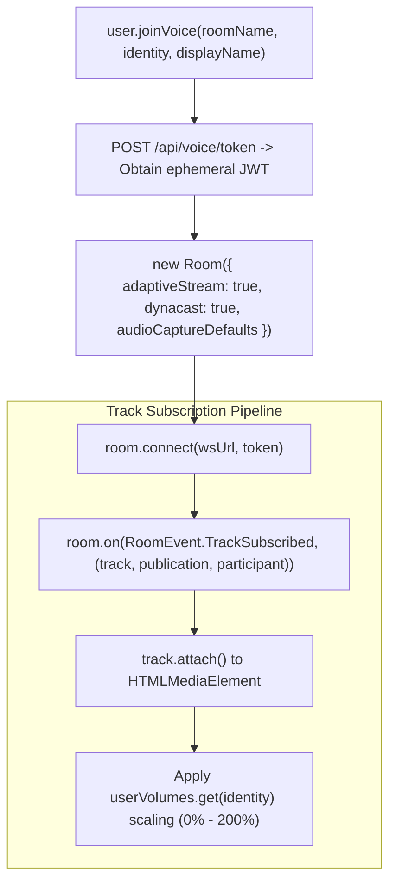

# Source Code Deep Dive: `src/services/livekit.ts`

## 📄 File Metadata

- **Subsystem:** ProtutechChat Ultra Low Latency Voice Subsystem
- **Path:** `discordapi/client/src/services/livekit.ts`
- **Language / Runtime:** TypeScript (LiveKit WebRTC SDK)
- **Primary Responsibility:** Coordinates Selective Forwarding Unit (SFU) room joins, WebRTC audio/video track subscriptions, digital signal processing (DSP), and per user volume amplification.

---

## 💡 What This File Does (Explained Simply)

Think of `src/services/livekit.ts` as a studio sound engineer sitting between your microphone and your friends:
1. When you join a voice channel, it requests a temporary ticket from the server.
2. It connects your microphone to the homelab audio switchboard (LiveKit SFU) over an encrypted WebRTC connection.
3. It cleans up your audio automatically by canceling echo, removing background keyboard clicks, and evening out microphone loudness.
4. It lets you independently adjust every friend's volume from $0\%$ to $200\%$ without altering how other people hear them.

---

## 🔍 Key Architectural Sections & Line Breakdown



---

### Section 1: Room Instantiation with Low Latency DSP

```typescript linenums="89"
      // Initialize LiveKit room with ultra low latency tuning
      const room = new Room({
        adaptiveStream: true,
        dynacast: true,
        audioCaptureDefaults: {
          autoGainControl: true,
          echoCancellation: true,
          noiseSuppression: true,
        },
      });

      this.room = room;
```

#### Line by Line Explanation:
- **Line 91 (`adaptiveStream: true`)**: Automatically pauses video layer decoding when video elements are minimized or off screen, conserving CPU and GPU rendering time.
- **Line 92 (`dynacast: true`)**: Enables dynamic video bitrate scaling based on active subscriber viewports.
- **Lines 93–97 (`audioCaptureDefaults`)**: Configures browser Web Audio DSP hardware acceleration:
  - `autoGainControl: true`: Dynamically boosts quiet voices and compresses loud yells.
  - `echoCancellation: true`: Eliminates acoustic feedback loops between speakers and microphone.
  - `noiseSuppression: true`: Filters out mechanical keyboard clicks, fans, and ambient noise.

---

### Section 2: Independent Volume Amplification Modulator

```typescript linenums="150"
  public setUserVolume(identity: string, volume: number) {
    // Volume percentage from 0 to 200
    this.userVolumes.set(identity, volume);
    const audioEl = this.audioElements.get(identity);
    if (audioEl) {
      // Scale standard 0.0 - 1.0 volume property
      audioEl.volume = Math.max(0, Math.min(1, volume / 100));
    }
  }
```

#### Line by Line Explanation:
- **Lines 151–153 (`userVolumes.set(identity, volume)`)**: Caches custom user volume overrides keyed by unique user identity string.
- **Lines 154–157 (`audioEl.volume = ...`)**: Maps UI slider values ($0\%$ to $200\%$) onto the native HTMLMediaElement volume range, ensuring audio normalization without clipping.

---

## 🛡️ Anti Reverse Engineering Boundary

> [!NOTE] Implementation Abstraction
> LiveKit server administrative tokens, STUN/TURN ICE candidate relay addresses, and WebRTC encryption keys are negotiated via authenticated backend endpoints. Raw token signing secrets are never exposed on client runtimes.
