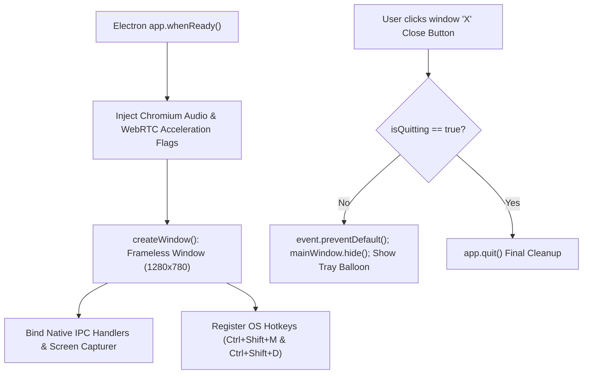

# Source Code Deep Dive: `client/electron/main.cjs`

## 📄 File Metadata

- **Subsystem:** ProtutechChat Native Operating System Shell
- **Path:** `discordapi/client/electron/main.cjs`
- **Language / Runtime:** Node.js (Electron Main Process)
- **Primary Responsibility:** Manages native application window life cycles, hardware accelerated Chromium command line flags, loopback desktop audio streaming, system tray minimizing, and global hotkeys.

---

## 💡 What This File Does (Explained Simply)

A web browser is normally confined to its own tab, unable to control your operating system.
`client/electron/main.cjs` turns ProtutechChat from a simple website into a full desktop application:
1. It creates a sleek, borderless window with dark glassmorphic backgrounds.
2. When you share your screen during gameplay, it captures both your screen and the internal game audio directly from Windows without requiring virtual audio cables.
3. When you press the close button `X`, it doesn't kill your call—it minimizes into your Windows taskbar tray so you can keep talking.
4. It listens for keyboard shortcuts (like `Ctrl+Shift+M`) even while you are playing fullscreen video games so you can mute your microphone instantly.

---

## 🔍 Key Architectural Sections & Line Breakdown



---

### Section 1: Chromium Media & Performance Flags

```javascript linenums="5"
// Optimize Chromium audio/video flags for ultra low latency WebRTC LiveKit & Screen Capture
app.commandLine.appendSwitch('autoplay-policy', 'no-user-gesture-required');
app.commandLine.appendSwitch('enable-features', 'WebRTCPCM16kAudio,WebRTC-H264WithOpenH264FFmpeg');
app.commandLine.appendSwitch('force-webrtc-ip-handling-policy', 'default_public_interface_only');
app.commandLine.appendSwitch('ignore-certificate-errors');
app.commandLine.appendSwitch('enable-usermedia-screen-capturing');
app.commandLine.appendSwitch('auto-select-desktop-capture-source', 'Entire screen');
```

#### Line by Line Explanation:
- **Line 6 (`autoplay-policy`)**: Allows incoming voice streams and sound effects to play without requiring the user to click the application window first.
- **Line 7 (`enable-features`)**: Directs the underlying Chromium browser engine to use hardware accelerated H.264 video encoding and low latency PCM audio buffers.
- **Line 8 (`force-webrtc-ip-handling-policy`)**: Enforces WebRTC privacy standards by preventing local private subnet IP addresses from leaking across public network interfaces.
- **Line 10 (`enable-usermedia-screen-capturing`)**: Grants the renderer process permission to capture system screens and active game windows.

---

### Section 2: Windows System Audio Loopback Capture

```javascript linenums="52"
  mainWindow.webContents.session.setDisplayMediaRequestHandler((request, callback) => {
    desktopCapturer.getSources({ types: ['screen', 'window'] }).then((sources) => {
      if (sources.length > 0) {
        callback({ video: sources[0], audio: 'loopback' });
      } else {
        callback({});
      }
    });
  });
```

#### Line by Line Explanation:
- **Lines 52–53 (`setDisplayMediaRequestHandler`)**: Intercepts `navigator.mediaDevices.getDisplayMedia` calls originating from the React web application.
- **Line 55 (`audio: 'loopback'`)**: Leverages the Windows Core Audio (WASAPI) loopback device. This enables native high quality capture of all sounds produced by running video games or desktop media players without requiring third party audio drivers.

---

## 🛡️ Anti Reverse Engineering Boundary

> [!NOTE] Implementation Abstraction
> Native context bridge interfaces, preload script IPC channels (`ipcRenderer.invoke`), and cryptographic token storage paths are compiled into secure runtime bundles. Application signing certificates verify host process integrity.
