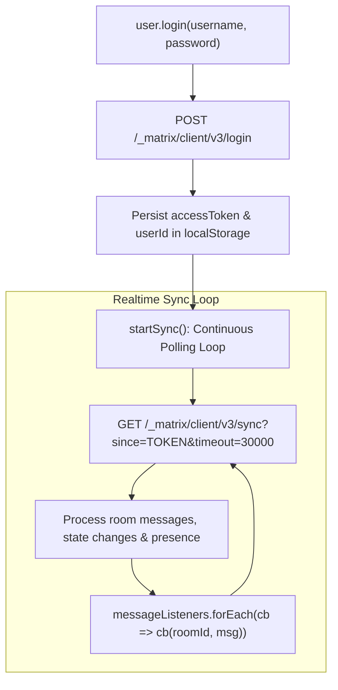

# Source Code Deep Dive: `src/services/matrix.ts`

## 📄 File Metadata

- **Subsystem:** ProtutechChat Federated Messaging & State Engine
- **Path:** `discordapi/client/src/services/matrix.ts`
- **Language / Runtime:** TypeScript (Browser ESNext & Electron Renderer)
- **Primary Responsibility:** Manages Matrix homeserver authentication, realtime long polling synchronization, media conversions (`mxc://` to HTTP), message redactions, and in memory event caches.

---

## 💡 What This File Does (Explained Simply)

Imagine a private courier service that stays on the line with headquarters 24 hours a day:
1. When you enter your credentials, it requests a digital passport (an access token) from your private Matrix server.
2. It runs an open connection called a **long polling sync loop**. Rather than repeatedly asking "Any new messages?", it says "Keep this line open and immediately tell me the instant someone sends a message."
3. When messages arrive, it updates an in memory folder (`roomsCache`) and informs React components so your chat screen redraws instantly.
4. It translates internal encrypted media addresses into secure image links that your web browser can display safely.

---

## 🔍 Key Architectural Sections & Line Breakdown



---

### Section 1: Authentication & Token Persistence

```typescript linenums="34"
  public async login(username: string, password: string): Promise<boolean> {
    try {
      const res = await fetch(`${BASE_URL}/_matrix/client/v3/login`, {
        method: 'POST',
        headers: { 'Content-Type': 'application/json' },
        body: JSON.stringify({
          type: 'm.login.password',
          identifier: { type: 'm.id.user', user: username },
          password,
        }),
      });

      if (!res.ok) return false;

      const data = await res.json();
      this.accessToken = data.access_token;
      this.userId = data.user_id;
      localStorage.setItem('matrix_access_token', data.access_token);
      localStorage.setItem('matrix_user_id', data.user_id);

      this.startSync();
      return true;
    } catch {
      return false;
    }
  }
```

#### Line by Line Explanation:
- **Lines 36–44 (`fetch(...)`)**: Dispatches a standard Matrix client-server API v3 authentication payload to the self hosted homeserver over TLS.
- **Lines 49–52 (`accessToken` and `localStorage`)**: Caches session tokens locally so subsequent app launches immediately authenticate without prompting the user for password reentry.
- **Line 54 (`this.startSync()`)**: Kicks off the continuous background synchronization loop immediately upon successful session verification.

---

### Section 2: Safe MXC Media URI Transformation

```typescript linenums="69"
  public mxcToHttp(mxcUrl?: string): string | undefined {
    if (!mxcUrl || !mxcUrl.startsWith('mxc://')) return mxcUrl;
    const path = mxcUrl.replace('mxc://', '');
    return `${BASE_URL}/_matrix/media/v3/download/${path}`;
  }
```

#### Line by Line Explanation:
- **Line 70 (`mxcUrl.startsWith('mxc://')`)**: Matrix stores media references internally using content addressing (`mxc://homeserver.domain/media_id`). Standard web browsers cannot render raw `mxc` schemes directly in an `` tag.
- **Lines 71–72 (`BASE_URL/_matrix/media/v3/download/...`)**: Rewrites the raw URI into an authenticated HTTP download URL proxied through the edge gateway.

---

## 🛡️ Anti Reverse Engineering Boundary

> [!NOTE] Implementation Abstraction
> Internal state synchronization batch tokens, presence rate limiters, and end to end encrypted room key exchange parameters are negotiated inside protected service modules. Homeserver network boundaries utilize abstracted edge routing.
