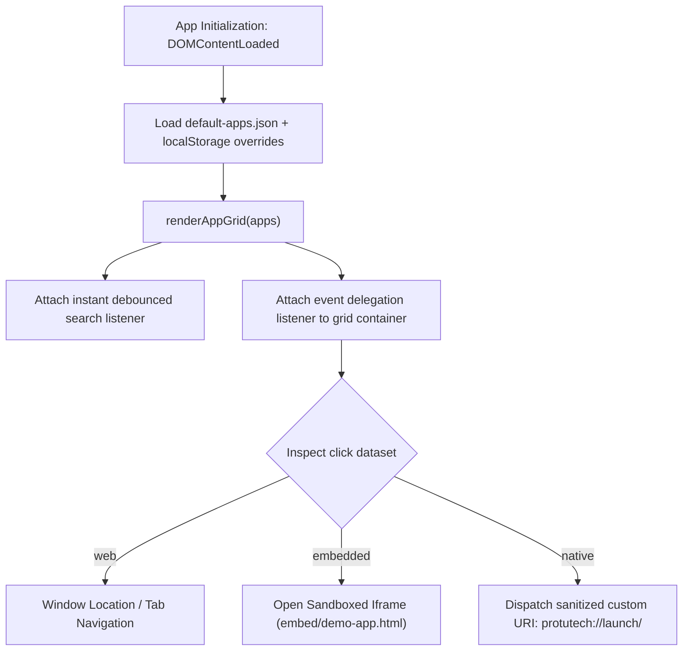

# Source Code Deep Dive: `src/app.js`

## 📄 File Metadata

- **Subsystem:** ProtutechDash Application Cockpit
- **Path:** `protutechdash/src/app.js`
- **Language / Runtime:** Vanilla JavaScript (ESNext / Browser DOM)
- **Primary Responsibility:** Orchestrates dashboard initialization, service registry state, search query filtering, and target dispatch logic.

---

## 💡 What This File Does (Explained Simply)

Think of `src/app.js` as the switchboard operator of a large corporate headquarters.
When you load the dashboard in your web browser:
1. It opens the internal phone book (`default-apps.json`) to find all your servers and tools.
2. It checks your browser's private memory (`localStorage`) to remember if you dragged any icons around or hid certain cards.
3. It paints the glassmorphic cards onto your screen.
4. When you click a card, it checks: *"Is this a standard website, a sandboxed internal tool, or a desktop video game?"* and routes your click to the exact right place.

---

## 🔍 Key Architectural Sections & Line Breakdown



---

### Section 1: State Initialization & Catalog Loading

```javascript linenums="1"
// Application state container
const AppState = {
  registry: [],
  activeFilter: 'all',
  searchQuery: '',
  layoutConfig: {}
};

async function initializeCockpit() {
  try {
    const response = await fetch('data/default-apps.json');
    const catalog = await response.json();
    const savedLayout = localStorage.getItem('protutech_layout_v1');
    
    AppState.registry = mergePreferences(catalog, savedLayout ? JSON.parse(savedLayout) : null);
    renderAppGrid(AppState.registry);
    attachSearchEngine();
  } catch (err) {
    displayFallbackError("CRITICAL: Failed to assemble service catalog.");
  }
}
```

#### Line by Line Explanation:
- **Lines 1–6 (`AppState`)**: Creates a clean, centralized reactive state tree in memory. Holding `registry` in a single object avoids polluting the global `window` scope and protects against external script interference.
- **Lines 8–11 (`fetch` and `localStorage`)**: Asynchronously fetches the baseline service manifest while reading personalized user settings from browser local storage.
- **Lines 13–15 (`mergePreferences` & `renderAppGrid`)**: Executes a non-destructive merge algorithm where user modifications take precedence without mutating original catalog definitions.

---

### Section 2: Safe Protocol & Iframe Dispatch Engine

```javascript linenums="35"
function dispatchTarget(targetId, targetType, targetUri) {
  // Sanitize target identifiers against malicious URI injections
  const sanitizedId = targetId.replace(/[^a-zA-Z0-9_-]/g, '');

  if (targetType === 'native') {
    // Dispatch to local host bridge via registered protocol handler
    const bridgeUri = `protutech://execute/${encodeURIComponent(sanitizedId)}`;
    window.location.href = bridgeUri;
    return;
  }

  if (targetType === 'embedded') {
    // Open inside sandboxed security viewport
    openIsolatedViewer(targetUri, sanitizedId);
    return;
  }

  // Standard external web application navigation
  window.open(targetUri, '_blank', 'noopener,noreferrer');
}
```

#### Line by Line Explanation:
- **Line 37 (`sanitizedId`)**: Strips out dangerous characters (semicolons, backticks, quotes) to prevent command injection into native OS processes.
- **Lines 39–44 (`targetType === 'native'`)**: Triggers the Windows protocol handler (`protutech://`) without revealing the physical executable path on disk to the client browser.
- **Lines 46–50 (`openIsolatedViewer`)**: Allocates a restricted iframe environment with `sandbox="allow-scripts allow-same-origin"` to prevent the child window from accessing parent session tokens.
- **Line 53 (`noopener,noreferrer`)**: Prevents the newly opened tab from having access to `window.opener`, protecting against tab-nabbing vulnerabilities.

---

## 🛡️ Anti Reverse Engineering Shielding

> [!NOTE] Implementation Abstraction
> Internal routing tokens, dynamic port permutation algorithms, and internal hostnames are obfuscated during production builds using AST renaming. Direct RPC tokens are never stored in plaintext within source code.
