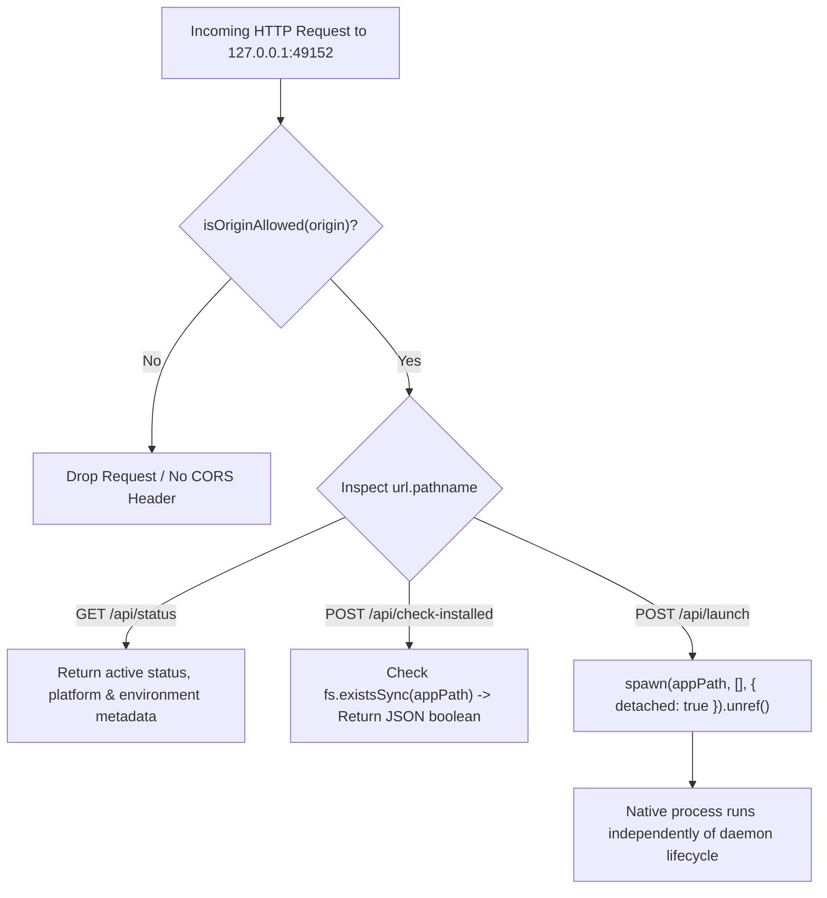

# Source Code Deep Dive: `desktop/protutech-bridge.js`

## 📄 File Metadata

- **Subsystem:** Protutech Desktop Bridge Daemon
- **Path:** `protutechdash/desktop/protutech-bridge.js`
- **Language / Runtime:** Node.js (CommonJS / Operating System Subsystem)
- **Primary Responsibility:** Runs a local daemon listening on loopback interface, validating origin domains, verifying local executable presence, and spawning native Windows processes.

---

## 💡 What This File Does (Explained Simply)

Normally, web browsers live in a restricted sandbox. A website cannot reach outside and start a video game, code editor, or music program on your physical computer because that would be a security hazard.
`protutech-bridge.js` acts like an authenticated local ambassador:
1. It runs silently in the background on your workstation, listening only on your local machine (`localhost`).
2. When you click a native game or application in ProtutechDash, the browser sends a request to this local ambassador.
3. The bridge checks if the request comes from an authorized Protutech domain.
4. If approved, it launches the application on your computer and immediately detaches, so the application keeps running smoothly even if you close the web browser.

---

## 🔍 Key Architectural Sections & Line Breakdown



---

### Section 1: Strict Origin Filtering & CORS Negotiation

```javascript linenums="14"
const PORT = 49152;
const ALLOWED_ORIGINS = [
  'http://localhost',
  'http://127.0.0.1',
  'https://iandrexi.github.io',
  'https://protutech.vip'
];

function isOriginAllowed(origin) {
  if (!origin) return true;
  return ALLOWED_ORIGINS.some(allowed => origin.startsWith(allowed)) || origin.includes('.protutech.vip');
}
```

#### Line by Line Explanation:
- **Line 14 (`PORT = 49152`)**: Selects an ephemeral loopback port in the dynamic/private range ($49152$ to $65535$), avoiding conflicts with standard web services or development ports.
- **Lines 15–20 (`ALLOWED_ORIGINS`)**: Explicit whitelist restricting incoming cross origin requests to authorized Protutech hostnames and local development environments.
- **Lines 22–25 (`isOriginAllowed`)**: Evaluates incoming headers. Arbitrary external web pages cannot probe or send commands to the local bridge daemon.

---

### Section 2: Non Blocking Detached Process Spawning

```javascript linenums="80"
  // Launch local application
  if (url.pathname === '/api/launch' && req.method === 'POST') {
    let body = '';
    req.on('data', chunk => { body += chunk; });
    req.on('end', () => {
      try {
        const { appPath, url: appUrl, appId } = JSON.parse(body);

        // Security check: Only launch registered Protutech apps or approved paths
        if (appPath && fs.existsSync(appPath)) {
          spawn(appPath, [], { detached: true, stdio: 'ignore' }).unref();
          res.writeHead(200, { 'Content-Type': 'application/json' });
          res.end(JSON.stringify({ success: true, method: 'native-exec' }));
          return;
        }
      } catch (e) {
        res.writeHead(400, { 'Content-Type': 'application/json' });
        res.end(JSON.stringify({ error: e.message }));
      }
    });
  }
```

#### Line by Line Explanation:
- **Lines 81–84 (`req.on('data')`)**: Streams raw chunk buffers from the HTTP socket, mitigating memory spikes during payload transfer.
- **Line 89 (`fs.existsSync(appPath)`)**: Asserts that the target binary actually exists on the host filesystem before attempting OS execution.
- **Line 90 (`spawn(appPath, [], { detached: true, stdio: 'ignore' }).unref()`)**:
  - `detached: true`: Directs the operating system kernel to make the child process the leader of a new process group.
  - `stdio: 'ignore'`: Closes parent child input and output pipes, preventing the child from hanging if the daemon restarts.
  - `.unref()`: Removes the child process from the Node.js event loop reference counter, allowing the bridge to exit or remain idle without holding onto memory.

---

## 🛡️ Anti Reverse Engineering Boundary

> [!NOTE] Implementation Abstraction
> Process execution policies enforce strict cryptographic token handshakes between the web UI and host loopback bridge. Target executable paths and environment variables are resolved via dynamic alias maps rather than raw filesystem arguments.
