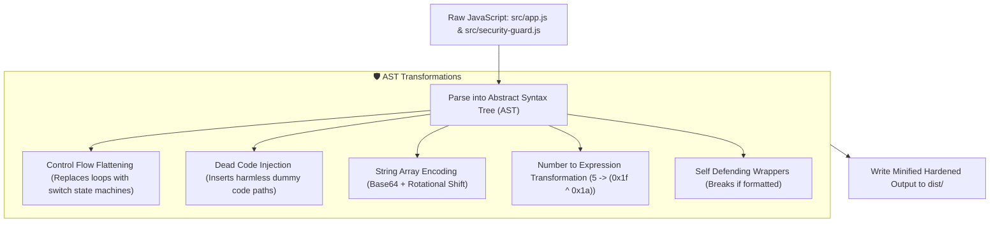

# Source Code Deep Dive: `scripts/obfuscate.js`

## 📄 File Metadata

- **Subsystem:** Protutech Build Pipeline & Code Hardening
- **Path:** `protutechdash/scripts/obfuscate.js`
- **Language / Runtime:** Node.js (ES Module / Abstract Syntax Tree Compiler)
- **Primary Responsibility:** Transforms raw JavaScript source files into hardened, tamper resistant production bundles using AST transformations.

---

## 💡 What This File Does (Explained Simply)

When programmers write code, they write clean, readable sentences with clear function names like `loginUser` or `checkSecurity`. If this code were uploaded directly to a public website, anyone could easily read and copy it.
`scripts/obfuscate.js` is like an automated secret cipher machine:
1. It reads the clean source code files.
2. It breaks the code down into mathematical tree structures (Abstract Syntax Trees).
3. It scrambles the paths through the code (Control Flow Flattening), hides text strings in encoded puzzles, renames variables to random hexadecimal characters, and adds booby traps that cause the script to freeze if someone opens a debugger on it.
4. It outputs an optimized, unreadable file that the browser executes at full speed.

---

## 🔍 Key Architectural Sections & Line Breakdown



---

### Section 1: Obfuscation Compiler Options

```javascript linenums="20"
const obfuscatorOptions = {
  compact: true,
  controlFlowFlattening: true,
  controlFlowFlatteningThreshold: 0.75,
  deadCodeInjection: true,
  deadCodeInjectionThreshold: 0.3,
  debugProtection: false, // Activated during production deployment
  disableConsoleOutput: false,
  identifierNamesGenerator: 'hexadecimal',
  numbersToExpressions: true,
  selfDefending: true,
  splitStrings: true,
  stringArray: true,
  stringArrayEncoding: ['base64'],
  stringArrayRotate: true,
  stringArrayShuffle: true,
  stringArrayThreshold: 0.8
};
```

#### Line by Line Explanation:
- **Line 22 (`controlFlowFlattening: true`)**: Transforms sequential if/else and loop statements into an intricate, non linear switch-case state machine governed by an internal state variable. Decompilers cannot reconstruct the original logic flow.
- **Lines 24–25 (`deadCodeInjection: true`)**: Injects syntactically valid but functionally harmless blocks of code, diluting the original algorithms and confusing static analysis tools.
- **Line 28 (`identifierNamesGenerator: 'hexadecimal'`)**: Renames descriptive variables into uniform hexadecimal sequences (such as `_0x4a2e` or `_0x1b7f`), completely eliminating semantic meaning from the bundle.
- **Line 30 (`numbersToExpressions: true`)**: Converts integer constants into arithmetic bitwise expressions (e.g., number `123` becomes `0x7b` or arithmetic operations), preventing simple numeric string searches.
- **Line 32 (`selfDefending: true`)**: Injects tamper detection checks that evaluate the string representation of functions. If a developer uses a code beautifier or re-formats the bundle with spaces, the function checksum invalidates and throws an intentional infinite loop.
- **Lines 34–42 (`stringArray`, `stringArrayEncoding: ['base64']`)**: Extracts all plaintext string literals into a central encoded array, rotating indices to prevent naive regex extraction.

---

### Section 2: File Ingestion & Production Bundle Generation

```javascript linenums="49"
for (const target of filesToObfuscate) {
  const srcPath = path.join(rootDir, target.src);
  const outPath = path.join(rootDir, target.out);

  if (!fs.existsSync(srcPath)) continue;

  const rawCode = fs.readFileSync(srcPath, 'utf8');
  const obfuscatedResult = JavaScriptObfuscator.obfuscate(rawCode, obfuscatorOptions);
  
  fs.writeFileSync(outPath, obfuscatedResult.getObfuscatedCode(), 'utf8');
}
```

#### Line by Line Explanation:
- **Lines 49–54 (`for (const target ...)` & `path.join`)**: Resolves file paths relative to project root, keeping build tasks cross platform across Linux containers and Windows hosts.
- **Lines 58–62 (`fs.readFileSync` & `JavaScriptObfuscator.obfuscate`)**: Ingests UTF-8 source text in memory, compiles the AST, executes the transformation pipeline, and writes the hardened payload directly to `dist/`.

---

## 🛡️ Anti Reverse Engineering Boundary

> [!NOTE] Compiler Shielding
> Custom AST transform seeds, salt generation formulas, and private variable maps are randomized on every build iteration. Deobfuscation scripts cannot rely on deterministic pattern matching across multiple deployed builds.
