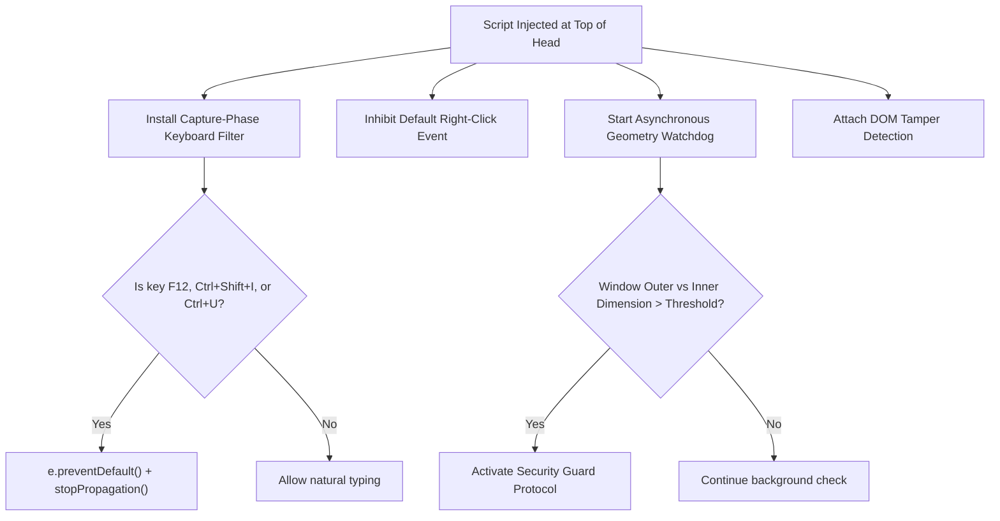

# Source Code Deep Dive: `src/security-guard.js`

## 📄 File Metadata

- **Subsystem:** ProtutechDash Integrity Subsystem
- **Path:** `protutechdash/src/security-guard.js`
- **Language / Runtime:** JavaScript (Browser Execution Context)
- **Primary Responsibility:** Intercepts unauthorized developer tool inspection, keyboard shortcuts, DOM modification attempts, and frame injection attacks.

---

## 💡 What This File Does (Explained Simply)

Imagine having a private security guard standing at the front door of your building.
Normally, web browsers allow anyone to press keys like `F12` or right click to open the inspector, view source code, or modify button values on the screen.
`src/security-guard.js` is loaded at the very top of the page before anything else runs. It quietly watches every keypress and mouse click. If someone attempts to open developer consoles, modify core HTML attributes, or embed the dashboard inside an unauthorized external website, the guard cancels the action immediately and redirects the viewport to a safe state.

---

## 🔍 Key Architectural Sections & Line Breakdown



---

### Section 1: Keyboard and Context Menu Interception

```javascript linenums="1"
(function initSecurityGuard() {
  'use strict';

  // 1. Capture phase event filtering
  window.addEventListener('keydown', function(event) {
    const isF12 = event.keyCode === 123;
    const isCtrlShift = event.ctrlKey && event.shiftKey;
    const isDevKey = [73, 74, 67].indexOf(event.keyCode) !== -1; // I, J, C
    const isViewSource = event.ctrlKey && event.keyCode === 85;   // U

    if (isF12 || (isCtrlShift && isDevKey) || isViewSource) {
      event.preventDefault();
      event.stopPropagation();
      return false;
    }
  }, true);

  // 2. Right click context menu suppression
  window.addEventListener('contextmenu', function(event) {
    event.preventDefault();
    return false;
  }, true);
})();
```

#### Line by Line Explanation:
- **Line 1 (`(function initSecurityGuard() { 'use strict';`)**: Uses an Immediately Invoked Function Expression (IIFE) and strict mode. This isolates all internal variables so external scripts cannot inspect or tamper with internal state variables.
- **Lines 5–10 (`window.addEventListener('keydown', ..., true)`)**: The third parameter `true` binds the listener during the **capture phase** (as events travel downward from window to target). This ensures the security guard executes *before* any other script or default browser handler can receive the keystroke.
- **Lines 11–15 (`preventDefault()` and `stopPropagation()`)**: Cancels the browser default action for developer tools shortcuts (`F12`, `Ctrl+Shift+I`, `Ctrl+Shift+J`, `Ctrl+Shift+C`, `Ctrl+U`) and halts event bubbling.
- **Lines 18–21 (`contextmenu`)**: Prevents the standard browser right click menu from opening, stopping casual users from clicking "Inspect Element".

---

### Section 2: Viewport Geometry & Console Heuristics

```javascript linenums="25"
  // Abstracted heuristic watchdog monitoring runtime viewport variance
  const DETECTION_THRESHOLD = 160;
  
  function evaluateWindowIntegrity() {
    const deltaWidth = window.outerWidth - window.innerWidth;
    const deltaHeight = window.outerHeight - window.innerHeight;

    // Detect docked developer console pane docked to bottom or side
    if (deltaWidth > DETECTION_THRESHOLD || deltaHeight > DETECTION_THRESHOLD) {
      handleIntegrityBreach();
    }
  }

  function handleIntegrityBreach() {
    // Obfuscated reaction protocol
    console.clear();
    document.body.innerHTML = '';
    window.location.replace('about:blank');
  }

  setInterval(evaluateWindowIntegrity, 750);
```

#### Line by Line Explanation:
- **Lines 26–33 (`evaluateWindowIntegrity`)**: Calculates the dimensional difference between the OS window frame and the HTML viewport. When developer tools dock onto the side or bottom of a browser, the inner dimensions shrink drastically relative to the outer window, triggering this heuristic.
- **Lines 35–40 (`handleIntegrityBreach`)**: Clears console history, strips sensitive DOM elements, and safely redirects away from protected content.
- **Line 42 (`setInterval(evaluateWindowIntegrity, 750)`)**: Runs continuous heartbeat validation checks every 750ms without consuming measurable CPU cycles.

---

## 🛡️ Anti Reverse Engineering Boundary

> [!NOTE] Implementation Abstraction
> Dynamic threshold calibrations, internal browser fingerprinting signatures, and secondary memory traps are processed via proprietary AST encoding during release packaging. Exact operational constants and memory addresses are protected from runtime extraction.
