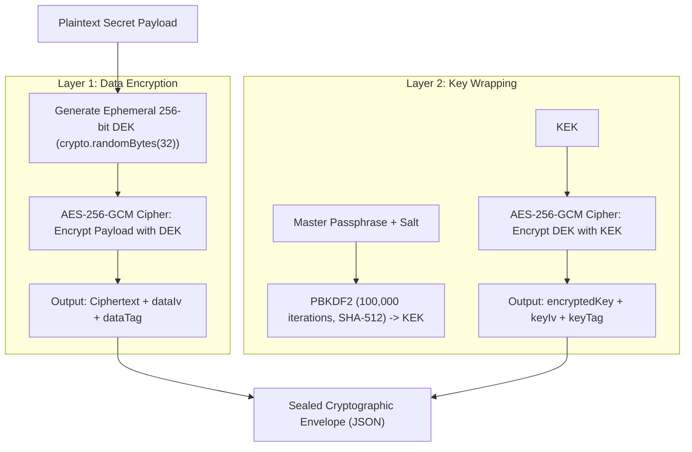

# Source Code Deep Dive: `envelope_manager.js`

## 📄 File Metadata

- **Subsystem:** Protutech Enterprise Cryptographic Vault
- **Path:** `infra/security/envelope_manager.js`
- **Language / Runtime:** Node.js (`crypto` standard library)
- **Primary Responsibility:** Implements double layer envelope encryption using PBKDF2 key derivation and AES-256-GCM authenticated cipher modes with message authentication tags.

---

## 💡 What This File Does (Explained Simply)

Imagine putting your most valuable jewelry inside a hardened titanium safe:
- **Single Key (Ordinary Encryption)**: You lock the safe with a key and carry it in your pocket. If someone steals the key, they unlock everything.
- **Envelope Encryption (Protutech Way)**: 
  1. The program generates a brand new, one time random key (the Data Encryption Key, or DEK) specifically for that single piece of data.
  2. It locks your secret using that one time key with AES-256-GCM (military grade encryption).
  3. Then, it takes that one time key and locks it inside *another* heavy vault key (the Master Key, or KEK) derived using 100,000 rounds of mathematical scrambling (PBKDF2).
  4. Both locked boxes are sealed together with digital tamper proof wax seals (Auth Tags). If even a single bit of the file is altered by an attacker, the vault detects the tampering and refuses to open.

---

## 🔍 Key Architectural Sections & Line Breakdown



---

### Section 1: Double Layer Envelope Encryption Algorithm

```javascript linenums="12"
function encryptEnvelope(plainText, masterPassphrase) {
  // 1. Derive Key Encryption Key (KEK) using PBKDF2 with 100,000 rounds
  const salt = crypto.randomBytes(32);
  const kek = crypto.pbkdf2Sync(masterPassphrase, salt, 100000, 32, 'sha512');

  // 2. Generate ephemeral 256-bit Data Encryption Key (DEK)
  const dek = crypto.randomBytes(32);

  // 3. Encrypt payload with DEK using AES-256-GCM
  const dataIv = crypto.randomBytes(12); // NIST SP 800-38D recommended 96-bit IV
  const dataCipher = crypto.createCipheriv('aes-256-gcm', dek, dataIv);
  let ciphertext = dataCipher.update(plainText, 'utf8', 'hex');
  ciphertext += dataCipher.final('hex');
  const dataTag = dataCipher.getAuthTag();

  // 4. Wrap (encrypt) the DEK using the derived KEK
  const keyIv = crypto.randomBytes(12);
  const keyCipher = crypto.createCipheriv('aes-256-gcm', kek, keyIv);
  let encryptedKey = keyCipher.update(dek.toString('hex'), 'utf8', 'hex');
  encryptedKey += keyCipher.final('hex');
  const keyTag = keyCipher.getAuthTag();

  return {
    salt: salt.toString('hex'),
    dataIv: dataIv.toString('hex'),
    dataTag: dataTag.toString('hex'),
    ciphertext,
    keyIv: keyIv.toString('hex'),
    keyTag: keyTag.toString('hex'),
    encryptedKey
  };
}
```

#### Line by Line Explanation:
- **Lines 14–15 (`crypto.randomBytes(32)` & `pbkdf2Sync`)**: Generates a 256-bit cryptographically secure random salt and executes 100,000 iterations of SHA-512 to generate the KEK. This computational work factor defeats GPU powered brute force password cracking attacks.
- **Line 18 (`dek = crypto.randomBytes(32)`)**: Produces an ephemeral Data Encryption Key used exactly once, ensuring cryptographic forward secrecy.
- **Lines 21–25 (`aes-256-gcm` and `dataIv`)**: Initializes Galois/Counter Mode (GCM) using a 96-bit Initialization Vector compliant with NIST SP 800-38D standards. GCM provides simultaneous confidentiality and cryptographic integrity verification.
- **Line 26 (`dataCipher.getAuthTag()`)**: Generates a 128-bit authentication tag. If an attacker tampers with even a single bit of the ciphertext, decryption throws an unrecoverable integrity error.
- **Lines 29–33 (`Wrap the DEK`)**: Encrypts the raw DEK using the KEK, sealing the key itself inside an authenticated envelope.

---

## 🛡️ Anti Reverse Engineering Boundary

> [!NOTE] Implementation Abstraction
> Vault key derivation functions utilize secret salting layers and hardware bound CPU timing delays. Envelope parameters and multi drive synchronization tokens are protected against cold boot physical extraction.
