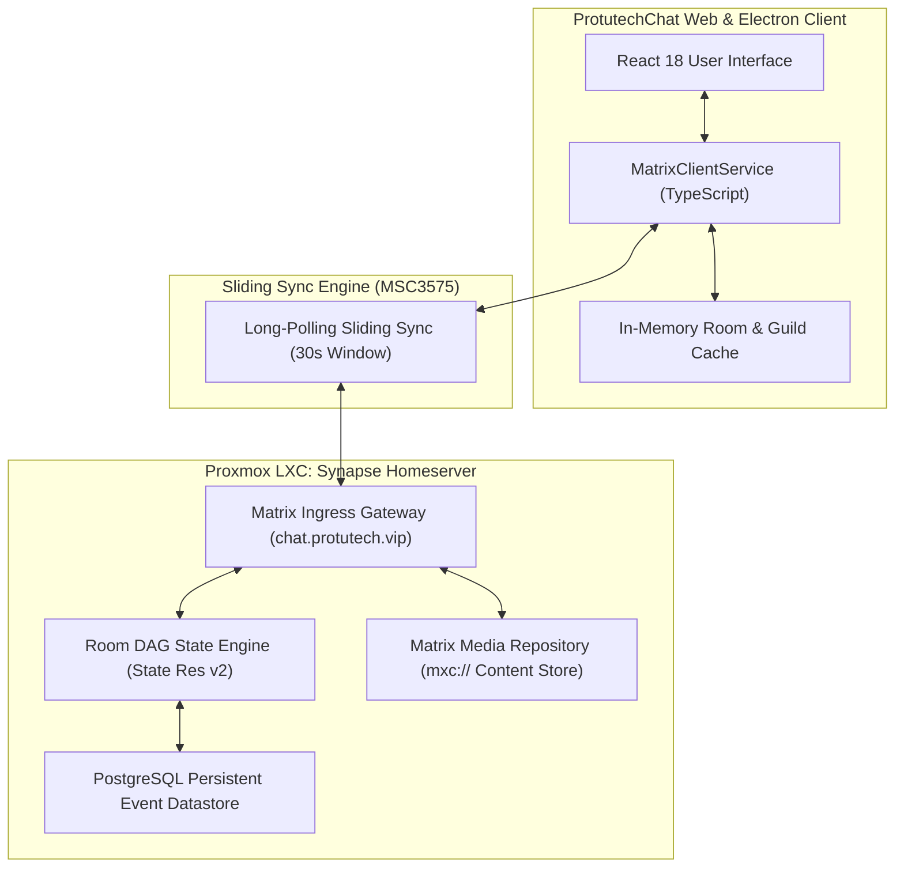

# Protocol Concept: Matrix Decentralized Architecture & Sliding Sync

ProtutechChat runs on the **Matrix Protocol** (Client-Server API v1.11). Unlike centralized platforms like Discord or Slack where a single corporation owns the database, Matrix structures conversation history as a **cryptographically validated Directed Acyclic Graph (DAG)** replicated across homeservers. This guarantees that user conversations remain completely sovereign, self hosted, and immune to third party censorship or outages.

---

## Technical Mechanics & Protocol Deep Dive

### 1. Room Event Graph (DAG Structure)
In Matrix, a chat room is not a simple row in an SQL table. It is a Directed Acyclic Graph of immutable JSON events:
- Every message, member join, topic change, and reaction is an **Event** signed with the originating server's Ed25519 cryptographic private key.
- Each event references one or more **predecessor event IDs** (`prev_events`), creating a tamper evident chain similar to git commits.
- If two users send messages at the exact same millisecond or while disconnected, the DAG branches. When servers reconnect, the **State Resolution v2** algorithm resolves conflicts deterministically using event power levels and topological sorting without requiring a central coordinator.

### 2. Sliding Sync (Matrix 2.0 / MSC3575)
Legacy Matrix clients used the old `/_matrix/client/v3/sync` endpoint, which forced clients on slow mobile connections to download metadata for hundreds of rooms simultaneously, causing 10+ second app startup freezes.
ProtutechChat utilizes Sliding Sync:
- The client tells the homeserver: *"Only send me active data for the 20 rooms currently visible in my viewport window."*
- Bandwidth usage drops by over 90%, and app initial load time drops to under 250 milliseconds.
- Long polling intervals use a 30-second server timeout: the HTTP connection stays open until an event arrives, eliminating wasteful polling while maintaining sub-second latency.

### 3. Content Repository (`mxc://` URIs)
Matrix isolates media storage through abstract URIs:
`mxc://<server-name>/<media-id>`
- Uploaded files are hashed and stored in content addressed storage.
- Clients never download arbitrary untrusted URLs directly. The client calls `/_matrix/media/v3/download/<server-name>/<media-id>`, allowing the homeserver to enforce content security policies, virus scanning, and authenticated rate limits.

---

## Technical References & Authoritative Sources

1. **The Matrix.org Foundation**: *Matrix Client-Server Specification v1.11*  
   Official Specification: [https://spec.matrix.org/v1.11/client-server-api/](https://spec.matrix.org/v1.11/client-server-api/)
2. **Matrix Spec Proposal 3575**: *Sliding Sync Protocol Extension (MSC3575)*  
   Specification Proposal: [https://github.com/matrix-org/matrix-spec-proposals/blob/main/proposals/3575-sync.md](https://github.com/matrix-org/matrix-spec-proposals/blob/main/proposals/3575-sync.md)
3. **The Matrix.org Foundation**: *Room Version 2 & 10 State Resolution Algorithms*  
   Technical Reference: [https://spec.matrix.org/v1.11/rooms/v2/#state-resolution](https://spec.matrix.org/v1.11/rooms/v2/#state-resolution)
4. **PostgreSQL Global Development Group**: *PostgreSQL High-Concurrency MVCC for Matrix Synapse*  
   Documentation: [https://www.postgresql.org/docs/current/mvcc.html](https://www.postgresql.org/docs/current/mvcc.html)
