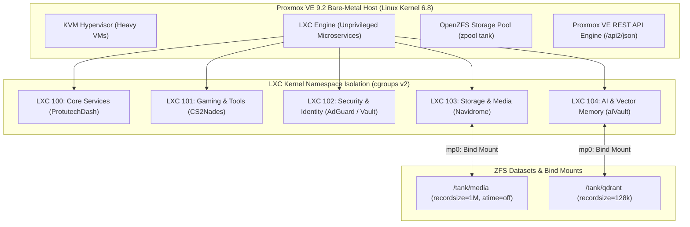

# Virtualization Concept: Proxmox VE Architecture, LXC & ZFS

The foundation of the Protutech ecosystem is hosted on **Proxmox Virtual Environment 9.2**. Rather than spinning up heavy full system hardware virtualization (KVM) for every service, we run modular microservices inside **unprivileged Debian LXC containers** backed by a high performance **OpenZFS storage pool**.

---

## Technical Mechanics & Kernel Architecture

### 1. Unprivileged Containers & User Namespace Mapping
In traditional Docker or privileged LXC setups, `root` inside the container maps directly to `UID 0` on the physical host machine. If an attacker discovers a container escape vulnerability, they gain full root privileges over the physical server hardware.
- In Protutech's unprivileged LXC architecture, `root` inside the container is mapped via user namespaces (`/etc/subuid` and `/etc/subgid`) to an unprivileged host range:
  $$\text{Container UID 0} \longrightarrow \text{Host UID 100000}$$
- Even if an attacker executes code as root inside the container, on the physical Proxmox host they are merely an unprivileged user without permission to modify host kernel drivers, hardware devices, or storage datasets.

### 2. cgroups v2 Resource Governance
Every container is bounded using Linux Control Groups v2 (`cgroups v2`):
- **CPU Quotas**: Configured via `cpu.max` and `cpu.weight`. Background services (like blocklist compilers or audio taggers) are given lower weight (`weight=50`), while realtime game whiteboards and AI streaming proxies receive priority scheduling (`weight=500`).
- **Memory Boundaries**: `memory.max` enforces hard out-of-memory (OOM) limits, while `memory.high` provides smooth proactive page reclaiming before processes trigger hard kernel kills.

### 3. ZFS Dataset Tuning
Container roots and bind mounts reside on OpenZFS with granular dataset property tuning:
- **`atime=off`**: Disables access time updates on file reads, eliminating redundant disk write IOPS.
- **`compression=zstd`**: Enables real time Zstandard compression, reducing NVMe wear while increasing effective storage bandwidth.
- **`recordsize=1M`**: Applied to `/tank/media` to match large uncompressed FLAC audio files, reducing metadata overhead.
- **`recordsize=128k`**: Applied to `/tank/qdrant` to optimize random read/write latency for vector database HNSW graph segments.

---

## Technical References & Authoritative Sources

1. **Proxmox Server Solutions**: *Proxmox VE 9 Administration Guide*  
   Official Documentation: [https://pve.proxmox.com/pve-docs/pve-admin-guide.html](https://pve.proxmox.com/pve-docs/pve-admin-guide.html)
2. **Proxmox Server Solutions**: *Proxmox VE API v2 Reference Engine*  
   API Explorer: [https://pve.proxmox.com/pve-docs/api-viewer/index.html](https://pve.proxmox.com/pve-docs/api-viewer/index.html)
3. **OpenZFS Project**: *OpenZFS Administration Documentation and Dataset Property Tunables*  
   Documentation: [https://openzfs.github.io/openzfs-docs/](https://openzfs.github.io/openzfs-docs/)
4. **Linux Kernel Organization**: *Control Group v2 (cgroup2) Official Kernel Documentation*  
   Kernel Guide: [https://docs.kernel.org/admin-guide/cgroup-v2.html](https://docs.kernel.org/admin-guide/cgroup-v2.html)
